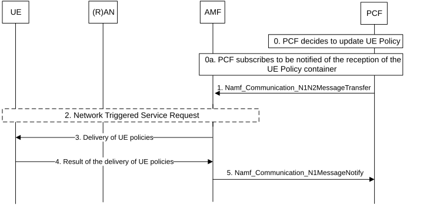

# 4.2.4.3 UE Configuration Update procedure for transparent UE Policy delivery

This procedure is initiated when the PCF wants to update UE policy information (i.e. UE policy) in the UE configuration. In the non-roaming case, the V-PCF is not involved and the role of the H-PCF is performed by the PCF. For the roaming scenarios, the V-PCF interacts with the AMF and the H-PCF interacts with the V-PCF.

For the purpose of URSP delivery via EPS, the delivery procedure of UE Policy Containers from the SMF+PGW-C to the UE is specified in clause 4.11.0a.2a.10.

Figure 4.2.4.3-1: UE Configuration Update procedure for transparent UE Policy delivery

0\. PCF decides to update UE policy based on triggering conditions such as an initial registration, registration with 5GS when the UE moves from EPS to 5GS, or need for updating UE policy as follows:

\- For the case of initial registration and registration with 5GS when the UE moves from EPS to 5GS, the PCF compares the list of PSIs included in the UE policy information in Npcf_UEPolicyControl_Create request and determines, as described in clause 6.1.2.2.2 of TS 23.503 \[20\], whether UE policy information have to be updated and be provided to the UE via the AMF using DL NAS TRANSPORT message; and

\- For the network triggered UE policy update case (e.g. the change of UE location, the change of Subscribed S-NSSAIs as described in clause 6.1.2.2.2 of TS 23.503 \[20\]), the PCF checks the latest list of PSIs to decide which UE policies have to be sent to the UE.

The PCF checks if the size of the resulting UE policy information exceeds a predefined limit:

\- If the size is under the limit, then UE policy information are included in a single Namf_Communication_N1N2MessageTransfer service operation as described below.

\- If the size exceeds the predefined limit, the PCF splits the UE policy information in smaller, logically independent UE policy information ensuring the size of each is under the predefined limit. Each UE policy information will be then sent in separated Namf_Communication_N1N2MessageTransfer service operations as described below.

NOTE 1: NAS messages from AMF to UE do not exceed the maximum size limit allowed in NG-RAN (PDCP layer), so the predefined size limit in PCF is related to that limitation.

NOTE 2: The mechanism used to split the UE policy information is described in TS 29.507 \[32\].

0a. If the PCF has not subscribed to be notified by the AMF about the UE response to an update of UE policy information, the PCF subscribes to the AMF to be notified about the UE response to an update of UE policy information.

1\. PCF invokes Namf_Communication_N1N2MessageTransfer service operation provided by the AMF. The message includes SUPI, UE Policy Container.

2\. If the UE is registered and reachable by AMF in either 3GPP access or non-3GPP access, AMF shall transfers transparently the UE Policy container to the UE via the registered and reachable access.

If the UE is registered in both 3GPP and non-3GPP accesses and reachable on both access and served by the same AMF, the AMF transfers transparently the UE Policy container to the UE via one of the accesses based on the AMF local policy.

If the UE is not reachable by AMF over both 3GPP access and non-3GPP access, the AMF reports to the PCF that the UE Policy container could not be delivered to the UE using Namf_Communication_N1N2TransferFailureNotification as in the step 5 in clause 4.2.3.3.

If AMF decides to transfer transparently the UE Policy container to the UE via 3GPP access, e.g. the UE is registered and reachable by AMF in 3GPP access only, or if the UE is registered and reachable by AMF in both 3GPP and non-3GPP accesses served by the same AMF and the AMF decides to transfer transparently the UE Policy container to the UE via 3GPP access based on local policy and the UE is in CM-IDLE and reachable by AMF in 3GPP access, the AMF starts the paging procedure by sending a Paging message described in the step 4b of Network Triggered Service Request (in clause 4.2.3.3). Upon reception of paging request, the UE shall initiate the UE Triggered Service Request procedure (clause 4.2.3.2).

3\. If the UE is in CM-CONNECTED over 3GPP access or non-3GPP access, the AMF transfers transparently the UE Policy container (UE policy information) received from the PCF to the UE. The UE Policy container includes the list of Policy Sections as described in TS 23.503 \[20\].

4\. The UE updates the UE policy provided by the PCF and sends the result to the AMF.

5\. The AMF forwards the response of the UE to the PCF using Namf_Communication_N1MessageNotify.

The PCF maintains the latest list of PSIs delivered to the UE and updates the latest list of PSIs in the UDR by invoking Nudr_DM_Update (SUPI, Policy Data, Policy Set Entry, updated PSI data) service operation.

If the PCF is notified about UE Policy delivery failure from the AMF, the PCF may initiate UE Policy Association Modification procedure to provide a new trigger "Connectivity state changes" in Policy Control Request Trigger of UE Policy Association to AMF as defined in clause 4.16.12.2. The PCF may re-initiate the UE Configuration Update procedure for transparent UE Policy delivery as in step 1 when the PCF is notified of the UE connectivity state changed to CONNECTED.

NOTE 3: For backward compatibility the PCF may subscribe the "Connectivity state changes (IDLE or CONNECTED)" event in Rel-15 AMF as defined in clause 5.2.2.3.
