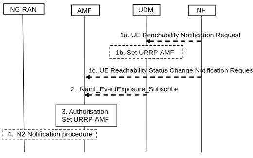
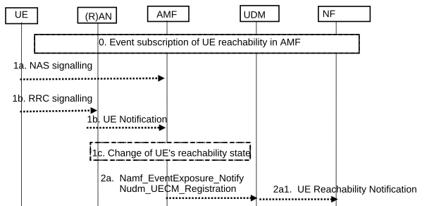

# 4.2.5 Reachability procedures

## 4.2.5.1 General

Elements of this procedure are used for UDM/NF initiated UE Reachability Notification requests, e.g. for "SMS over NAS".

The procedure applies to UEs that are in RRC_IDLE, RRC_INACTIVE and RRC_CONNECTED states.

There are two procedures necessary for any service related entity that would need to be notified by the reachability of the UE:

\- UE Reachability Notification Request procedure; and

\- UE Activity Notification procedure.

## 4.2.5.2 UE Reachability Notification Request procedure

The UE Reachability Notification Request procedure is illustrated in figure 4.2.5.2-1.

Figure 4.2.5.2-1: UE Reachability Notification Request Procedure

1a. \[Conditional\] When a service-related entity requests the UDM to provide an indication regarding UE reachability, the UDM checks whether that service-related entity is authorized to perform this request on this subscriber. The service-related entity may subscribe in UDM to receive notifications about UE Reachability or UE Reachability for SMS delivery events as defined in clause 4.15.3.

NOTE 1: This request for UE Reachability Notification is received in UDM using different interfaces/services depending on the service-related entity. For example, an SBI capable service-related entity can use the Nudm_EventExposure_Subscribe service while an SMS-GMSC using non-SBI interfaces triggers this procedure as described in TS 23.040 \[7\].

The UDM may retrieve from the UDR the list of NF IDs for Network Functions authorized by the HPLMN to request notifications on this UE's reachability.

If the entity is not authorized, the UDM may reject the request (e.g. if the requesting entity is recognized as being a valid entity, but not authorized for that subscriber) or discard it silently (e.g. if the requesting entity is not recognized). Appropriate O&M reports are generated.

1b. \[Conditional\] The UDM stores the identity of the service-related entity.

In the case that the service-related entity is an SMS-GMSC using non-SBI interfaces, the UDM stores the SC address within the MWD list. Otherwise, if the service-related entity is an SBI capable service-related entity, the UDM stores the address of the SBI capable service-related entity in the form of a subscription to the Nudm_EventExposure service.

If the UE Reachability Notification Request is for SMS over NAS and no SMSF is registered for the target UE, steps 2 to 4 are skipped.

Otherwise the UDM sets the URRP-AMF flag parameter and continues with step 2.

1c. \[Conditional\] An NF (e.g. SMF) may subscribe event of UE reachability status change by using the Namf_EventExposure_Subscribe service operation. Steps 2 to 4 are skipped.

The AMF invokes the Namf_EventExposure_Notify service operation to report the current reachability state of a UE to the NF if requested by the consumer NF.

2\. \[Conditional\] If the value of URRP-AMF flag parameter changes from "not set" to "set" and an AMF is registered in the UDM for the target UE, the UDM initiates Namf_EventExposure_Subscribe service operation for UE reachability for UE reachable for DL traffic (SUPI, UE Reachability) towards the AMF. The UDM may indicate if direct notification to NF shall be used by the AMF. When direct notification to NF is indicated to the AMF, the URRP-AMF is not set in the UDM in step 1a for NF initiated requests. If the service-related entity requested UDM to receive notifications about UE Reachability for SMS delivery, the UDM shall not indicate direct notification to NF.

NOTE 2: The UDM can trigger UE Reachability Notification Request procedure with two different AMFs for a UE which is connected to 5G Core Network over 3GPP access and non-3GPP access simultaneously. Also, for interworking with EPC, the UDM/HSS can trigger UE Reachability Notification Request procedure with MME as described in TS 23.401 \[13\].

3\. The AMF checks that the requesting entity is authorized to perform this request on this subscriber.

If the AMF has an MM Context for that user, the AMF stores the NF ID in the URRP-AMF information, associated with URRP-AMF information flag to indicate the need to report to the UDM or directly to the NF with a UE Activity Notification (see clause 4.2.5.3).

4\. \[Conditional\] For UE reachability for UE reachable for DL traffic, if the UE state in AMF is in CM-CONNECTED state and the Access Type is 3GPP access, the AMF initiates N2 Notification procedure (see clause 4.8.3) with reporting type set to Single RRC_CONNECTED state notification.

## 4.2.5.3 UE Activity Notification procedure

The UE Activity Notification procedure is illustrated in figure 4.2.5.3-1.

Figure 4.2.5.3-1: UE Activity Procedure

0\. Event has been subscribed in the AMF for UE reachability for DL traffic or for UE reachability status change.

1a. For a UE in CM-IDLE, the AMF receives (N1) NAS signalling implying UE is reachable for DL traffic, e.g. a Registration Request or Service Request message from the UE, the AMF performs step 2;

1b. For a UE in CM-CONNECTED, if the AMF has initiated the N2 Notification procedure in Step 4 of clause 4.2.5.2 and when the AMF receives a (N2) UE Notification (see clause 4.8.3) or a (N2) Path Switch Request (see clause 4.9.1.2) implying UE is reachable for DL traffic from the NG-RAN, the AMF performs step 2. Otherwise, i.e. UE is in CM-CONNECTED and AMF has not initiated N2 Notification procedure, the AMF performs step 2; or

1c. The UE's reachability state changes from reachable to unreachable, then AMF performs step 2.

2a. For event subscription of "UE reachable for DL traffic", if the AMF has an MM context for the UE and the URRP-AMF information flag associated with the subscribing NF is set to report once that the UE is reachable for DL traffic, the AMF initiates the Namf_EventExposure_Notify service operation (SUPI, UE Reachable) message (or Nudm_UECM_Registration service operation when applicable) to the UDM following step 1a or step 1b. The AMF clears the corresponding URRP-AMF information if applicable for the UE.

2a1. When the UDM receives the Namf_EventExposure_Notify service operation (SUPI, UE-Reachable) message or Nudm_UECM_Registration service from AMF for a UE that has URRP-AMF information flag set in the UDM, it triggers appropriate notifications to the service-related entities associated with the URRP-AMF information flag that have subscribed to the UDM for UE Reachability notifications.

If SMSF is registered, it also triggers appropriate notifications to the service-related entities associated with the URRP-AMF information flag that have subscribed to the UDM for UE reachability for SMS delivery notification (e.g. SMS-GMSC, HSS). UDM clears the URRP-AMF information for the UE.

If no SMSF is registered and there are service-related entities subscribed to the UDM for the UE reachability for SMS delivery notification, the UDM clears the URRP-AMF information for the UE but does not notify any service-related entity.

When the UDM receives the Nudm_UECM_Registration service from SMSF for a UE that has service-related entities subscribed to the UDM for the UE reachability for SMS delivery notification and no URRP-AMF flag set in the UDM, the UDM triggers appropriate notifications to the service-related entities that have subscribed to the UDM for UE reachability for SMS delivery notification).

NOTE: The UE Reachability Notification is sent by the UDM using different interfaces/services depending on the service-related entity. For example, an SBI capable service-related entity can receive the notification using the Nudm_EventExposure_Notify service operation (if previously subscribed) while an SMS-SC can get the notification as described in TS 23.040 \[7\] based on the SC address stored in the MWD list.

2b. If in step 0 the AMF received Namf_EventExposure_Subscribe_service operation directly from an NF authorised to receive direct notifications in the case of UE reachability status change, or the UDM indicated that the notification needs to be sent directly to the NF in the case of UE reachability for DL traffic, the AMF initiates the Namf_EventExposure_Notify service operation (SUPI, UE reachability state) message directly to the NF.
