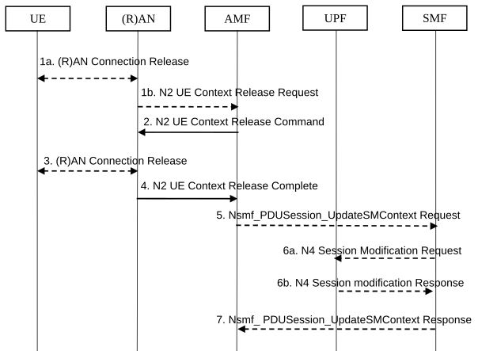

# 4.2.6 AN Release

This procedure is used to release the logical NG-AP signalling connection for the UE between the (R)AN and the AMF and the associated N3 User Plane connections and (R)AN signalling connection between the UE and the (R)AN and the associated (R)AN resources.

When the NG-AP signalling connection is lost due to (R)AN or AMF failure, the AN release is performed locally by the AMF or the (R)AN as described in the procedure flow below without using or relying on any of the signalling shown between (R)AN and AMF. The AN release causes all UP connections of the UE to be deactivated.

The initiation of AN release may be due to:

\- (R)AN-initiated with cause e.g. O&M Intervention, Unspecified Failure, (R)AN (e.g. Radio) Link Failure, User Inactivity, Inter-System Redirection, request for establishment of QoS Flow for IMS voice, Release due to UE generated signalling connection release, mobility restriction, Release Assistance Information (RAI) from the UE, UE using satellite access moved out of PLMN serving area, etc.; or

\- AMF-initiated with cause e.g. Unspecified Failure, etc.

Both (R)AN-initiated and AMF-initiated AN Release procedures are shown in Figure 4.2.6-1.

If Service Gap Control shall be applied for the UE (see clause 5.31.16 of TS 23.501 \[2\]) and the Service Gap timer is not already running, the Service Gap timer shall be started in AMF and UE when entering CM-IDLE, unless the connection was initiated after a paging of an MT event, or after a Registration procedure without Uplink data status or after a Registration procedure for regulatory prioritized services like Emergency services or exception reporting.

For this procedure, the impacted SMF and UPF are all under control of the PLMN serving the UE, e.g. in Home Routed roaming case the SMF and UPF in HPLMN are not involved.

Figure 4.2.6-1: AN Release procedure

1\. If there is some confirmed (R)AN conditions (e.g. Radio Link Failure) or for other (R)AN internal reason, the (R)AN may decide to initiate the UE context release in the (R)AN. In this case, the (R)AN sends an N2 UE Context Release Request (Cause, List of PDU Session ID(s) with active N3 user plane) message to the AMF. Cause indicates the reason for the release (e.g. AN Link Failure, O&M intervention, unspecified failure, etc.). The List of PDU Session ID(s) indicates the PDU Sessions served by (R)AN of the UE. If the (R)AN is NG-RAN, this step is described in clause 8.3.2 of TS 38.413 \[10\]. If the (R)AN is an N3IWF this step is described in clause 4.12.4.2.

If the reason for the release is the NG-RAN received an AS Release Assistance Indicator as defined in TS 36.331 \[16\], NG-RAN should not immediately release the RRC connection but instead send an N2 UE Context Release Request message to the AMF. If the AS RAI indicates only a single downlink transmission is expected then NG-RAN should only send the N2 UE Context Release Request after a single downlink NAS PDU or N3 data PDU has been transferred.

If N2 Context Release Request cause indicates the release is requested due to user inactivity or AS RAI then the AMF continues with the AN Release procedure unless the AMF is aware of pending MT traffic or signalling.

If N2 Context Release Request cause indicates the release is requested due to a UE using satellite access moved out of PLMN serving area, the AMF may deregister the UE as described in clause 4.2.2.3.3 before continuing with the AN Release procedure.

If N2 Context Release Request cause indicates the release is requested due to MBSR not authorized as described in clause 5.35A.4 of TS 23.501 \[2\], the AMF may deregister the MBSR as described in clause 4.2.2.3.3 before continuing with the AN Release procedure.

2\. AMF to (R)AN: If the AMF receives the N2 UE Context Release Request message or due to an internal AMF event, including the reception of Service Request or Registration Request to establish another NAS signalling connection still via (R)AN, the AMF sends an N2 UE Context Release Command (Cause) to the (R)AN. The Cause indicates either the Cause from (R)AN in step 1 or the Cause due to an AMF event. If the (R)AN is a NG-RAN this step is described in detail in clause 8.3.3 of TS 38.413 \[10\]. If the (R)AN is an N3IWF/TNGF/W-AGF this step is described in clauses 4.12.4.2 / 4.12a and in clause 7.2.5 of TS 23.316 \[53\] for W-5GAN access.

If the AMF receives Service Request or Registration Request to establish another NAS signalling connection still via (R)AN, after successfully authenticating the UE, the AMF releases the old NAS signalling connection and then continues the Service Request or Registration Request procedure.

3\. \[Conditional\] If the (R)AN connection (e.g. RRC connection or NWu connection) with the UE is not already released (step 1), either:

a\) the (R)AN requests the UE to release the (R)AN connection. Upon receiving (R)AN connection release confirmation from the UE, the (R)AN deletes the UE's context, or

b\) if the Cause in the N2 UE Context Release Command indicates that the UE has already locally released the RRC connection, the (R)AN locally releases the RRC connection.

4\. The (R)AN confirms the N2 Release by returning an N2 UE Context Release Complete (List of PDU Session ID(s) with active N3 user plane, User Location Information, Age of Location Information) message to the AMF. The List of PDU Session ID(s) indicates the PDU Sessions served by (R)AN of the UE. The AMF stores always the latest UE Radio Capability information or NB-IoT specific UE Radio Access Capability Information received from the NG-RAN node received as described in TS 38.413 \[10\]. The N2 signalling connection between the AMF and the (R)AN for that UE is released. If the UE is served by an NG-eNB that supports WUS, then the NG-eNB should include the Information On Recommended Cells And RAN nodes For Paging; otherwise the (R)AN may provide the list of recommended cells / TAs / NG-RAN node identifiers for paging to the AMF.

If the PLMN has configured secondary RAT usage reporting, the NG-RAN node may provide RAN usage data Report.

This step shall be performed promptly after step 2, i.e. it shall not be delayed, for example, in situations where the UE does not acknowledge the RRC Connection Release.

The NG-RAN includes Paging Assistance Data for CE capable UE, if available, in the N2 UE Context Release Complete message. The AMF stores the received Paging Assistance Data for CE capable UE in the UE context for subsequent Paging procedure.

5\. \[Conditional\] AMF to SMF: For each of the PDU Sessions in the N2 UE Context Release Complete, the AMF invokes Nsmf_PDUSession_UpdateSMContext Request (PDU Session ID, PDU Session Deactivation, Cause, Operation Type, User Location Information, Age of Location Information, N2 SM Information (Secondary RAT usage data)). The Cause in step 5 is the same Cause in step 2. If List of PDU Session ID(s) with active N3 user plane is included in step 1b, the step 5 to 7 are performed before step 2. The Operation Type is set to "UP deactivate" to indicate deactivation of user plane resources for the PDU Session.

For PDU Sessions using Control Plane CIoT 5GS Optimisation and if the UE has negotiated the use of extended Idle mode DRX, the AMF informs the SMF immediately that the UE is not reachable for downlink data. For PDU Sessions using Control Plane CIoT 5GS Optimisation and if the UE has negotiated the use of MICO mode with Active Time, the AMF informs the SMF that the UE is not reachable for downlink data once the Active Time has expired.

6a \[Conditional\] SMF to UPF: N4 Session Modification Request (AN or N3 UPF Tunnel Info to be removed, Buffering on/off).

For PDU Sessions not using Control Plane CIoT 5GS Optimisation, the SMF initiates an N4 Session Modification procedure indicating the need to remove Tunnel Info of AN or UPF terminating N3. Buffering on/off indicates whether the UPF shall buffer incoming DL PDU or not.

If the SMF has received an indication from the AMF that the UE is not reachable for downlink data for PDU Sessions using Control Plane CIoT 5GS Optimisation, the SMF may initiate an N4 Session Modification procedure to activate buffering in the UPF.

If multiple UPFs are used in the PDU Session and the SMF determines to release the UPF terminating N3, step 6a is performed towards the UPF (e.g. PSA) terminating N9 towards the current N3 UPF. The SMF then releases the N4 session towards the N3 UPF (the N4 release is not shown on the call flow).

See clause 4.4 for more details.

If the cause of AN Release is because of User Inactivity, or UE Redirection, the SMF shall preserve the GBR QoS Flows. If the AN Release is due to the reception of Service Request or Registration Request to establish another NAS signalling connection via (R)AN as described in step 2, the SMF also preserves the GBR QoS Flows. In any other case, the SMF shall trigger the PDU Session Modification procedure (see clause 4.3.3) for the GBR QoS Flows of the UE after the AN Release procedure is completed.

If the redundant I-UPFs are used for URLLC, the N4 Session Modification Request procedure is done for each I-UPF. In this case, SMF selects both the redundant I-UPFs to buffer the DL packets for this PDU Session or drop the DL packets for this PDU session or forward the DL packets for this PDU session to the SMF, based on buffering instruction provided by the SMF as described in clause 5.8.3.2 or 5.8.3.3 of TS 23.501 \[2\].

If the redundant N3 tunnels are used for URLLC, the N4 Session Modification Request procedure to the UPF of N3 terminating point is to remove the dual AN Tunnel Info for N3 tunnel of the corresponding PDU Session.

6b. \[Conditional\] UPF to SMF: N4 Session Modification Response acknowledging the SMF request.

See clause 4.4 for more details.

7\. \[Conditional\] SMF to AMF: Nsmf_PDUSession_UpdateSMContext Response for step 5.

Upon completion of the procedure, the AMF considers the N2 and N3 as released and enters CM-IDLE state.

After completion of the procedure, the AMF reports towards the NF consumers are triggered for cases in clause 4.15.4.

After completion of the procedure, if steps 5 to 7 were performed before step 2 and the AMF received N2 SM information from NG-RAN in step 4 (e.g. Secondary RAT usage data report), the AMF initiates a Nsmf_PDUSession_UpdateSMContext towards SMF to deliver the N2 SM information.
