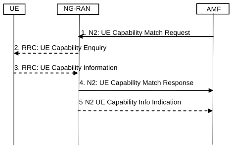

# 4.2.8a UE Capability Match Request procedure

If the AMF requires more information on the UE radio capabilities support to be able to set the IMS voice over PS Session Supported Indication (see clause 5.16.3 of TS 23.501 \[2\]), then the AMF may send a UE Radio Capability Match Request message to the NG-RAN. This procedure is typically used during the registration procedure or when AMF has not received the Voice Support Match Indicator (as part of the 5GMM Context).

Figure 4.2.8a-1: UE Capability Match Request

1\. The AMF indicates whether the AMF wants to receive Voice support match indicator. The AMF may include the UE radio capability information it has previously received from NG-RAN.

2\. Upon receiving the UE Capability Match Request message, if the NG-RAN has not already received the UE radio capabilities from the UE or from AMF in step 1, the NG-RAN requests the UE to upload the UE radio capability information.

3\. The UE provides the NG-RAN with its UE radio capabilities sending the RRC UE Capability Information.

4\. The NG-RAN checks whether the UE radio capabilities are compatible with the network configuration for ensuring voice service continuity of voice calls initiated in IMS.

For determining the appropriate UE Radio Capability Match Response, the NG-RAN is configured by the operator to check whether the UE supports certain capabilities required for Voice continuity of voice calls using IMS PS. In a shared network, the NG-RAN keeps a configuration separately per PLMN.

NOTE 1: What checks to perform depends on network configuration, i.e. following are some examples of UE capabilities to be taken into account:

\- E-UTRAN/NG-RAN Voice over PS capabilities;

\- the Radio capabilities for E-UTRAN/NG-RAN FDD and/or TDD; and/or

\- the support of E-UTRAN/NG-RAN frequency bands;

\- the SRVCC from NG-RAN to UTRAN capabilities and the support of UTRAN frequency bands.

NOTE 2: The network configuration considered in the decision for the Voice Support Match Indicator is homogenous within a certain area (e.g. AMF Set) in order to guarantee that the Voice Support Match Indicator from the NG-RAN is valid within such area.

The NG-RAN provides a Voice Support Match Indicator to the AMF to indicate whether the UE capabilities and networks configuration are compatible for ensuring voice service continuity of voice calls initiated in IMS.

The AMF stores the received Voice support match indicator in the 5GMM Context and uses it as an input for setting the IMS voice over PS Session Supported Indication.

5\. If NG-RAN requested radio capabilities from UE in step 2 and 3, the NG-RAN also sends the UE radio capabilities to the AMF. The AMF stores the UE radio capabilities without interpreting them for further provision to the NG-RAN according to clause 5.4.4.1 of TS 23.501 \[2\].

NOTE 3: Steps 4 and 5 could be received by the AMF in any order.
