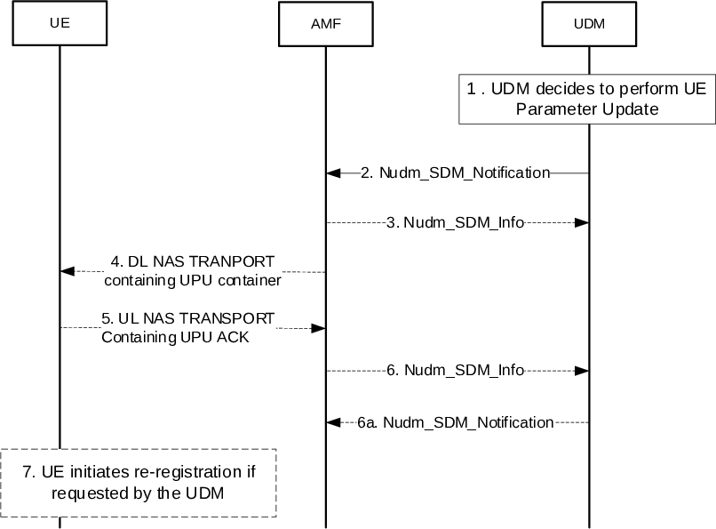

# 4.20 UE Parameters Update via UDM Control Plane Procedure

## 4.20.1 General

The purpose of the control plane solution for update of UE parameters is to allow the HPLMN, SNPN, or CH to update the UE with a specific set of parameters, generated and stored in the UDM, by delivering protected UDM Update Data via NAS signalling. The HPLMN, SNPN, or CH updates such parameters based on the operator policies.

The UDM Update Data that the UDM delivers to the UE may contain:

\- one or more UE parameters including:

\- the updated Default Configured NSSAI (final consumer of the parameter is the ME);

\- the updated Routing Indicator Data (final consumer of the parameter is the USIM when the related credential is stored in the USIM, i.e. for PLMN or SNPN credentials; or final consumer of the parameter is the ME when the related credential is stored in the ME, i.e. for SNPN credentials);

\- indication of whether disaster roaming is enabled in the UE if UE MINT support indicator is received or UE is registered for Disaster Roaming service currently; and

\- indication of 'applicability of "lists of PLMN(s) to be used in disaster condition" provided by a VPLMN' if UE MINT support indicator is received or UE is registered for Disaster Roaming service currently.

\- a "UE acknowledgement requested" indication.

\- a "re-registration requested" indication.

## 4.20.2 UE Parameters Update via UDM Control Plane Procedure

Figure 4.20.2-1: UE Parameters Update via UDM Control Plane Procedure

1\. UDM decides to perform UE parameter update.

2\. From UDM to the AMF: The UDM notifies the changes of the information related to the UE to the affected AMF by the means of invoking Nudm_SDM_Notification service operation. The Nudm_SDM_Notification service operation contains the UDM Update Data that needs to be delivered transparently to the UE over NAS within the Access and Mobility Subscription data. The UDM Update Data includes:

\- The updated parameters to be delivered to the UE (see clause 4.20.1 for parameters possible to deliver).

\- whether the UE needs to send an ack to the UDM.

\- whether the UE needs to re-register after updating the data.

If the UE parameter update is performed due to "Routing Indicator update data" and the updated Routing Indicator value is not supported by the UDM where the AMF is currently registered, the UDM shall request the UE to re-register after updating the data.

3\. From AMF to UDM: If AMF determines that the UE is not reachable, then AMF invokes the Nudm_SDM_Info service operation to UDM indicating that the transmission of UE Parameters Update data is not successful. The UDM considers the procedure as UE Parameters Update procedure as pending and subsequent steps from 4-7 are skipped.

4\. From AMF to the UE: the AMF sends a DL NAS TRANSPORT message to the served UE. The AMF includes in the DL NAS TRANSPORT message the transparent container received from the UDM.

The UE verifies based on mechanisms defined in TS 33.501 \[15\] that the UDM Update Data is provided by HPLMN, SNPN, or CH; and:

\- If the security check on the UDM Update Data is successful, as defined in TS 33.501 \[15\] the UE either stores the information and uses those parameters from that point onwards, or forwards the information to the USIM; and

\- If the security check on the UDM Update Data fails, the UE discards the contents of the UDM Update Data.

5\. The UE to the AMF: If the UE has verified that the UDM Update Data is provided by HPLMN, SNPN, or CH and the UDM has requested the UE to send an ack to the UDM, the UE sends an UL NAS TRANSPORT message to the serving AMF with a transparent container including the UE acknowledgement.

6\. The AMF to the UDM: If the AMF receives an UL NAS TRANSPORT message with a transparent container carrying a UE acknowledgement from the UE, the AMF sends a Nudm_SDM_Info request message including the transparent container to the UDM.

6a. If the UE parameter update is performed due to "Routing Indicator update data", the updated Routing Indicator value is also supported by the UDM where the AMF is currently registered and the UDM requests the UE to send an ack but does not request the UE to re-register, then upon reception of the transparent container indicating the acknowledgement of successful reception, the UDM shall trigger a Nudm_SDM_Notification service operation to update the UE Context in the AMF with the updated Routing Indicator Data (e.g. to avoid transmitting an outdated Routing Indicator on UE context transfer to another AMF).

7\. If the UDM has requested the UE to re-register, the UE waits until it goes back to RRC_IDLE and initiates a Registration procedure as defined in TS 24.501 \[25\].

## 4.20.3 Void
