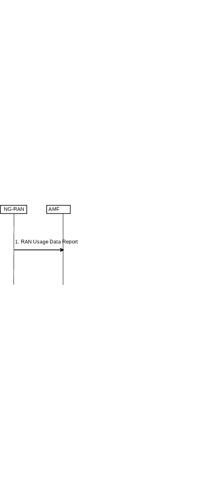
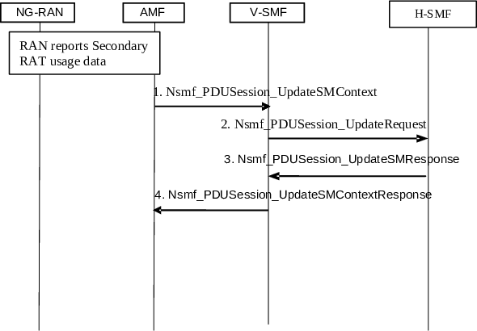

# 4.21 Secondary RAT Usage Data Reporting Procedure

The procedure in Figure 4.21-1 may be used to report Secondary RAT Usage Data from NG-RAN node to the AMF. It is executed by the NG-RAN node to report the Secondary RAT Usage Data information towards AMF which is then reported towards SMF.

The procedure in Figure 4.21-2 may be used to report the Secondary RAT Usage Data from AMF towards the SMF. Optionally, it is used to report the Secondary RAT Usage Data from V-SMF to the H-SMF when the reporting to H-SMF is activated.

Figure 4.21-1: RAN Secondary RAT Usage Data Reporting procedure

1\. The NG-RAN, if it supports Dual Connectivity with Secondary RAT (using NR radio, E-UTRA radio, or unlicensed spectrum using NR or E-UTRA radio) and it is configured to report Secondary RAT Usage Data for the UE, depending on certain conditions documented in this specification, it shall send a RAN Usage Data Report message to the AMF including the Secondary RAT Usage Data for the UE. The NG-RAN node will send only one RAN Usage Report for a UE when the UE is subject to handover by RAN. The RAN Usage Data Report includes a Handover Flag to indicate when the message is sent triggered by a handover.

Figure 4.21-2: SMF Secondary RAT Usage Data Reporting procedure

The NG-RAN, if it supports Dual Connectivity with Secondary RAT (using NR radio, E-UTRA radio, or unlicensed spectrum using NR or E-UTRA radio) and it is configured to report Secondary RAT usage data for the UE, it shall include the Secondary RAT usage data for the UE to the AMF in certain messages depending on certain conditions documented elsewhere in this TS.

1\. The AMF forwards the N2 SM Information (Secondary RAT Usage Data) to the SMF in a Nsmf_PDUSession_UpdateSMContext Request.

2\. The V-SMF sends the Nsmf_PDUSession_Update (Secondary RAT Usage Data) message to the H-SMF.

3\. The H-SMF acknowledges receiving the Secondary RAT Usage data for the UE.

4\. The V-SMF acknowledges receiving the Secondary RAT Usage data back to the AMF.
