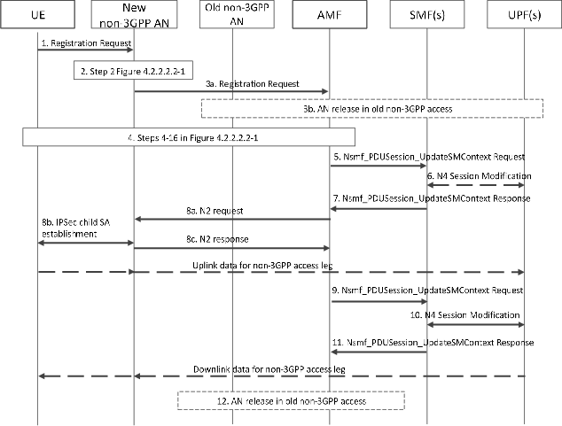

# 4.22.9 Connection, Registration and Mobility Management procedures

## 4.22.9.1 Registration procedures

Support for using the Registration procedures for non-3GPP access path switching is described in clause 4.22.9.5.

The signalling flow for a Registration is based on the signalling flow in Figure 4.2.2.2.2-1 with the following differences and clarifications:

\- In step 1, if the UE wants to re-activate the user plane of the MA PDU Session(s) over the access the Registration message is sent to, the UE indicates PDU Session ID(s) of the MA PDU Session(s) in the List Of PDU Sessions To Be Activated.

If the UE locally releases the MA PDU Session(s) in both accesses, the UE indicates it in the PDU Session Status. If the AMF receives the PDU Session Status and finds mismatch, regardless of roaming mode of the MA PDU Session(s) (i.e. non-roaming, local breakout roaming, home routed roaming in the same PLMN or home routed roaming in different PLMNs), the AMF invokes Nsmf_PDUSession_ReleaseSMContext service towards the SMF(s) in order to release any network resources related to the MA PDU Session(s).

\- In step 4, the old AMF determines whether the new AMF support ATSSS or not based on the supported features provided by the new AMF.

\- In step 5, if the old AMF determined in step 4 that the new AMF does not support ATSSS, the old AMF does not include the PDU Session context of the MA PDU Session(s) in the UE context transferred to the new AMF.

\- If the old AMF has not included MA PDU Session(s) in the UE context in step 5, the old AMF informs the corresponding SMF(s) to release the MA PDU Session(s) by invoking the Nsmf_PDUSession_ReleaseSMContext service operation as described in clause 4.22.10.

\- In step 21, the AMF provides an MA PDU Session Support indicator in Registration Accept message to inform the UE whether ATSSS is supported or not. The UE uses this indicator to determine whether an MA PDU session related procedure can be initiated or not, as described in clause 4.22.1.

In step 17, if the UE indicated to re-activate MA PDU Session(s) in the List Of PDU Sessions To Be Activated the AMF includes access type which the Registration Request message is received on when the AMF triggers Nsmf_PDUSession_UpdateSMContext service operation. The SMF only re-activates user plane resources of the access type the Registration Request message is received on.

\- In step 21, the AMF indicates to the UE whether it supports non-3GPP access path switching.

\- In step 22, if the AMF indicates that the PDU Session(s) has been released in the PDU Session Status to the UE in Registration Accept message, the UE removes locally any internal resources related to the MA PDU Session(s) that are not marked as established.

## 4.22.9.2 UE Triggered Service Request

The signalling flow for a UE Triggered Service Request is based on the signalling flow in Figure 4.2.3.2-1 with the following differences and clarifications:

\- In step 1, if the UE wants to re-activate the user plane of the MA PDU Session(s) over the access the Service Request message is sent to, the UE indicates PDU Session ID(s) of the MA PDU Session(s) in the List Of PDU Sessions To Be Activated.

If the UE locally releases the MA PDU Session(s), the UE indicates it in the PDU Session Status. If the AMF receives the PDU Session Status and finds mismatch, regardless of roaming mode of the MA PDU Session (i.e. non-roaming, local breakout roaming, home routed roaming in the same PLMN or home routed roaming in different PLMNs), the AMF invokes Nsmf_PDUSession_ReleaseSMContext service towards the SMF(s) in order to release any network resources related to the MA PDU Session(s).

In step 4, if the UE indicated to re-activate MA PDU Session(s) in the List Of PDU Sessions To Be Activated the AMF includes access type which the Service Request message is received on when the AMF triggers Nsmf_PDUSession_UpdateSMContext service operation. The SMF only re-activates user plane resources of the access type the Service Request message is received on.

\- In step 12, if the AMF indicates that the PDU Session(s) has been released in the PDU Session Status to the UE in Service Accept message, the UE removes locally any internal resources related to the MA PDU Session(s) that are not marked as established.

NOTE: For an MA PDU session established when UE was registered on only one access, during the registration on the second access, the AMF does not notify the SMF (for this MA PDU session) that the UE is now registered on the second access since this will occur later, i.e. when the UE sends the second PDU Session Establishment Request to add user plane resources.

## 4.22.9.3 N2 based handover

Inter NG-RAN node N2 based handover, as described in clauses 4.9.1.3.2 and 4.9.1.3.3, is supported for the 3GPP access with the differences and clarifications described below.

\- In step 2 of clause 4.9.1.3.2, the S-AMF determines whether or not the T-AMF supports ATSSS based on the supported features of the T-AMF provided by NRF or based on local configuration.

\- In step 3 of clause 4.9.1.3.2, if the S-AMF determined in step 2 that the T-AMF does not support ATSSS, the S-AMF does not include the PDU Session context of the MA PDU Session(s) in the UE context transferred to the T-AMF.

\- After step 6a of clause 4.9.1.3.3, if the S-AMF has not included MA PDU Session(s) in the UE context in step 3 of clause 4.9.1.3.2, the S-AMF informs the corresponding SMF(s) to release the MA PDU Session(s) by invoking the Nsmf_PDUSession_ReleaseSMContext service operation as described in clause 4.22.10.

## 4.22.9.4 Network Triggered Service Request

The signalling flow for a Network Triggered Service Request is based on the signalling flow in Figure 4.2.3.3-1 with the following differences and clarifications:

\- In step 2a, the SMF determines over which access (3GPP access or non-3GPP access or both accesses) the user plane resources need to be activated for the MA PDU Session. The SMF may consider Steering Mode to determine the target access.

\- In step 3a, the SMF indicates to the AMF the access type (3GPP access or non-3GPP access) over which the user plane resources are to be activated for the MA PDU Session.

NOTE 1: If the SMF determines to activate both accesses, the SMF performs this step two times, i.e. one for 3GPP access and the other one for non-3GPP access.

In the case of DN-AAA or SMF initiated Secondary re-authentication procedure, when the SMF invokes the Namf_Communication_N1N2MessageTransfer service operation, SMF may indicate the target access type of sending N1 NAS message to the UE.

\- In step 4, the AMF considers the MA PDU Session is associated with the access type the SMF has indicated in step 3a.

The AMF determines the access type of which to send the N1 NAS message to the UE based on the target access type value if received from the SMF in step 3a. If the AMF does not receive a target access type value and the UE is CM-CONNECTED in both accesses, the AMF determines the target access type.

\- In step 5, if the SMF requested to re-activate user-plane resources over 3GPP access and the AMF has determined the UE is unreachable over 3GPP access (e.g. the AMF receives no response from the UE to the Paging), the AMF shall notify that the UE is unreachable. The (H-) SMF shall indicate the Anchor UPF that the user-plane resources on 3GPP access is unavailable by triggering N4 Session Modification procedure. Further action by the UPF is implementation dependent.

If the SMF requested to re-activate the user-plane resources over non-3GPP access and the AMF has determined the UE is unreachable over non-3GPP access (e.g. the UE is in CM-IDLE on non-3GPP access), the AMF shall reject the request from the SMF. The (H-) SMF shall indicate the Anchor UPF that the user-plane resources on non-3GPP access is unavailable by triggering N4 Session Modification procedure. Further action by the UPF is implementation dependent.

If this procedure is triggered for Secondary Re-authentication and UE and SMF+PGW-C supports for DN authentication and authorization over EPC as described in clause 5.4.4b, SMF+PGW-C selects one access type from non-3GPP access connected to 5GC or 3GPP access connected to EPC in step 3a. If the SMF+PGW-C receives failure indication from the AMF or MME that UE is unreachable then SMF+PGW-C retries by sending it to the other access type. Only when the failure is received from both AMF and MME, then SMF+PGW-C informs the DN-AAA Server that UE is not reachable for re-authentication according to clauses 4.3.2.3 and H.2.1.

NOTE 2: The provision of access availability/unavailability reports via user plane specified in clause 5.32.5.3 is UE implementation dependent. Such reporting by UE to UPF, can assist Anchor UPF to decide on handling DL traffic for the UE.

## 4.22.9.5 Registration procedures for non-3GPP access path switching

If the UE supports non-3GPP access path switching and the AMF indicates that the network supports non-3GPP access path switching as described in clause 4.22.2, the UE may trigger a Mobility Registration Update via a new non-3GPP access to switch traffic from an old non-3GPP access (i.e. TNGF or N3IWF) to the new non-3GPP access (i.e. TNGF or N3IWF) if the PLMN of the selected new non-3GPP access is the same PLMN of the old non-3GPP access.

The UE may trigger non-3GPP path switching if the AMF indicated support during registration as described in clause 4.22.9.1, even if the SMF did not indicate support to the UE during the MA PDU Session Establishment.

In this case the Registration procedure described in clause 4.22.9.1 applies with the differences and clarifications described in this clause:

Figure 4.22.9.5-1: Mobility Registration procedure for non-3GPP access path switching

1\. This is the same as step 1 in clause 4.22.9.1, with the following additions:

\- If the UE wants to switch the user plane from an old non-3GPP access to a new non-3GPP access where the Mobility Registration Update is sent, the UE indicates PDU Session ID(s) of the PDU Session(s) in the List Of PDU Sessions To Be Activated. This may include both PDU Session ID(s) corresponding to MA PDU Sessions and single access PDU Sessions.

NOTE 1: The PDU Sessions that are not indicated in the List Of PDU Sessions To Be Activated by the UE are not released but deactivated during the switching procedure. The UE or network can re-activate user plane resources by triggering Service Request procedure after non-3GPP path switching is completed.

The UE may also provide an ("Non-3GPP access path switching while using old AN resources") indication in the Registration Request to indicate that the UP connection(s) via the old non-3GPP access can still be used for the MA PDU Session(s) during the Registration procedure. If the UP connection(s) via the old non-3GPP access cannot be used by the UE during the Registration procedure, the UE shall not provide a "Non-3GPP access path switching while using old AN resources" indication.

The UE shall not perform non-3GPP access path switching if the PLMN of the selected new non-3GPP access is different from the PLMN of the old non-3GPP access.

2\. This is the same as step 2 in Figure 4.2.2.2.2-1.

3\. This is the same as step 3 in Figure 4.2.2.2.2-1 with the following additions:

\- If the UE provided an ("Non-3GPP access path switching while using old AN resources") indication in step 1 and the AMF supports to maintain two N2 connections for non-3GPP access during the Registration procedure and the SMF supports non-3GPP access path switching, the AMF delays the release of the old N2 connection until the UP connection via the new non-3GPP access is established. Otherwise, the AMF may trigger AN release towards the old non-3GPP access before proceeding with the Registration procedure in the new non-3GPP access, as described in clause 4.12.4.2 for untrusted non-3GPP access and clause 4.12a.4.2 for trusted non-3GPP access with the following clarifications:

\- During the AN release procedure, the AMF should notify the SMF to release the UP resources for the activated PDU Sessions before sending the N2 UE Context Release Command to the old non-3GPP access.

\- Due to pending downlink data in the UPF, the SMF may requests to establish user plane resources before non-3GPP path switching is finished. In this case, the AMF may reject the request with an indication that the Namf_Communication_N1N2MessageTransfer has been temporarily rejected. Upon reception of an Namf_Communication_N1N2MessageTransfer response with an indication that its request has been temporarily rejected, the SMF shall start a locally configured guard timer and wait for any message to come from an AMF. Upon reception of a message from an AMF, the SMF shall re-invoke the Namf_Communication_N1N2MessageTransfer (with N2 SM info and/or N1 SM info) to the AMF.

4\. This is the same as steps 4-16 in Figure 4.2.2.2.2-1.

5-11. These steps are the same as step 17 in clause 4.22.9.1, with the following additions:

\- If the Registration procedure is triggered to switch traffic from the old non-3GPP access to the new non-3GPP access and the UE provided an ("Non-3GPP access path switching while using old AN resources") indication in step 1, the AMF, if it supports maintaining two N2 connections for non-3GPP access, forwards this indication to the SMF in case the PDU Session is a MA PDU Session. If the SMF receives this indication, the SMF does not trigger release of the UP connection in the old non-3GPP access towards the old N3IWF or TNGF (if any).

\- In step 7 and 8, the CN Tunnel Info is sent from SMF to the new non-3GPP AN via AMF. The IPSec child SA(s) between UE and the new non-3GPP AN are established.

\- In step 10, the SMF updates the N4 rules by replacing the AN Tunnel Info of the old non-3GPP AN with the AN Tunnel Info of the new non-3GPP AN to instruct the UPF to switch traffic from the old non-3GPP access path to the new non-3GPP access path.

NOTE 2: The resource in the old non-3GPP access, i.e. the old N3IWF or TNGF, will in this case be released by the AMF in step 12.

\- After the UP connection via the new non-3GPP access is established, the UE and UPF start to send traffic via the new non-3GPP access.

12\. After the UP connection has been established in new non-3GPP access, the AMF also triggers AN release towards the old non-3GPP access (i.e. old N3IWF or TNGF), unless done previously with following clarifications:

\- For the PDU Sessions indicated by the old non-3GPP access in the "List of PDU Session ID(s) with active N3 user plane" but not in the List Of PDU Sessions To Be Activated sent by the UE in step 1, the AMF requests the SMF to deactivate the PDU Session(s). For other PDU Sessions, the AMF shall not request the SMF to deactivate the PDU Session(s).

\- When the UE receives Registration Accept over the new non-3GPP access, the UE considers that the UE is deregistered from the old non-3GPP access.

NOTE 3: In order to support RAT restrictions for non-3GPP access in the above procedure, it is assumed that UDM has provided restricted non-3GPP RAT types, if any, in the RAT restriction parameter in AM subscription data. In order to ensure that RAT restrictions are not violated in case the PDU Session is established in LBO roaming scenarios, the AMF in VPLMN may be configured to not indicate support for non-3GPP access path switching for inbound roaming UEs during MA PDU Session Establishment towards a SMF in VPLMN, unless it has been agreed in roaming agreements that non-3GPP access path switching can be supported for such UEs.
