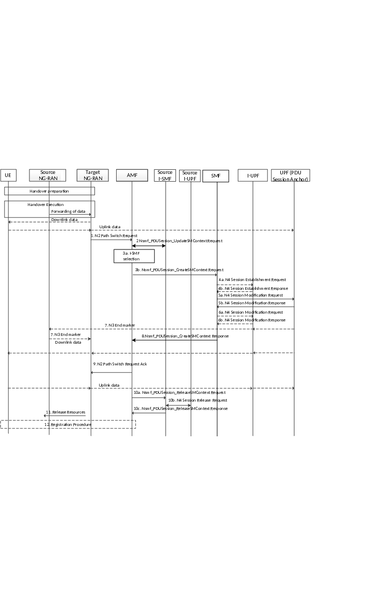

# 4.23.11 Xn based handover

## 4.23.11.1 General

This clause describes the Xn based handover with the insertion, reallocation and removal of I-SMF.

To support the EAS session continuity upon UL CL relocation (allowing the UE to go on exchanging with the source EAS despite the fact that a new UL CL has been allocated to the PDU Session), the N9 forwarding tunnel between the Source UL CL and Target UL CL is established and released as described in clause 4.23.9.4 or clause 4.23.9.5.

## 4.23.11.2 Xn based handover with insertion of intermediate SMF

This procedure is used to hand over a UE from a Source NG-RAN to a Target NG-RAN using Xn interface (in this case the AMF is unchanged) and the AMF decides that insertion of a new intermediate I-SMF is needed. This procedure is used for non-roaming or local breakout roaming scenario.

The call flow is shown in figure 4.23.11.2-1.

Figure 4.23.11.2-1: Xn based inter NG-RAN handover with insertion of intermediate SMF

1\. Step 1 is the same as described in clause 4.9.1.2.2.

2\. For each PDU Session Rejected in the list of PDU Sessions received in the N2 Path Switch Request, the AMF perform same step as step 2 in clause 4.9.1.2.2.

The rest of this procedure applies for each PDU Session To Be Switched.

3a. The AMF checks if an I-SMF needs to be selected as described in clause 5.34.3 of TS 23.501 \[2\].

3b. If a new I-SMF is selected the AMF sends Nsmf_PDUSession_CreateSMContext Request (SUPI, AMF ID, SMF ID, SM Context ID, PDU Session To Be Switched with N2 SM Information (Secondary RAT usage data), UE Location Information, UE presence in LADN service area) to the new selected I-SMF.

4\. The new I-SMF sends Nsmf_PDUSession_Context Request (SM context type, SM Context ID) to SMF to retrieve the SM Context.

The new I-SMF uses SM Context ID received from AMF for this service operation. SM context type indicates that the requested information is all SM context, i.e. PDN Connection Context and 5G SM context. The SM Context ID is used by the recipient of Nsmf_PDUSession_Context Request in order to determine the targeted PDU Session.

5a. I-SMF to I-UPF: N4 Session Establishment Request (Target NG-RAN Tunnel Info).

The I-SMF then selects a I-UPF based on UPF Selection Criteria according to clause 6.3.3 of TS 23.501 \[2\]. An N4 Session Establishment Request message is sent to the I-UPF. The target NG-RAN Tunnel Info is included in the N4 Session Establishment Request message.

5b. I-UPF to I-SMF: N4 Session Establishment Response.

The I-UPF sends an N4 Session Establishment Response message to the I-SMF. The UL CN Tunnel Info and DL CN Tunnel Info of I-UPF are sent to the I-SMF.

6\. I-SMF to SMF: Nsmf_PDUSession_Create Request to the SMF (SUPI, PDU Session ID, Secondary RAT usage data, UE Location Information, UE presence in LADN service area, DL CN Tunnel Info of the I-UPF, DNAI list supported by the I-SMF).

The I-SMF provides the DNAI list it supports to the SMF as defined in Figure 4.23.9.1-1 step 1.

Secondary RAT usage data is extracted from N2 SM Information within PDU Session To Be Switched received from NG RAN.

7a. SMF to UPF (PSA): N4 Session Modification Request (DL CN Tunnel Info of the I-UPF).

The SMF provides the DL CN Tunnel Info of the I-UPF to the UPF(PSA).

If old I-UPF controlled by SMF does not exist and if different CN Tunnel Info need to be used by PSA UPF, i.e. the CN Tunnel Info at the PSA for N3 and N9 are different, the CN Tunnel Info at the PSA for N9 needs to be allocated. The CN Tunnel Info is provided from UPF to SMF in the response.

7b. UPF (PSA) to SMF: N4 Session Modification Response.

The PDU Session Anchor responds with the N4 Session Modification Response message after requested PDU Sessions are switched. At this point, PDU Session Anchor starts sending downlink packets to the Target NG-RAN via I-UPF.

PDU Session Anchor sends one or more "end marker" packets for each N3/N9 tunnel on the old path immediately after switching the path, the source NG-RAN shall forward the "end marker" packets to the target NG-RAN.

8\. In order to assist the reordering function in the Target NG-RAN, the PDU Session Anchor sends one or more "end marker" packets for each N3/N9 tunnel on the old path immediately after switching the path, the source NG-RAN shall forward the "end marker" packets to the target NG-RAN.

9\. SMF to I-SMF: Nsmf_PDUSession_Create Response(Information for local traffic steering location, CN Tunnel Info at the PSA for N9, updated CN PDB in the QoS parameters for accepted QoS Flows).

The SMF may update the CN PDB in the response or using a separate PDU Session Modification procedure, based on local configuration.

9a. If the CN Tunnel Info at PSA for N9 is allocated, it is included in the response and the I-SMF provides the CN Tunnel Info at the PSA for N9 to I-UPF via N4 Session Modification Request.

In the case of I-SMF insertion and the PDU session corresponds to a LADN, the SMF shall release the PDU session after the handover procedure is completed.

10\. I-SMF to AMF: Nsmf_PDUSession_CreateSMContext Response (UL CN Tunnel Info of the I-UPF, updated CN PDB in the QoS parameters for accepted QoS Flows).

The SMF sends an Nsmf_PDUSession_CreateSMContext response to the AMF.

11-13. Steps 11-13 are same as steps 7-9 defined in clause 4.9.1.2.2 with the following addition:

If a Source I-UPF controlled by SMF was serving the PDU Session, the SMF initiates Source I-UPF Release procedure by sending an N4 Session Release Request toward the Source I-UPF.

## 4.23.11.3 Xn based handover with re-allocation of intermediate SMF

This procedure is used to hand over a UE from a Source NG-RAN to a Target NG-RAN using Xn interface (in this case the AMF is unchanged) and the AMF decides that the intermediate SMF(I-SMF) is to be changed. This procedure is used for non-roaming or local breakout roaming scenario. In the case of home routed roaming scenario, this procedure is also used except the I-SMF is replaced by V-SMF.

The call flow is shown in figure 4.23.11.3 -1.

Figure 4.23.11.3-1: Xn based inter NG-RAN handover with intermediate I-SMF re-allocation

1-3. Steps 1-3 are same as steps 1-3 described in clause 4.23.11.2 except that in step 2 the AMF sends Nsmf_PDUSession_UpdateSMContext Request to source I-SMF and then the source I-SMF sends the Nsmf_PDUSession_Update Request to SMF.

4\. The target I-SMF sends Nsmf_PDUSession_Context Request to Source I-SMF to retrieve 5G SM Context.

5a-11. Steps 5a-11 are same as steps 5a-11 described in clause 4.23.11.2 with the following difference:

In step 6, the target I-SMF invokes Nsmf_PDUSession_Update Request (Secondary RAT usage data, UE Location Information, UE presence in LADN service area, DL CN Tunnel Info of the I-UPF, DNAI list supported by target I-SMF) toward the SMF;

In step 9, the SMF respond with Nsmf_PDUSession_Update Response. The SMF may provide the DNAI(s) of interest for this PDU Session to I-SMF as described in step 1 of Figure 4.23.9.1-1. The SMF may update the CN PDB in the response or using a separate PDU Session Modification procedure, based on local configuration.

Secondary RAT usage data is extracted from PDU Session To Be Switched with N2 SM Information received from NG RAN.

12a. The AMF sends Nsmf_PDUSession_ReleaseSMContext Request (I-SMF only indication) to source I-SMF. The source I-SMF removes the SM context of this PDU session. An indication is included in this message to avoid invoking resource release in SMF.

12b. The source I-SMF sends N4 Session Release to release the resource in source I-UPF. If the source I-UPF acts as UL CL and is not co-located with local PSA, the source I-SMF also sends N4 Session Release to the local PSA to release the resource for the PDU Session.

13-14. Steps 13-14 are same as steps 12-13 described in clause 4.23.11.2.

## 4.23.11.4 Xn based handover with removal of intermediate SMF

This procedure is used to hand over a UE from a Source NG-RAN to a Target NG-RAN using Xn interface(in this case the AMF is unchanged) and the AMF decides that removal of intermediate I-SMF is needed. This procedure is used for non-roaming or local breakout roaming scenario.

The call flow is shown in figure 4.23.11.4-1.

Figure 4.23.11.4-1: Xn based inter NG-RAN handover with removal of intermediate SMF

1\. Step 1 is the same as described in clause 4.9.1.2.2.

2\. For each PDU Session Rejected in the list of PDU Sessions received in the N2 Path Switch Request, the AMF sends Nsmf_PDUSession_UpdateSMContext Request to source I-SMF and then the source I-SMF sends the Nsmf_PDUSession_Update Request to SMF forwarding the failure cause. The SMF decides whether to release the PDU Session.

The rest of this procedure applies for each PDU Session To Be Switched.

3a. The AMF performs I-SMF selection as described in clause 5.34.3 of TS 23.501 \[2\] and the AMF decides to remove I-SMF in this case.

3b. The AMF sends Nsmf_PDUSession_CreateSMContext Request (SUPI, PDU Session ID, AMF ID, PDU Session To Be Switched with N2 SM Information (Secondary RAT usage data), UE Location Information, UE presence in LADN service area, Target NG-RAN Tunnel Info) to the SMF.

4a. \[Conditional\] SMF to I-UPF: N4 Session Establishment Request (Target NG-RAN Tunnel Info, UL CN Tunnel Info of the UPF (PSA)).

The SMF may select an I-UPF based on UPF Selection Criteria according to clause 6.3.3 of TS 23.501 \[2\]. If an I-UPF is selected, an N4 Session Establishment Request message is sent to the I-UPF. The target NG-RAN Tunnel Info is included in the N4 Session Establishment Request message.

4b. I-UPF to SMF: N4 Session Establishment Response.

The I-UPF sends an N4 Session Establishment Response message to the I-SMF. The UL and DL CN Tunnel Info of I-UPF is sent to the I-SMF.

5a. SMF to UPF (PSA): N4 Session Modification Request (DL CN Tunnel Info of the I-UPF if I-UPF is selected, or Target NG-RAN Tunnel Info if I-UPF is not selected).

The SMF provides the DL CN Tunnel Info of the I-UPF to the UPF (PSA) if I-UPF is selected.

If an I-UPF is not selected, the SMF provides the target NG-RAN Tunnel Info to the UPF (PSA). If different CN Tunnel Info need to be used by PSA UPF, i.e. the CN Tunnel Info for N3 and N9 are different, the SMF retrieves the new CN Tunnel Info from UPF.

5b. UPF (PSA) to SMF: N4 Session Modification Response.

If different CN Tunnel Info needs to be used by PSA UPF, i.e. the CN Tunnel Info for N3 and N9 are different, the CN Tunnel Info is allocated by the UPF and provided to the SMF.

The PDU Session Anchor responds with the N4 Session Modification Response message after requested PDU Sessions are switched. PDU Session Anchor sends one or more "end marker" packets for each N3/N9 tunnel on the old path immediately after switching the path, the source NG-RAN shall forward the "end marker" packets to the target NG-RAN. At this point, PDU Session Anchor starts sending downlink packets to the Target NG-RAN via I-UPF.

6a. \[Conditional\] SMF to I-UPF: N4 Session Modification Request (UL CN Tunnel Info of the UPF (PSA)).

If the UL CN Tunnel Info of the UPF (PSA) has been changed, the SMF provides the UL CN Tunnel Info of the UPF (PSA) to I-UPF.

6b. I-UPF to SMF: N4 Session Modification Response.

The I-UPF responds with the N4 Session Modification Response message.

7\. In order to assist the reordering function in the Target NG-RAN, the PDU Session Anchor sends one or more "end marker" packets for each N3/N9 tunnel on the old path immediately after switching the path, the source NG-RAN shall forward the "end marker" packets to the target NG-RAN.

8\. SMF to AMF: Nsmf_PDUSession_CreateSMContext Response (UL CN Tunnel Info of the I-UPF if I-UPF is selected, or CN Tunnel Info (on N3) of UPF (PSA) if I-UPF is not selected, updated CN PDB in the QoS parameters for accepted QoS Flows). The SMF may update the CN PDB in the response or using a separate PDU Session Modification procedure, based on local configuration.

The SMF sends an Nsmf_PDUSession_CreateSMContext response to the AMF.

9\. Step 9 is same as step 7 defined in clause 4.9.1.2.2.

10a. AMF to source I-SMF: Nsmf_PDUSession_ReleaseSMContext request (I-SMF only Indication).

The AMF sends Nsmf_PDUSession_ReleaseSMContext request to source I-SMF. The I-SMF only indication is included in this message to avoid invoking resource release in SMF.

10b. Source I-SMF to source I-UPF: N4 Session Release Request/Response.

The source I-SMF sends N4 Session Release Request to source I-UPF in order to release resources for the PDU Session.

10c. Source I-SMF to AMF: Nsmf_PDUSession_ReleaseSMContext Response.

The source I-SMF responds to AMF with Nsmf_PDUSession_ReleaseSMContext response.

11-12. Steps 11-12 are same as steps 8-9 defined in clause 4.9.1.2.2.

## 4.23.11.5 Xn based handover without change of intermediate SMF

When both I-SMF and SMF are available for a PDU Session and no I-SMF change or removal is needed during Xn based handover procedure, compared to the procedure defined in clause 4.9.1.2.2 and clause 4.9.1.2.4 the SMF is replaced with the I-SMF.
