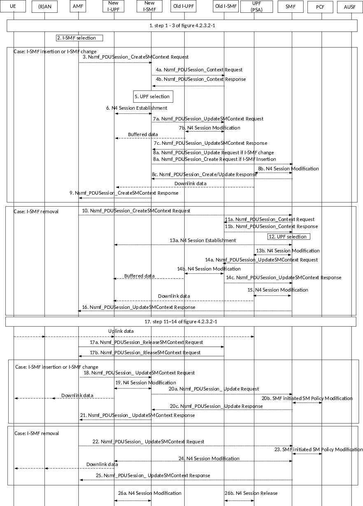

# 4.23.4 Service Request procedures

## 4.23.4.1 General

The following two scenarios are considered:

\- The I-SMF is available for the PDU Session and I-SMF is not changed or removed during the service request procedure. The procedure to support this scenario is described in clause 4.23.4.2.

\- The I-SMF is inserted, changed or removed during service request procedure. The procedure to support this scenario is described in clause 4.23.4.3.

When the AMF receives the service request message, for each PDU Session to be activated based on the service area information of SMF and the location where the UE camped the AMF determines which procedure is used.

## 4.23.4.2 UE Triggered Service Request without I-SMF change/removal

When both I-SMF and SMF are available for a PDU session and no I-SMF change or removal is needed during the service request procedure, the procedure in this clause is used. Compared to the procedure in clause 4.2.3.2, the SMF is replaced with the I-SMF and the impacted intermediate UPF(s) are UPFs that are controlled by I-SMF. Difference are captured below:

\- Steps 6a-6b, these steps are not needed as the CN Tunnel Info of UPF (PSA) allocated for N9 is available at the I-SMF when the I-SMF is inserted.

\- Step 7a, if a new intermediate UPF is selected, the I-SMF invokes Nsmf_PDUSession_Update Request (DN Tunnel Info of the new intermediate UPF. The I-SMF may also include UE location Information, Time Zone RAT type, Access Type and Operation Type set to "UP Activate", if those information is changed and need to be notified to SMF. If DL Tunnel Info of new intermediate UPF is received, the SMF provides the DL Tunnel Info of new intermediate UPF received from I-SMF to UPF(PSA).

\- Step 10, this step does not apply as in this scenario the I-UPF is always needed.

\- Step 16, If the I-SMF needs to update SMF with e.g. change of UE location information, change of Time Zone, change of RAT type and/or change of Access type, the I-SMF invokes Nsmf_PDUSession_Update Request to send User Location Information, Time Zone, RAT type and/or Access Type to SMF. If the I-SMF invoked Nsmf_PDUSession_Update Request in step 7a with Operation Type "UP Activate", the I-SMF also includes an Operation Type set to "UP Activated".

If dynamic PCC is deployed and if Policy Control Request Trigger condition(s) have been met (e.g. change of Access Type, change of UE location), the SMF performs SMF initiated SM Policy Modification procedure as defined in clause 4.16.5.1 and may get the updated policy.

\- Steps 18a-18b, these steps do not apply as in this scenario the I-UPF is always needed.

\- Step 21a, this step does not apply as in this scenario the I-UPF is always needed.

## 4.23.4.3 UE Triggered Service Request with I-SMF insertion/change/removal

When, as part of a UE Triggered Service Request, I-SMF is to be inserted, changed or removed, the procedure in this clause is used. It includes the following cases:

\- the UE moves from SMF service area to new I-SMF service area, a new I-SMF is inserted (i.e. I-SMF insertion); or

\- the UE moves from old I-SMF service area to new I-SMF service area, the I-SMF is changed (i.e. I-SMF change); or

\- the UE moves from old I-SMF service area to SMF service area, the old I-SMF is removed (i.e. I-SMF removal).

If the service request is triggered by network due to downlink data and a new I-UPF is selected, forwarding tunnel is established between the old I-UPF(if the old I-UPF is different from PSA) and the new I-UPF to forward buffered data.

For Home Routed Roaming case, the I-SMF (old and new) and I-UPF (old and new) are located in Visited PLMN, while the SMF and UPF(PSA) are located in the Home PLMN. In this HR roaming case only the case of I-SMF change applies (there is always a V-SMF for the PDU Session).

Figure 4.23.4.3-1: UE Triggered Service Request procedure with I-SMF insertion/change/removal

1\. Same as the steps 1-3 defined clause 4.2.3.2.

2\. The AMF determines whether new I-SMF needs to be selected based on UE location and service area of the SMF, if new I-SMF needs to be selected, the AMF selects a new I-SMF as described in clause 4.23.2.

Case: I-SMF insertion or I-SMF change, steps 3-9 are skipped for I-SMF removal case.

3\. If the AMF has selected a new I-SMF, the AMF sends a Nsmf_PDUSession_CreateSMContext Request (PDU Session ID, SM Context ID, UE location info, Access Type, RAT Type, Operation Type) to the new I-SMF. The SM Context ID points to the old I-SMF in the case of I-SMF change or to SMF in the case of I-SMF insertion.

The AMF Set the Operation Type to "UP activate" to indicate establishment of N3 tunnel User Plane resources for the PDU Session(s). The AMF determines Access Type and RAT Type based on the Global RAN Node ID associated with the N2 interface.

If the UE Time Zone has changed compared to the last reported UE Time Zone then the AMF shall include the UE Time Zone IE in this message.

4a. The new I-SMF retrieves SM Context from the old I-SMF (in the case of I-SMF change) or SMF (in the case of I-SMF insertion) by invoking Nsmf_PDUSession_Context Request (SM context type, SM Context ID). The new I-SMF uses SM Context ID received from AMF for this service operation. SM Context ID is used by the recipient of Nsmf_PDUSession_Context Request in order to determine the targeted PDU Session. SM context type indicates that the requested information is all SM context, i.e. PDN Connection Context and 5G SM context.

4b. The old I-SMF in the case of I-SMF change or SMF in the case of I-SMF insertion responds with the SM context of the indicated PDU Session.

If there is Extended Buffering is applied and the Extended Buffering timer is still running in old-SMF or old I-UPF, or the service request is triggered by downlink data, the old I-SMF or SMF includes a forwarding indication in the response to indicate that a forwarding tunnel is needed for sending buffered downlink packets. For I-SMF insertion, if I-UPF controlled by SMF was available for the PDU Session, the SMF includes a forwarding indication.

5\. The new I-SMF selects a new I-UPF: Based on the received SM context, e.g. S-NSSAI and UE location information, the new I-SMF selects a new I-UPF as described in clause 6.3.3 of TS 23.501 \[2\].

6\. The new I-SMF initiates a N4 Session Establishment to the new I-UPF. The new I-UPF provide tunnel endpoints to the new I-SMF.

If forwarding indication was received, the new I-SMF also requests the new I-UPF to allocate tunnel endpoints to receive the buffered DL data from the old I-UPF and to indicate end marker reception on this tunnel via usage reporting. In this case, the new I-UPF begins to buffer the downlink packet(s) received from the UPF (PSA).

7a. If the tunnel endpoints for the buffered DL data were allocated, the new I-SMF invokes Nsmf_PDUSession_UpdateSMContext Request (tunnel endpoints for buffered DL data) to the old I-SMF in the case of I-SMF change in order to establish the forwarding tunnel. The new I-SMF uses the SM Context ID received from AMF for this service operation.

7b. The old I-SMF, in the case of I-SMF change initiates a N4 session modification to the old I-UPF to send the tunnel endpoints for buffered DL data to the old I-UPF. After this step, the old I-UPF starts to send buffered DL data to the new I-UPF.

If the old I-UPF receives end marker packets and there is no associated tunnel to forward these packets, the old I-UPF discards the received end marker packets and does not send any Data Notification to SMF.

7c. The old I-SMF, in the case of I-SMF change responds the new I-SMF with Nsmf_PDUSession_UpdateSMContext response.

8a. In the case of I-SMF change, the new I-SMF invokes Nsmf_PDUSession_Update Request (SM Context ID, new I-UPF DL tunnel information, SM Context ID at I-SMF, Access Type, RAT Type, DNAI list supported by the new I-SMF, Operation Type) towards the SMF. The new I-SMF uses the SM Context ID at SMF received from old I-SMF for this service operation.

In the case of I-SMF insertion, the new I-SMF invokes Nsmf_PDUSession_Create Request (new I-UPF DL tunnel information, new I-UPF tunnel endpoint for buffered DL data, SM Context ID at I-SMF, Access Type, RAT type, DNAI list supported by the new I-SMF, Operation Type) towards the SMF.

The SM Context ID at I-SMF is to be used by the SMF for further PDU Session operation, e.g. to notify the new I-SMF of PDU Session Release. If SM Context ID at the I-SMF exists (i.e. in the case of I-SMF change), the SMF shall replace the SM Context ID at I-SMF.

The new I-UPF tunnel endpoint for buffered DL data is used to establish the forwarding tunnel (from old I-UPF controlled by SMF to new I-UPF controlled by new I-SMF).

If the old I-UPF receives end marker packets and there is no associated tunnel to forward these packets, the old I-UPF discards the received end marker packets and does not send any Data Notification to SMF.

The Operation Type is set to "UP activate" to indicate that User Plane resource for the PDU Session is to be established.

8b. The SMF initiates N4 Session Modification toward the PDU Session Anchor UPF. During this step:

\- The SMF provides the new I-UPF DL tunnel information.

\- If different CN Tunnel Info need be used by PSA UPF, i.e. the CN Tunnel Info at the PSA for N3 and N9 are different, a CN Tunnel Info for the PDU Session Anchor UPF is allocated.

\- For I-SMF insertion, if a new I-UPF tunnel endpoint for buffered DL data is received, the SMF triggers the transfer of buffered DL data to the new I-UPF tunnel endpoint for buffered DL data.

If the DL tunnel information has changed, the SMF indicates the UPF (PSA) to send one or more "end marker" packets for each N9 tunnel to the old I-UPF immediately after switching the path to new I-UPF. From now on the PDU Session Anchor UPF begins to send the DL data to the new I-UPF as indicated in the new I-UPF DL tunnel information. The UPF (PSA) sends one or more "end marker" packets for each N9 tunnel to the old I-UPF immediately after switching the path to new I-UPF. If indicated by the new I-SMF in step 6, the new I-UPF reports to SMF when "end marker" has been received. The new SMF initiates N4 Session Modification procedure to indicate the new I-UPF to send the DL packet(s) received from the UPF (PSA).

8c. The SMF responds to the new I-SMF with Nsmf_PDUSession_Update Response (the DNAI(s) of interest for this PDU Session in the case of I-SMF change) or Nsmf_PDUSession_Create Response (the DNAI(s) of interest for this PDU Session, Tunnel Info at UPF(PSA) for UL data in the case of I-SMF insertion if it is allocated in step 8b).

In the case of I-SMF insertion and the PDU session corresponds to a LADN, the SMF shall release the PDU session after the service request procedure is completed.

In the case of I-SMF insertion the SMF starts a timer to release resource, i.e. resource for the indirect data forwarding tunnel.

In the case of I-SMF insertion and the CN Tunnel Info at PSA for N9 is received in the response, I-SMF provides the CN Tunnel Info at the PSA for N9 to I-UPF via N4 Session Modification Request.

9\. The new I-SMF sends a Nsmf_PDUSession_CreateSMContext Response (N2 SM information (PDU Session ID, QFI(s), QoS profile(s), CN N3 Tunnel Info, S-NSSAI, User Plane Security Enforcement, UE Integrity Protection Maximum Data Rate), N1 SM Container, Cause)) to the AMF. The CN N3 Tunnel Info is the UL Tunnel Info of the new I-UPF.

If the PDU Session has been assigned any EPS bearer ID, the new I-SMF also includes the mapping between EPS bearer ID(s) and QFI(s) into the N2 SM information to be sent to the NG-RAN.

The new I-SMF starts a timer to release resource, i.e. resource for the indirect data forwarding tunnel.

Case: I-SMF removal: steps 10 to 16 are skipped for I-SMF insertion or I-SMF change cases.

10\. If the UE has moved from service area of old I-SMF into the service area of SMF, the AMF sends a Nsmf_PDUSession_CreateSMContext Request (SUPI, PDU Session ID, AMF ID, SM Context ID at I-SMF, UE location info, Access Type, RAT Type) to the SMF.

If the UE Time Zone has changed compared to the last reported UE Time Zone then the AMF shall include the UE Time Zone IE in this message.

The AMF Set the Operation Type to "UP activate" to indicate establishment of User Plane resources for the PDU Session(s). The AMF determines Access Type and RAT Type based, as defined in clause 4.2.3.2.

11a. The SMF retrieves SM Context from the I-SMF by invoking Nsmf_PDUSession_Context Request (SM context type). The SMF uses SM Context ID received from AMF for this service operation. SM context type indicates that the requested SM context is all, i.e. PDN Connection Context and 5G SM context.

11b. The old I-SMF responds with the SM context of the indicated PDU Session. If there is Extended Buffering is applied and the Extended Buffering timer is still running in old-SMF or old I-UPF, or the service request is triggered by downlink data (i.e. the old I-SMF received downlink data notification from old I-UPF), the old I-SMF includes a forwarding indication in the response to indicate that a forwarding tunnel is needed for sending buffered downlink packets from old I-UPF to new I-UPF or PSA (in the case that new I-UPF is not selected).

12\. The SMF may select a new I-UPF: If the SMF determines that the service area of the PSA does not cover the UE location, the SMF selects a new I-UPF based on S-NSSAI and UE location information as described in clause 6.3.3 of TS 23.501 \[2\].

13\. If a new I-UPF is selected by SMF, the SMF initiates a N4 Session Establishment to the new I-UPF. The new I-UPF provides tunnel endpoints to the SMF. If forwarding indication was received, the SMF requests the new I-UPF to allocate tunnel endpoints for forwarding data and to indicate end marker reception on this tunnel. In this case, the new I-UPF begins to buffer the downlink packet(s) received from the UPF (PSA).

If the new I-UPF is not selected, i.e. the PSA can serve the UE location, the SMF may initiate N4 Session Modification to the PSA to allocate UL N3 tunnel endpoints Info of PSA. The PSA provides the UL N3 tunnel endpoints to SMF. If the forwarding indication was received, the SMF requests the PSA to allocate the tunnel endpoints for the buffered DL data from the old I-UPF and indicate the PSA via usage reporting rule to report end marker to the SMF. In this case, the UPF (PSA) begins to buffer the DL data it may receive at the same time from the N6 interface. The UPF (PSA) sends one or more "end marker" packets according to the indication from SMF for each N9 tunnel to the old I-UPF immediately after switching the path to (R)AN. If indicated by the SMF, the UPF (PSA) reports to SMF when "end marker" packet is received. Then the SMF initiates N4 Session Modification procedure to indicate the UPF (PSA) to send the DL data received from the N6 interface.

14a. If the tunnel endpoints for the buffered DL data were allocated, the SMF invokes Nsmf_PDUSession_UpdateSMContext Request (tunnel endpoints for buffered DL data) to the old I-SMF in order to establish the forwarding tunnel. The SMF uses the SM Context ID received from AMF for this service operation.

14b. The old I-SMF initiates a N4 session modification to the old I-UPF and sends the tunnel endpoints for buffered DL data to the old I-UPF. After this step, the old I-UPF start to send buffered DL data to the new I-UPF or PSA if new I-UPF is not selected.

If the old I-UPF receives end marker packets and there is no associated tunnel to forward these packets, the old I-UPF discards the received end marker packets and does not send any Data Notification to SMF.

14c. The old I-SMF responds the SMF with Nsmf_PDUSession_UpdateSMContext response.

15\. If a new I-UPF was selected by SMF, the SMF initiates N4 Session Modification toward the PDU Session Anchor UPF, providing the new I-UPF DL tunnel information. The PSA begins to send the DL data to the new I-UPF as indicated in the new I-UPF DL tunnel information. If the forwarding indication was received, the SMF indicates the PDU Session Anchor UPF to send one or more "end marker" packets. The UPF (PSA) sends one or more "end marker" packets according to the indication from SMF for each N9 tunnel to the old I-UPF immediately after switching the path to new I-UPF. If indicated by the SMF in step 13, the new I-UPF reports to SMF when "end marker" packet is received. The SMF initiates N4 Session Modification procedure to indicate the new I-UPF to send the DL packet(s) received from the UPF (PSA).

16\. The SMF sends a Nsmf_PDUSession_CreateSMContext Response (N2 SM information (PDU Session ID, QFI(s), QoS profile(s), CN N3 Tunnel Info, S-NSSAI), N1 SM Container, Cause)) to the AMF. The CN N3 Tunnel Info is the UL Tunnel Info of the new I-UPF.

If the PDU Session has been assigned any EPS bearer ID, the SMF also includes the mapping between EPS bearer ID(s) and QFI(s) into the N2 SM information to be sent to the NG-RAN.

The SMF starts a timer to release the resource, i.e. resource for indirect data forwarding tunnel.

17\. These steps are same as steps 12 to 14 in clause 4.2.3.2. After step 16, the Uplink data is transferred from (R)AN via new I-UPF (if exists) to PSA. If procedure in clause 4.2.3 is triggered together with this procedure, this step can be executed together with the corresponding steps in clause 4.2.3.

17a. If the step 9 or step 16 was successful response, in the case of I-SMF removal or change, the AMF sends Nsmf_PDUSession_ReleaseSMContext Request (I-SMF only indication) to old I-SMF for the release of resources in old I-SMF. The I-SMF only indication indicates to old I-SMF not to invoke resource release in SMF.

The old I-SMF starts a timer to release resources, i.e. resource for indirect data forwarding tunnel.

17b. The old I-SMF responds to AMF with Nsmf_PDUSession_ReleaseSMContext response.

Case: I-SMF insertion or I-SMF change: steps 18 to 21 are skipped for the I-SMF removal case.

18\. The AMF sends an Nsmf_PDUSession_UpdateSMContext Request (N2 SM information, RAT type, Access type) to the new I-SMF.

If the AMF received N2 SM information (one or multiple) in step 17, then the AMF shall forward the N2 SM information to the relevant new I-SMF per PDU Session ID.

19\. The new I-SMF updates the new I-UPF with the AN Tunnel Info and List of accepted QFI(s). Downlink data is now forwarded from new I-UPF to UE.

20a. The new I-SMF invokes Nsmf_PDUSession_Update request (RAT type, Access type, Operation Type) to SMF. The SMF updates associated access of the PDU Session.

The Operation Type is set to "UP activated" to indicate User Plane resource for the PDU Session has been established.

20b. If dynamic PCC is deployed, SMF may initiate notification about new location information to the PCF (if subscribed) by performing an SMF initiated SM Policy Modification procedure as defined in clause 4.16.5.1. The PCF may provide updated policies. If the PCC rule(s) are updated, the SMF may initiate a N4 Session Modification procedure to UPF (PSA) based on the updated PCC rule(s).

20c. The SMF responds with Nsmf_PDUSession_Update Response.

21\. The new I-SMF sends a Nsmf_PDUSession_UpdateSMContext Response to AMF.

Case: I-SMF removal: steps 22 to 25 are skipped for the I-SMF insertion or I-SMF change cases.

22\. The AMF sends a Nsmf_PDUSession_UpdateSMContext Request (N2 SM information, RAT Type, Access Type) to the SMF. The AMF determines Access Type and RAT Type based on the Global RAN Node ID associated with the N2 interface.

If the AMF received N2 SM information (one or multiple) in step 17, then the AMF shall forward the N2 SM information to the relevant new I-SMF per PDU Session ID.

23\. If dynamic PCC is deployed, SMF may initiate notification about new location information to the PCF by performing an SMF initiated SM Policy Modification procedure as defined in clause 4.16.5.1. The PCF may provide updated policies.

24\. If a new I-UPF was selected by the SMF, the SMF updates the new I-UPF with the AN Tunnel Info and List of accepted QFI(s), otherwise, the SMF updates the PSA with the AN Tunnel Info and List of accepted QFI(s).

25\. The SMF sends a Nsmf_PDUSession_UpdateSMContext Response to AMF.

26a. In the case of I-SMF insertion or I-SMF change, upon timer set in step 9 expires and the indirect data forwarding tunnel was established before, the new I-SMF sends N4 Session Modification request to new I-UPF to release resources for the forwarding tunnel.

In the case of I-SMF removal, upon timer set in step 16 expires and the indirect data forwarding tunnel was established before, the SMF sends N4 Session Modification request to the new I-UPF or PSA to release the resource for the forwarding tunnel.

26b. In the case of I-SMF removal or change, upon timer set in step 17a expires and the indirect data forwarding tunnel was established before, the old I-SMF sends N4 Session Release request to the old I-UPF to release resources for the PDU Session. The old I-SMF releases the SM Context for the PDU Session. If the old I-UPF acts as UL CL and is not co-located with local PSA, the old I-SMF also sends N4 Session Release request to the local PSA to release resources for the PDU Session.

In the case of I-SMF insertion, upon timer set in step 8c expires and the indirect data forwarding tunnel was established before, the SMF sends N4 Session Release request to the old I-UPF to release the resource for the PDU Session.

## 4.23.4.4 Network Triggered Service Request

For network triggered service request procedure, if the procedure is triggered by downlink packet, the procedure in clause 4.2.3.3 are impacted as following:

\- if the I-SMF is available for the PDU Session, the procedure is triggered by I-SMF. Correspondingly, the SMF in that procedure is replaced by the I-SMF.

\- The referenced clause 4.4.4 for pause of charging is changed to clause 4.23.14.

\- Step 4a:

\- If I-SMF is not available for the PDU Session and no I-SMF insertion is needed, no additional change is needed.

\- If I-SMF is available for the PDU Session and no I-SMF change or removal is needed, steps 12 to 22 in clause 4.23.4.2 is performed where the SMF in that procedure is replaced by the I-SMF.

\- If I-SMF will be inserted, changed or removed, steps 2 to 25 in clause 4.23.4.3 is performed.

\- Step 6: If the UE is in CM-IDLE state in 3GPP access, upon reception of paging request for a PDU Session associated to 3GPP access:

\- If I-SMF is not available for the PDU Session and no I-SMF insertion is needed, no additional change is needed.

\- If I-SMF is available for the PDU Session and no I-SMF change or removal is needed, UE Triggered Service Request procedure as defined in clause 4.23.4.2 is performed.

\- If I-SMF will be inserted, changed or removed, UE Triggered Service Request procedure as defined in clause 4.23.4.3 is performed.
