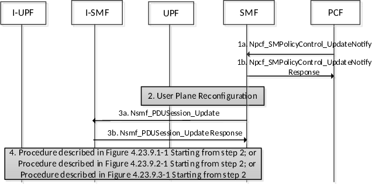

# 4.23.6 I-SMF Related Procedures with PCF

## 4.23.6.1 General

This clause provides PCC related details for scenarios including an I-SMF.

## 4.23.6.2 Policy Update Procedures with I-SMF

Figure 4.23.6-1 shows procedures related to provisioning of PCC rules containing traffic steering information related to an I-SMF.

Figure 4.23.6-1: Policy Update procedure

In cases where step 1a in figure 4.23.6-1 is triggered in response to PCF receiving AF request, below steps 3 and 4 are applicable, in addition to those steps as explained in clause 4.3.6.1.

Step 3: SMF provides to I-SMF with DNAI(s) of interest for this PDU Session for local traffic steering. If PCC rule changes for traffic offloaded via ULCL/BP due to the AF request, the SMF provides the updated N4 information to the I-SMF.

Step 4: The procedure described in clauses 4.23.9.1, 4.23.9.2 and 4.23.9.3, from step 2 is executed.

## 4.23.6.3 Reporting UP path change to the AF

Figure 4.23.6.3-1 shows procedures related Reporting UP path change to the AF.

Figure 4.23.6.3-1: Reporting UP path change to the AF

1a. I-SMF indicates that UP path change may occur for the PDU Session via Nsmf_PDUSession_Update Request as described in clause 4.23.9; the SMF responds to the I-SMF.

2\. If early notification has been requested by a PCC rule on behalf of AF as described in clause 4.3.6.2, then the SMF notifies the AF accordingly by invoking Nsmf_EventExposure_Notify service operation as described in clause 4.3.6.3. In this case the SMF may wait for further instructions of the AF.

3\. SMF initiates Nsmf_PDUSession_Update Request with N4 information to control the local PSA and ULCL/BP as described in clause 4.23.9.

4\. I-SMF enforces the change of DNAI or addition, change, or removal of UPF as described in clause 4.23.9.

5 I-SMF answers back to the Nsmf_PDUSession_Update from the SMF.

6\. If late notification has been requested by a PCC rule on behalf of AF as described in clause 4.3.6.2, then the SMF notifies the AF accordingly by invoking Nsmf_EventExposure_Notify service operation as described in clause 4.3.6.3.
