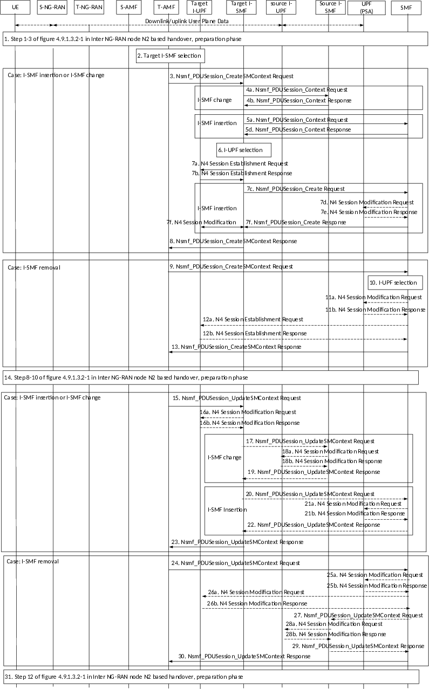

# 4.23.7.3.2 Preparation phase

Figure 4.23.7.3.2-1: Inter NG-RAN node N2 based handover, preparation phase, with I-SMF insertion/change/removal

1\. Steps 1-3 in clause 4.9.1.3.2 are performed.

2\. For PDU sessions in the UE context, the Target AMF determines whether a (new) Target I-SMF needs to be selected based on Target UE location and service area of the SMF or of the old I-SMF. If Target I-SMF needs to be selected, the AMF selects a Target I-SMF as described in clause 5.34.3 of TS 23.501 \[2\]. If the UE moves from the service area of the I-SMF to the service area of the SMF, the I-SMF will be removed.

The rest of steps are performed for PDU sessions requested to be handed over, i.e. the PDU Sessions with active UP connections.

Case: I-SMF insertion, or I-SMF change, step 3~8 are skipped for I-SMF removal case.

3\. T-AMF to Target I-SMF: Nsmf_PDUSession_CreateSMContext (PDU Session ID, Target ID, T-AMF ID, SM Context ID).

The SM Context ID points to the source I-SMF in the case of I-SMF change or to SMF in the case of I-SMF insertion.

Case: I-SMF change, steps 4 are skipped for I-SMF insertion case.

4a. (I-SMF change case) Target I-SMF to Source I-SMF: Target I-SMF retrieves SM Context from the source I-SMF by invoking Nsmf_PDUSession_Context Request (SM context type, SM Context ID).

The Target I-SMF uses SM Context ID received from T-AMF for this service operation. SM context type indicates that the requested information is all SM context, i.e. PDN Connection Context and 5G SM context. The SM Context ID is used by the recipient of Nsmf_PDUSession_Context Request in order to determine the targeted PDU Session.

4b. Source I-SMF to Target I-SMF: Nsmf_PDUSession_Context Response. The source I-SMF responds with the requested SM context.

Case: I-SMF insertion, steps 5 are skipped for I-SMF change case.

5a. Target I-SMF to SMF: Target I-SMF retrieves SM Context from the SMF by invoking Nsmf_PDUSession_Context Request (SM context type, SM Context ID).

The Target I-SMF uses SM Context ID received from T-AMF for this service operation. SM context type indicates that the requested information is all SM context, i.e. PDN Connection Context and 5G SM context. The SM Context ID is used by the recipient of Nsmf_PDUSession_Context Request in order to determine the targeted PDU Session.

5b. Void.

5c. Void.

5d. SMF to Target I-SMF: Nsmf_PDUSession_Context Response. The SMF responds with the requested SM context.

6\. The Target I-SMF selects a Target I-UPF: Based on the received SM context, e.g. S-NSSAI and UE location information, the Target I-SMF selects a Target I-UPF as described in clause 6.3.3 of TS 23.501 \[2\].

7a. The Target I-SMF to Target I-UPF: N4 Session Establishment Request.

An N4 Session Establishment Request message is sent to the Target I-UPF, providing Packet detection, enforcement and reporting rules to be installed on the Target I-UPF. The UL CN Tunnel Info (on N9) of UPF (PSA) for this PDU Session, which is used to setup N9 tunnel, is also provided to the Target I-UPF.

7b. Target I-UPF to Target I-SMF or SMF: N4 Session Establishment Response.

The Target I-UPF sends an N4 Session Establishment Response message to the Target I-SMF with DL CN Tunnel Info (i.e. N9 tunnel info) and UL CN Tunnel Info (i.e. N3 tunnel info).

Case: I-SMF insertion, step 7c~7f are skipped for I-SMF change case.

7c. Target I-SMF to SMF: Nsmf_PDUSession_Create Request (PDU Session ID, HO Preparation Indication).

7d. \[Conditional\] SMF to UPF (PSA): N4 Session Modification Request.

If different CN Tunnel Info need be used by PSA UPF, i.e. the CN Tunnel Info for N3 and N9 are different, the SMF request CN tunnel information from UPF.

7e. \[Conditional\] UPF(PSA) to SMF: N4 Session Modification Response.

The UPF (PSA) sends an N4 Session Modification Response message to the SMF with CN Tunnel Info (on N9).

7f. SMF to Target I-SMF: Nsmf_PDUSession_Create Response (PDU Session ID, CN Tunnel Info of UPF(PSA) for N9).

The Target I-SMF provides the CN Tunnel Info of UPF(PSA) for N9 to Target I-UPF via N4 Session Modification.

8\. The Target I-SMF to T-AMF: Nsmf_PDUSession_CreateSMContext Response (PDU Session ID, N2 SM Information, Reason for non-acceptance).

If N2 handover for the PDU Session is accepted, the Target I-SMF includes in the Nsmf_PDUSession_CreateSMContext Response the N2 SM Information containing the N3 UP address and the UL CN Tunnel ID of the UPF and the QoS parameters.

Case: I-SMF removal, step 9~13 are skipped for I-SMF insertion, or I-SMF change case.

9\. T-AMF to SMF: Nsmf_PDUSession_CreateSMContext (PDU Session ID, Target ID, T-AMF ID, SM Context ID). The SM Context ID points to the source I-SMF.

10\. The SMF selects a Target I-UPF if the UE is not in the service area of the PDU Session Anchor UPF. The SMF selects a Target I-UPF as described in clause 6.3.3 of TS 23.501 \[2\].

11a. \[Conditional\] SMF to UPF(PSA): N4 Session Modification Request.

If the Target I-UPF was not selected (i.e. the service area of PSA covers UE location) and different CN Tunnel Info (on N3) need to be used by PSA, the SMF sends N4 Session Modification Request to UPF(PSA).

11b. \[Conditional\] UPF(PSA) to SMF: N4 Session Modification Response. The PSA UPF sends UL CN Tunnel Info (i.e. N3 tunnel info) to SMF.

12a: \[Conditional\] SMF to Target I-UPF: N4 Session Establishment Request.

If a Target I-UPF is selected by SMF in step 10, the SMF sends N4 Session Establishment Request to Target I-UPF.

An N4 Session Establishment Request message is sent to the Target I-UPF, providing Packet detection, enforcement and reporting rules to be installed on the Target I-UPF. The UL CN Tunnel Info (on N9) of UPF (PSA) for this PDU Session, which is used to setup N9 tunnel, is also provided to the Target I-UPF.

12b. \[Conditional\]Target I-UPF to SMF: N4 Session Establishment Response. The Target I-UPF sends an N4 Session Establishment Response message to the SMF with DL CN Tunnel Info (i.e. N9 tunnel info) and UL CN Tunnel Info (i.e. N3 tunnel info).

13\. SMF to T-AMF: Nsmf_PDUSession_CreateSMContext Response (PDU Session ID, N2 SM Information, Reason for non-acceptance).

If N2 handover for the PDU Session is accepted, the Target I-SMF includes in the Nsmf_PDUSession_CreateSMContext Response the N2 SM Information containing the N3 UP address and the UL CN Tunnel ID of the UPF and the QoS parameters.

14\. Same as step 8-10 clause 4.9.1.3.2 are performed.

Case: I-SMF insertion, or I-SMF change, step 15~23 are skipped for I-SMF removal case.

15\. T-AMF to Target I-SMF: Nsmf_PDUSession_UpdateSMContext Request (PDU Session ID, N2 SM response received from T-RAN).

The Target I-SMF stores the N3 tunnel info of T-RAN from the N2 SM response if N2 handover is accepted by T-RAN.

16a. \[Conditional\]Target I-SMF to Target I-UPF: N4 Session modification request (T-RAN SM N3 forwarding Information list, indication to allocate DL forwarding tunnel(s) for indirect forwarding).

Indirect forwarding may be performed via a UPF which is different from the Target I-UPF, in which case the Target I-SMF selects another UPF for indirect forwarding.

16b. \[Conditional\]Target I-UPF to Target I-SMF: N4 Session Modification Response (Target I-UPF N9 forwarding Information list).

The Target I-UPF allocates Tunnel Info and returns an N4 Session Modification Response message to the Target I-SMF.

The Target I-UPF SM N9 forwarding info list includes Target I-UPF N9 address, Target I-UPF N9 Tunnel identifiers for forwarding data.

Case: I-SMF change, step 17~19 are skipped for I-SMF insertion case.

17\. \[Conditional\]Target I-SMF to Source I-SMF: Nsmf_PDUSession_UpdateSMContext Request.

Target I-SMF invokes Nsmf_PDUSession_UpdateSMContext Request (Target I-UPF SM N9 forwarding Information list, Operation type) to the source I-SMF in order to establish the indirect forwarding tunnel. The Target I-SMF uses the SM Context ID received from Target AMF for this service operation. The Operation type indicates the establishment of forwarding tunnel(s) for indirect forwarding.

18a. \[Conditional\]The source I-SMF initiates a N4 session modification request (Target I-UPF SM N9 forwarding Information list, indication to allocate DL forwarding tunnel(s) for indirect forwarding) to the source I-UPF to establish indirect forwarding tunnel.

Indirect forwarding may be performed via a UPF which is different from the Source I-UPF.

18b. \[Conditional\]The source I-UPF to source I-SMF: N4 Session Modification Response (source I-UPF SM N3 forwarding Information list).

19\. \[Conditional\]Source I-SMF to Target I-SMF: Nsmf_PDUSession_UpdateSMContext response (Source I-UPF SM N3 forwarding Information list).

Case: I-SMF insertion, step 20~22 are skipped for I-SMF change case.

20\. \[Conditional\]Target I-SMF to SMF: Nsmf_PDU Session_UpdateSMContext.

The Target I-SMF invokes Nsmf_PDUSession_UpdateSMContext Request (Target I-UPF SM N9 forwarding Information list, Operation type) to the SMF in order to establish the indirect forwarding tunnel. The Target I-SMF uses the SM Context ID received from Target AMF for this service operation. The Operation type indicates the establishment of forwarding tunnel(s) for indirect forwarding.

21a. \[Conditional\]The SMF initiates a N4 session modification request (UPF SM N9 forwarding Information list, indication to allocate DL forwarding tunnel(s) for indirect forwarding) to the UPF(PSA) to establish indirect forwarding tunnel.

Indirect forwarding may be performed via a UPF which is different from the UPF(PSA).

21b \[Conditional\] The UPF(PSA) to SMF: N4 Session Modification Response (UPF SM N3 forwarding Information list).

22\. \[Conditional\] The SMF to Target I-SMF: Nsmf_PDUSession_UpdateSMContext response (UPF SM N3 forwarding Information list).

23\. Target I-SMF to T-AMF: Nsmf_PDUSession_UpdateSMContext Response (N2 SM Information).

Target I-SMF creates an N2 SM information containing the DL forwarding Tunnel Info to be sent to the S-RAN by Source AMF via the Target AMF. Target I-SMF includes this information in the Nsmf_PDUSession_UpdateSMContext response. The DL forwarding Tunnel Info can be one of the following information:

\- If direct forwarding applies, then Target I-SMF includes the T-RAN N3 forwarding information received in step 15.

\- If the indirect forwarding tunnel is setup, then the SMF includes Source I-UPF forwarding information containing the N3 UP address and the Tunnel ID of the Source I-UPF.

Case: I-SMF removal, step 24~30 are skipped for I-SMF insertion, or I-SMF change case.

24\. T-AMF to SMF: Nsmf_PDUSession_UpdateSMContext Request (PDU Session ID, N2 SM response received from T-RAN).

The SMF stores the N3 tunnel info of T-RAN from the N2 SM response if N2 handover is accepted by T-RAN.

25a. \[Conditional\] SMF to UPF (PSA): N4 Session modification Request.

If the Target I-UPF is not selected (i.e. the service area of PSA covers UE location), the SMF sends N4 Session modification request to UPF(PSA) to allocate DL forwarding tunnel(s).

Indirect forwarding may be performed via a UPF which is different from the UPF(PSA), in which case the SMF selects another UPF for indirect forwarding.

25b. \[Conditional\] UPF (PSA) to SMF: N4 Session Modification Response (UPF N9 forwarding Information list).

26a. \[Conditional\] SMF to Target I-UPF:

If the Target I-UPF is selected, the SMF sends N4 Session modification request to Target I-UPF to allocate DL forwarding tunnel(s) for indirect forwarding;

Indirect forwarding may be performed via a UPF which is different from the Target I-UPF, in which case the SMF selects another UPF for indirect forwarding.

26b. \[Conditional\] Target I-UPF to SMF: N4 Session Modification Response (Target I-UPF N9 forwarding Information list).

27\. \[Conditional\] SMF to Source I-SMF: Nsmf_PDUSession_UpdateSMContext.

The SMF invokes Nsmf_PDUSession_UpdateSMContext Request (SM N9 forwarding Information list, Operation type) to the source I-SMF in order to establish the indirect forwarding tunnel. The SMF uses the SM Context ID received from T-AMF for this service operation. The Operation type indicates the establishment of forwarding tunnel(s) for indirect forwarding.

28a. \[Conditional\] Source I-SMF to Source I-UPF: N4 Session Modification Request.

The source I-SMF initiates a N4 session modification request (Target I-UPF SM N9 forwarding Information list, indication to allocate DL forwarding tunnel(s) for indirect forwarding) to the source I-UPF to establish indirect forwarding tunnel.

Indirect forwarding may be performed via a UPF which is different from the Source I-UPF.

28b. \[Conditional\]The source I-UPF to source I-SMF: N4 Session Modification Response (source I-UPF SM N3 forwarding Information list).

29\. \[Conditional\]The source I-SMF to SMF: Nsmf_PDUSession_UpdateSMContext response (Source I-UPF SM N3 forwarding Information list).

30\. SMF to T-AMF: Nsmf_PDUSession_UpdateSMContext Response (N2 SM Information).

The SMF creates an N2 SM information containing the DL forwarding Tunnel Info to be sent to the S-RAN by the Source AMF via the Target AMF. The DL forwarding Tunnel Info can be one of the following information:

\- If direct forwarding applies, then the SMF includes the T-RAN N3 forwarding information the SMF received in step 24.

\- If the indirect forwarding tunnel is setup, then the SMF includes Source I-UPF forwarding information containing the N3 UP address and the Tunnel ID of the Source I-UPF.

31\. Same as step 12 in clause 4.9.1.3.2 is performed.
