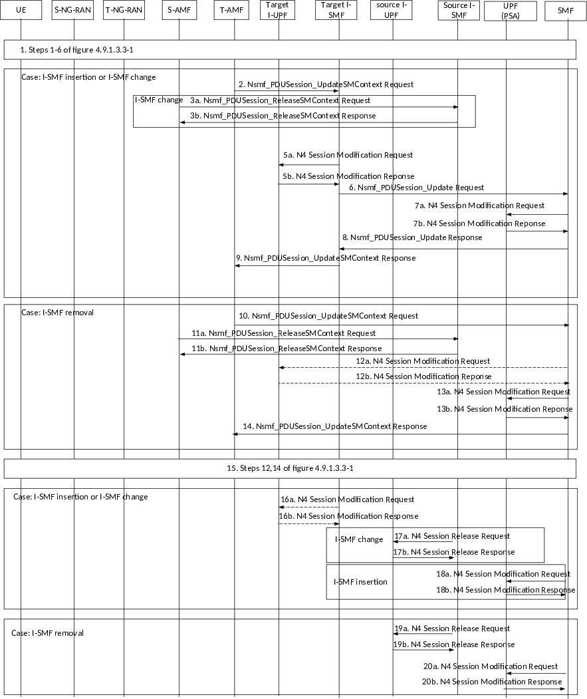

# 4.23.7.3.3 Execution phase

Figure 4.23.7.3.3-1: Inter NG-RAN node N2 based handover, execution phase, with I-SMF insertion/change/removal

1\. Steps 1-6 in clause 4.9.1.3.3 are performed with the following change:

Step 6a: For PDU sessions in the UE context, if the I-SMF is either to be changed, or to be removed, the T-AMF includes an indication in Namf_Communication_N2InfoNotify to indicate the I-SMF change/removal.

Step 6c: The SMF in this step is source I-SMF in the case of I-SMF removal or change, or is SMF in the case of I-SMF insertion.

Case: I-SMF insertion, or I-SMF change, step 2~9 are skipped for I-SMF removal case.

2\. T-AMF to Target I-SMF: Nsmf_PDUSession_UpdateSMContext Request (Handover Complete indication, (N2 SM Information (Secondary RAT usage data))).

Handover Complete indication is sent per each PDU Session to the corresponding Target I-SMF to indicate the success of the N2 Handover.

If in step 6b of clause 4.9.1.3.3 the source AMF has provided information for secondary RAT usage reporting the T-AMF propagates this information to the Target I-SMF.

Case: I-SMF change, step 3 is skipped for I-SMF insertion.

3a. S-AMF to Source I-SMF: Nsmf_PDUSession_ReleaseSMContext Request (I-SMF only indication).

After received N2 handover notify from T-AMF, if indication of I-SMF change/removal has been received, the S-AMF invokes Nsmf_PDUSession_ReleaseSMContext Request to inform the Source I-SMF to release the SM context of the PDU Session. The I-SMF only indication is used to inform the Source I-SMF not to invoke resource release in SMF. The Source I-SMF initiates a timer to release the SM Context of the PDU Session if indirect forwarding tunnel(s) were previously established, or if the Source I-SMF has not received request from Target I-SMF to retrieve SM Context. Otherwise, the Source I-SMF immediately releases the SM Context.

3b. Source I-SMF to S-AMF: Nsmf_PDUSession_ReleaseSMContext Response.

4a. Void.

4b. Void.

5a. Target I-SMF to Target I-UPF: N4 Session Modification Request. The N4 Modification Request indicates DL AN Tunnel Info of T-RAN to UPF.

5b. The Target I-UPF to Target I-SMF: N4 Session Modification Response.

6\. Target I-SMF to SMF:

In the case of I-SMF change, Nsmf_PDUSession_Update Request (PDU Session ID, DL CN Tunnel Info of Target I-UPF for N9, DNAI(s) supported by the I-SMF, Secondary RAT usage data).

In the case of I-SMF insertion, Nsmf_PDUSession_Update Request (PDU Session ID, DL CN Tunnel Info of Target I-UPF for N9, DNAI(s), Secondary RAT usage data, Handover Complete Indication). The SMF initiates a timer to release the resource, i.e. resource for indirect data forwarding tunnel.

If the T-AMF has provided information for secondary RAT usage reporting in step 2, the Target I-SMF propagates this information to the SMF.

7a. SMF to UPF (PSA): N4 Session Modification Request.

The SMF sends N4 Session Modification Request to UPF PSA, providing the DL CN Tunnel Info of Target I-UPF to the UPF PSA.

7b. UPF (PSA) to SMF: N4 Session Modification Response.

8\. SMF to Target I-SMF: In the case of I-SMF change, Nsmf_PDUSession_Update Response. In the case of I-SMF insertion, Nsmf_PDUSession_Create Response. The SMF provides the DNAI(s) of interest for this PDU Session to Target I-SMF.

In the case of I-SMF insertion and the PDU session corresponds to a LADN, the SMF shall release the PDU session after the handover procedure is completed.

9\. Target I-SMF to T-AMF: Nsmf_PDUSession_UpdateSMContext Response.

If indirect data forwarding applies, the Target I-SMF starts an indirect data forwarding timer, to be used to release the resource of indirect data forwarding tunnel.

Case: I-SMF removal, step 10~14 are skipped for I-SMF insertion, or I-SMF change case.

10\. T-AMF to SMF: Nsmf_PDUSession_UpdateSMContext Request (Handover Complete indication, (N2 SM Information (Secondary RAT usage data))).

Handover Complete indication is sent per each PDU Session to the corresponding SMF to indicate the success of the N2 Handover.

If in step 6b of clause 4.9.1.3.3 the source AMF has provided information for secondary RAT usage reporting the T-AMF propagates this information to the SMF.

11a. S-AMF to Source I-SMF: Nsmf_PDUSession_ReleaseSMContext Request I-SMF only indication.

After received N2 handover notify from T-AMF, if indication of I-SMF change/removal has been received, the S-AMF invokes Nsmf_PDUSession_ReleaseSMContext Request to inform the Source I-SMF to release the SM context of the PDU Session. I-SMF only indication is used to inform the Source I-SMF not to invoke resource release in SMF. The Source I-SMF initiates a timer to release the SM Context of the PDU Session if indirect forwarding tunnel(s) were previously established, otherwise, the Source I-SMF immediately releases the SM Context.

11b. Source I-SMF to S-AMF: Nsmf_PDUSession_ReleaseSMContext Response.

12a. \[Conditional\]SMF to Target I-UPF: N4 Session Modification Request.

If the Target I-UPF is selected by SMF, the SMF to Target I-UPF: N4 Session Modification Request. The N4 Modification Request indicates DL AN Tunnel Info of T-RAN to Target I-UPF.

12b. \[Conditional\] Target I-UPF to SMF: N4 Session Modification Response

13a. SMF to UPF (PSA): N4 Session Modification Request.

The SMF sends N4 Session Modification Request to UPF(PSA). The N4 Modification Request indicates DL AN Tunnel Info of T-RAN to UPF(PSA) if Target I-UPF is not selected by SMF. The N4 Modification Request indicates DL CN Tunnel Info of Target I-UPF if Target I-UPF is selected by SMF.

13b. UPF (PSA) to SMF: N4 Session Modification Response. PDU Session Anchor sends one or more "end marker" packets for each N3/N9 tunnel on the old path immediately after switching the path, the source NG-RAN shall forward the "end marker" packets to the target NG-RAN.

14\. SMF to T-AMF: Nsmf_PDUSession_UpdateSMContext Response (PDU Session ID).

If indirect data forwarding applies, the SMF starts an indirect data forwarding timer, to be used to release the resource of indirect data forwarding tunnel.

15\. Steps 12, 14 in clause 4.9.1.3.3 are performed.

During the UE mobility registration procedure, if required, the T-AMF performs I-SMF insertion/change/removal for the PDU session which were not handed over, i.e. the PDU sessions without active UP connections. This takes place as described in clause 4.23.3 with the exception that there is no UE context retrieved from the old AMF and that steps 17a and 17b as described in clause 4.23.4.3 are not applicable.

Case: I-SMF insertion, or I-SMF change, step 16~18 are skipped for I-SMF removal case.

16a. \[Conditional\]Target I-SMF to Target I-UPF: N4 Session Modification Request.

After indirect data forwarding timer set in step 9 expires, the Target I-SMF sends an N4 Session Modification Request to Target I-UPF to release the indirect data forwarding resource in Target I-UPF.

16b. \[Conditional\]Target I-UPF to SMF: N4 Session Modification Response.

Case: I-SMF change, step 17 is skipped for I-SMF insertion.

17a. Source I-SMF to Source I-UPF: N4 Session Release Request.

Upon the timer set in step 3 expires, the Source I-SMF sends N4 Session Release Request (Release Cause) to Source I-UPF to release the resources for the PDU Session. This message is also used to release the indirect data forwarding resource in Source I-UPF.

If the Source I-UPF acts as UL CL and is not co-located with local PSA, the Source I-SMF also sends N4 Session Release Request to the local PSA to release the resources for the PDU Session.

17b. Source I-UPF to Source I-SMF: N4 Session Release Response.

The Source I-SMF releases SM Context of the PDU Session.

Case: I-SMF insertion, step 18 is skipped for I-SMF change.

18a. SMF to UPF: N4 Session Modification Request.

Upon the timer set in step 6 expires, if UPF(PSA) is used for indirect forwarding, the SMF sends an N4 Session Modification Request to UPF(PSA) to release the indirect data forwarding resource in UPF(PSA). If the UPF (PSA) uses different Tunnel Info for N3 and N9, this message is also used to release the N3 Tunnel. If I-UPF is used for indirect forwarding, the SMF sends an N4 Session Modification Request to the I-UPF to release the indirect data forwarding resource.

18b. UPF to SMF: N4 Session Modification Response.

If UPF(PSA) is used for indirect forwarding, the UPF (PSA) sends N4 Session Modification Response to SMF.

If I-UPF is used for indirect forwarding, the I-UPF sends N4 Session Modification Response to SMF.

Case: I-SMF removal, step 19~20 are skipped for I-SMF insertion, I-SMF change case.

19a. The Source I-SMF to Source I-UPF: N4 Session Release Request.

Upon the timer set in step 11 expires, the Source I-SMF sends N4 Session Release Request (Release Cause) to Source I-UPF to release the resources for the PDU Session. This message is also used to release the indirect data forwarding resource in Source I-UPF.

19b. Source I-UPF to Source I-SMF: N4 Session Release Response.

The Source I-SMF releases SM Context of the PDU Session.

20a. SMF to UPF: N4 Session Modification Request.

Upon the timer set in step 14 expires, if UPF(PSA) is used for indirect forwarding, the SMF sends an N4 Session Modification Request to UPF (PSA) to release the indirect forwarding resource in UPF (PSA). If the UPF (PSA) uses different Tunnel Info for N3 and N9, this message is also used to release the N3 Tunnel. If I-UPF is used for indirect forwarding, the SMF sends an N4 Session Modification Request to the I-UPF to release the indirect data forwarding resource.

20b. UPF to SMF: N4 Session Modification Response.

If UPF(PSA) is used for indirect forwarding, the UPF (PSA) sends N4 Session Modification Response to SMF.

If I-UPF is used for indirect forwarding, the I-UPF sends N4 Session Modification Response to SMF.
