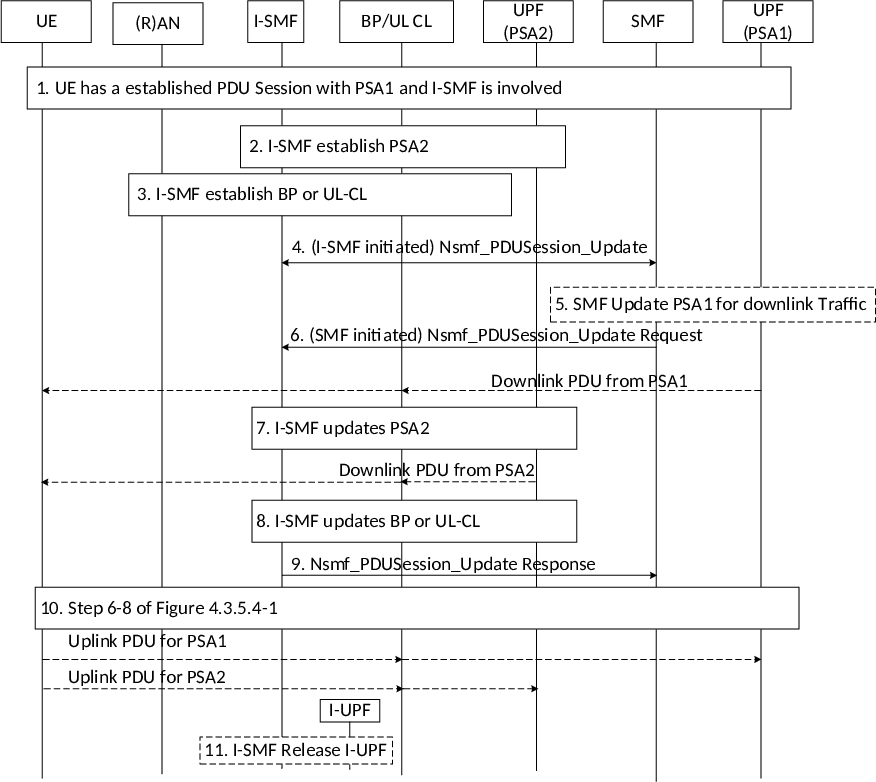

# 4.23.9.1 Addition of PDU Session Anchor and Branching Point or UL CL controlled by I-SMF

This clause describes a procedure to add a PDU Session Anchor and Branching Point or UL CL controlled by I-SMF.

Figure 4.23.9.1-1: Addition of PDU Session Anchor and Branching Point or UL CL controlled by I-SMF

1\. UE has an established PDU Session with a UPF including the PDU Session Anchor 1, which is controlled by SMF. The I-SMF and an I-UPF controlled by I-SMF have already been inserted for the PDU Session. Events described in item 1 and 2 of clause 4.23.9.0 have taken place.

2\. At some point, using the list of DNAI(s) of interest for this PDU Session received from the SMF, the I-SMF decides to establish a new PDU Session Anchor e.g. due to UE mobility. The I-SMF selects a UPF and using N4 establishes the new PDU Session Anchor 2 (PSA2) of the PDU Session. During this step:

\- (if needed) the PSA2 CN Tunnel Info of the local N9 termination on the PSA2 may be determined,

\- In the case of IPv6 multi-homing applies to the PDU Session, a new IPv6 prefix corresponding to PSA2 is allocated by the I-SMF or by the UPF supporting the PSA2.

3\. The I-SMF may select a UPF that will be acting as UL CL or Branching Point and replace the current I-UPF.

If a new UPF that will act as UL CL/Branching Point is selected (i.e. the existing I-UPF is replaced), the I-SMF uses N4 establishment to provide the 5G AN Tunnel Info, the PSA1 and (where applicable) PSA2 CN Tunnel Info to the new UPF.

NOTE 1: If the Branching Point or UL CL and the PSA2 are co-located in a single UPF then steps 2 and 3 can be merged.

4\. The I-SMF invokes Nsmf_PDUSession_Update Request (Indication of UL CL or Branching Point insertion, IPv6 prefix @PSA2, DNAI(s) supported by PSA2, DL Tunnel Info of the new UL CL/Branching Point, if any) to SMF. Separate N4 contents are exchanged over N16a for the local UL CL/BP(s) and for the local PSA(s) controlled by the I-SMF Multiple local PSAs (i.e. PSA2) may be inserted at one time, each corresponds to a DNAI and/or an IPv6 prefix in the case of multi-homing.

The I-SMF informs the SMF that a UL CL or Branching Point is inserted, the I-SMF provides DNAI(s) supported by PSA2 to the SMF. The DL Tunnel Info of UL CL/Branching Point is provided to SMF if a new UPF is selected to replace I-UPF in step 3.

In the case of IPv6 multi-homing PDU Session, the IPv6 prefix @PSA2 is also provided to SMF.

The SMF performs the Session Management Policy Modification procedure as defined in clause 4.16.5 to provide the new allocated IPv6 prefix to the PCF. The SMF may also send a notification to the AF, as described in clause 4.3.6.3.

The DNAI(s) supported by PSA2 may be used by the SMF to determine which PCC rules are to be applied at UPF(s) controlled by the I-SMF. The SMF acknowledges the Nsmf_PDUSession_Update from the I‑SMF

5\. If a new DL Tunnel Info of UL CL/ Branching Point has been provided in step 4, the SMF updates the PSA1 via N4 with the CN Tunnel Info for the downlink traffic. Now the downlink packets from PSA1 are sent to UE via the new UPF which will act as Branching Point/UL CL. The SMF may also update the forwarding rules in PSA1 if some traffic is to be moved to UPFs controlled by I-SMF.

6\. The SMF provides I-SMF with N4 information for the PSA and for the UL CL with a SMF initiated Nsmf_PDUSession_Update Request (set of (N4 information, involved DNAI), Indication of no DNAI change, Indication of no local PSA change)). The SMF generates N4 information for local traffic handling based on PCC rules and CHF requests that will be enforced by UPFs controlled by I-SMF. The N4 information for local traffic handling corresponds to N4 rules (PDR, FAR, URR, QER, etc.) related with the support of a DNAI. This is described in clause 5.34.6 of TS 23.501 \[2\]. N4 information for local traffic handling may indicate information (as the 5G AN Tunnel Info) that the SMF does not know and that the I-SMF needs to determine itself to build actual rules sent to the UPF(s). If the rule is applied to the local PSA, the N4 information includes the associated DNAI.

If the "Indication of application relocation possibility" or "UE IP address preservation indication" attributes are included in the PCC rule, the SMF includes the corresponding Indication of no DNAI change and Indication no local PSA change respectively.

If the CN Tunnel Info at the PSA1 has changed, the SMF may also provide its new value.

The I-SMF uses N4 information for local traffic handling received from the SMF as well as 5G AN Tunnel Info received from the 5G AN via the AMF and local configuration to determine N4 rules to send to the UPF(s) it is controlling.

7\. The I-SMF updates the PSA2 via N4 providing N4 rules determined in step 6. It also provides the Branching Point or UL CL CN Tunnel Info for down-link traffic if the PSA2 and the UL CL/Branching Point are supported by different UPF(s).

8\. The I-SMF updates the Branching Point or UL CL via N4 providing N4 rules determined in step 6.

NOTE 2: If the Branching Point or UL CL and the PSA2 are co-located in a single UPF then step 7 and step 8 can be merged.

9\. The I-SMF Issues a Nsmf_PDUSession_Update Response to SMF that may include N4 information received from the local UPF(s).

10\. Steps 6-8 of clause 4.3.5.4 are performed. In the case of IPv6 multi-homing PDU Session, the SMF notifies the UE of the IPv6 prefix @PSA2 and updates the UE with IPv6 multi-homed routing rule via a PSA controlled by the SMF.

NOTE 3: Step 6 of clause 4.3.5.4 is skipped if the current I-UPF is selected to act as Branching Point or UL CL.

11\. If a new UPF is selected to replace I-UPF in step 3, the I-SMF uses N4 Release to remove the I-UPF of the PDU Session. The I-UPF releases resources for the PDU Session.
