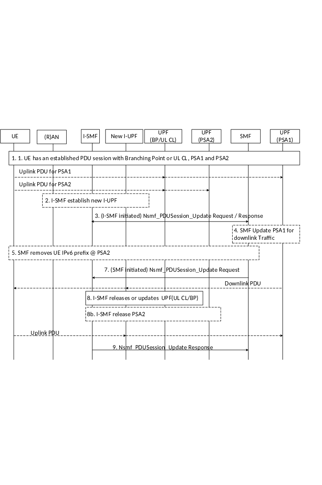

# 4.23.9.2 Removal of PDU Session Anchor and Branching Point or UL CL controlled by I-SMF

This clause describes a procedure to remove a PDU Session Anchor and Branching Point or UL CL controlled by I-SMF.

Figure 4. 23.9.2-1: Removal of PDU Session Anchor and Branching Point or UL CL controlled by I-SMF

1\. UE has an established PDU Session with a UPF including the PDU Session Anchor 1 (controlled by SMF) and the UL-CL/BP and the PDU Session Anchor 2 (controlled by I-SMF). Events described in item 1 and 2 of clause 4.23.9.0 have taken place.

At some point the I-SMF decides to remove the PDU Session Anchor 2 and UL-CL/BP function, e.g. due to UE mobility.

2\. The I-SMF may select a new UPF acting as new I-UPF and replace the existing I-UPF which was acting as UL-CL/BP before.

If a new UPF acting as new I-UPF is selected, the I-SMF uses N4 establishment to provide the PSA1 CN Tunnel Info and (R)AN Tunnel Info to the new I-UPF.

3\. The I-SMF invokes Nsmf_PDUSession_Update Request (Indication of Removal of traffic offload, Removal of IPv6 prefix @PSA2, DNAI associated with the PSA2, DL Tunnel Info of new I-UPF, if any) to SMF. Multiple local PSAs may be removed, in this case, the I-SMF provides for each local PSA to be removal, the associated DNAI and an IPv6 prefix in the case of multi-homing.

The I-SMF informs the SMF that local traffic offload is removed. In the case of IPv6 multi-homing, the I-SMF also notifies the SMF with the removal of the IPv6 prefix @PSA2.

The SMF issues a SM Policy Association Modification (clause 4.16.5) corresponding to the IP address allocation/release PCRT(Policy Control Request Trigger). The SMF may also send a notification to the AF, as described in clause 4.3.6.3.

4\. If a new UPF that replaces existing I-UPF is selected in step 2, the SMF updates the PSA1 via N4. It provides the CN Tunnel Info of the new I-UPF for the downlink traffic. The SMF may update the packet handling rules in PSA1 as now all traffic is to be moved to PSA1.

5\. In the case of IPv6 multi-homing, the SMF notifies the UE to stop using the IPv6 prefix corresponding to PSA2. Also the SMF sends IPv6 multi-homed routing rule along with the IPv6 prefix corresponding to PSA1 to the UE. Based on the information provided in the Router Advertisement, the UE starts using the IPv6 prefix (corresponding to PSA1) for corresponding traffic.

7\. The SMF provides I-SMF with N4 information for the local UPF(s) with a SMF initiated Nsmf_PDUSession_Update Request; The N4 information indicates the removal of the traffic offload rules.

8\. If a new UPF that replaces existing I-UPF is selected in step 2, the I-SMF releases the old I-UPF. Otherwise the I-SMF updates the existing I-UPF with new rules in order to remove the UL-CL/BP functionality from that I-UPF.

If a new UPF that replaces existing I-UPF is selected in step 2, the SMF updates the (R)AN with the new I-UPF CN Tunnel Info.

If the PSA2 is not collocated with UL-CL/BP function, the I-SMF releases it via N4.

9\. The I-SMF answers to the SMF with a Nsmf_PDUSession_Update Response SMF that may include N4 information received from the local UPF(s).
