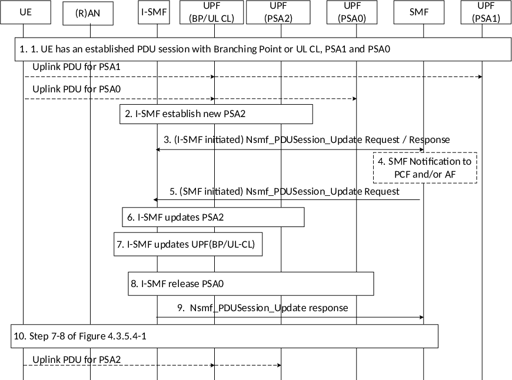

# 4.23.9.3 Change of PDU Session Anchor for IPv6 multi-homing or UL CL controlled by I-SMF

This clause describes a change of UL-CL/BP function, e.g. addition of a new PDU Session Anchor (i.e. PSA2) and release of the existing additional PDU Session Anchor (i.e. PSA0), via modifying IPv6 multi-homing or UL CL rule in the same Branching Point or UL CL under controlled by the same I-SMF.

Figure 4.23.9.3-1: Change of PDU Session Anchor for Branching Point or UL CL controlled by I-SMF

1\. The UE has an established PDU Session with a UPF including the PDU Session Anchor 1(controlled by SMF) and the PDU Session Anchor 0 (PSA0) and an I-UPF acting as UL CL or BP (controlled by I-SMF). Events described in item 1 and 2 of clause 4.23.9.0 have taken place.

2\. At some point the I-SMF decides to establish a new PDU Session Anchor and release the existing PDU Session Anchor e.g. due to UE mobility. The I-SMF selects a UPF and using N4 establishes the new PDU Session Anchor 2 of the PDU Session.

In the case of IPv6 multi-homing PDU Session, the I-SMF ensures allocation of a new IPv6 prefix corresponding to PSA2.

3\. The I-SMF invokes Nsmf_PDUSession_Update Request (Indication of Change of traffic offload, (new allocated IPv6 prefix @PSA2, DNAI(s) supported by PSA2), (Removal of IPv6 prefix @PSA0, DNAI(s) supported by PSA0)) to SMF.

The I-SMF informs the SMF that a change of traffic offload may occur. Multiple local PSAs may be changed. The I-SMF provides:

\- for each local PSA to be added, the DNAI now reachable and in the case of multi-homing: the new allocated IPv6 prefix @PSA2;

\- for each local PSA no more reachable, the DNAI no more reachable and in the case of multi-homing, the old IPv6 prefix @PSA0.

4\. The SMF may issue a SM Policy Association Modification (clause 4.16.5) corresponding to the IP address allocation/release PCRT. The SMF may also send an "early" notification to the AF, as described in clause 4.23.6.3.

5\. The SMF generates the N4 information based on DNAI(s) information received in step 3.The SMF provides I-SMF with N4 information for the PSA and for the UL CL with a SMF initiated Nsmf_PDUSession_Update Request (set of (N4 information, involved DNAI), Indication of no DNAI change, Indication of no local PSA change)). The information includes N4 information to remove the traffic offload related to the DNAI(s) that are no more reachable and to enable the traffic offload related to the DNAI(s) that are now reachable.

6-7. Same as step 7-8 of clause 4.23.9.1

8\. The I-SMF releases via N4 the PSA0 if PSA0 is not collocated with UL CL/BP, or updates the UL CL/BP to remove corresponding rules if PSA0 is collocated with UL CL/BP.

9\. The I-SMF issues a Nsmf_PDUSession_Update Response to SMF that may include N4 information received from the local UPF(s) including the PSA0.

10\. Same as step 7-8 of clause 4.3.5.4 are performed.
