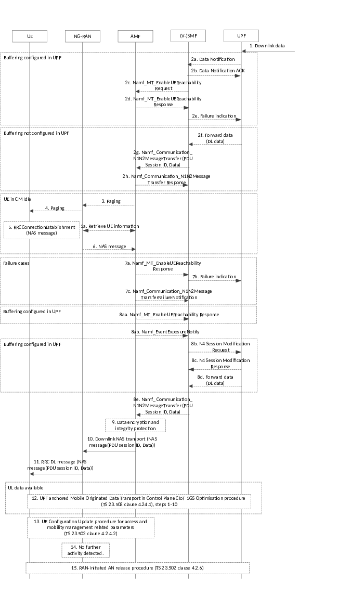

# 4.24 Procedures for UPF Anchored Data Transport in Control Plane CIoT 5GS Optimisation

## 4.24.1 UPF anchored Mobile Originated Data Transport in Control Plane CIoT 5GS Optimisation

This clause describes the procedures for Mobile Originated Transport in Control Plane CIoT 5GS Optimisation where the PDU Session is terminated at a UPF.

Figure 4.24.1-1: UPF anchored Mobile Originated Data Transport in Control Plane CIoT 5GS Optimisation

1\. If the UE is CM-CONNECTED it sends a NAS message carrying the ciphered PDU session ID and ciphered uplink data as payload. If the UE is in CM-IDLE, the UE first establishes an RRC connection or sends the RRCEarlyDataRequest message and sends a NAS message as part of this.

The UE may also send NAS Release Assistance Information (NAS RAI) included in the NAS message. NAS RAI indicates that no further Uplink and Downlink Data transmissions are expected, or that only a single Downlink data transmission (e.g. Acknowledgement or response to Uplink data) subsequent to this Uplink Data transmission is expected.

1a. In the NB-IoT case, during step 1 the NG-RAN, based on configuration, may retrieve the NB-IoT UE Priority and the Expected UE Behaviour Parameters from the AMF, if not previously retrieved. Based on such parameters, the NG-RAN may apply prioritisation between requests from different UEs before triggering step 2 and throughout the RRC connection. The NG-RAN may retrieve additional parameters (e.g. UE Radio Capabilities).

2\. NG-RAN forwards the NAS message to the AMF using the Initial NAS message procedure (if the UE was in CM-IDLE before step 1) or using the Uplink NAS transport procedure (if the UE was in CM-CONNECTED before step 1). If RRCEarlyDataRequest message was received in step 1, the NG-RAN includes "EDT Session" indication in the N2 Initial UE message.

The RAI signalled by MAC based on the Buffer Status Report (BSR), see TS 36.321 \[56\], shall not be used when using Control Plane CIoT 5GS Optimisations.

3\. AMF checks the integrity of the incoming NAS message and deciphers the PDU session ID and uplink data.

If a NAS RAI is received from the UE and it conflicts with the Expected UE Behaviour, the NAS RAI takes precedence.

3a. If the AMF received "EDT Session" indication from the NG-RAN in step 2, the AMF sends an N2 message to the NG-RAN.

a\) In the case of NAS RAI with Uplink data and it indicated that Downlink data was not expected and the AMF does not expect any other signalling with the UE, the AMF shall

\- either send a NAS service accept in the N2 Downlink NAS Transport message and include End Indication to indicate that no further data or signalling is expected with the UE; or

\- alternatively, the AMF sends an N2 Connection Establishment Indication message including End Indication to indicate that no further data or signalling is expected with the UE.

b\) If the AMF determines more data or signalling may be pending, the AMF sends an N2 Downlink NAS Transport message or Initial Context Setup Request message without End Indication.

3b. If 3a was executed, the NG-RAN completes the RRC early data procedure as follows.

a\) For the case of 3a.a) the NG-RAN proceeds with RRCEarlyDataComplete message. The procedure is completed in step 5.

b\) For the case of 3a.b) the NG-RAN proceeds with RRC connection establishment procedure. In that case, all steps up to step 13 apply.

4\. AMF determines the (V-)SMF handling the PDU session based on the PDU session ID contained in the NAS message and passes the PDU Session ID and the data to the (V-)SMF by invoking Nsmf_PDUSession_SendMOData service operation.

If NG-RAN forwarded the NAS message to the AMF using the Initial NAS message procedure in step 2 and the UE is accessing via NB-IoT RAT then the AMF may inform the (H-)SMFs whether the RRC establishment cause is set to "MO exception data", as described in clause 5.31.14.3 of TS 23.501 \[2\]. The AMF may immediately send the MO Exception Data Counter to the (H-)SMF.

If no Downlink Data is expected based on the NAS RAI from the UE in step 1 and if the AMF is not aware of pending MT traffic, then AMF does not wait for step 7 and continues with step 12.

5\. The (V-)SMF decompresses the header if header compression applies to the PDU session and forwards the data to the UPF.

The UPF forwards the data to the DN based on data forwarding rule, e.g. in the case of unstructured data, tunnelling may be applied according to clause 5.6.10.3 of TS 23.501 \[2\].

6\. \[Conditional\] In the non-roaming and LBO case, the UPF forwards available downlink data to the (V-)SMF, in the home-routed roaming case, the H-UPF forwards the data to the V-UPF then to the V-SMF.

7\. \[Conditional\] The (V-)SMF compresses the header if header compression applies to the PDU session. The (V‑)SMF forwards the downlink data and the PDU session ID to the AMF using the Namf_Communication_N1N2MessageTransfer service operation.

8\. \[Conditional\] The AMF creates a DL NAS transport message with the PDU session ID and the downlink data. The AMF ciphers and integrity protects the NAS transport message

9\. \[Conditional\] The AMF sends the DL NAS transport message to NG-RAN. If NAS RAI indicated for single uplink and single downlink packets (e.g. acknowledgment expected) and AMF has determined the data transmission is for single uplink and single downlink packets, the AMF includes an End Indication in the DL NAS transport message to indicate that no further data or signalling is expected with the UE.

10\. \[Conditional\] NG-RAN delivers the NAS payload over RRC to the UE.

11\. If no further data or signalling is pending and AMF received NAS RAI indicating single downlink data transmission, then AMF triggers the AN release procedure (clause 4.2.6) and the procedure stops after this step.

12\. \[Conditional\] If no further activity is detected by NG-RAN, then NG-RAN triggers the AN release procedure.

13\. \[Conditional\] The UE's logical NG-AP signalling connection and RRC signalling connection are released according to clause 4.2.6.

NOTE: The details of the NGAP messages to be used for this procedure are specified in TS 38.413 \[10\].

## 4.24.2 UPF anchored Mobile Terminated Data Transport in Control Plane CIoT 5GS Optimisation

This clause describes the procedures for Mobile Terminated Data Transport in Control Plane CIoT 5GS Optimisation where the PDU Session is terminated at a UPF.

Figure 4.24.2-1: Mobile Terminated Data Transport in Control Plane CIoT 5GS Optimisation

1\. Downlink data is received by the UPF. If buffering is configured in the UPF, then the flow continues in step 2a, otherwise the flow continues in step 2f.

2a. \[conditional\] If this is the first downlink packet to be buffered and SMF has instructed the UPF to report the arrival of first downlink packet to be buffered, then the UPF sends a Data Notification to the SMF.

2b. \[conditional\] The SMF sends a Data Notification ACK to the UPF.

2c. \[conditional\] The SMF sends a Namf_MT_EnableUEReachability request to the AMF.

The SMF determines whether Extended Buffering applies based on local policy and the capability of the UPF. If Extended Buffering applies, the SMF includes "Extended Buffering support" indication in Namf_MT_EnableUEReachability request.

2d. \[conditional\] If the UE is considered reachable, step 3 is executed immediately.

If the AMF determines the UE is unreachable (e.g. if the UE is in MICO mode or the UE is configured for extended idle mode DRX), then the AMF rejects the request from the SMF with an indication that the UE is not reachable. If the SMF included Extended Buffering support indication, the AMF indicates the Estimated Maximum Wait time in the response message. Based on the rejection message from the AMF, the SMF should subscribe with the AMF for UE reachability using the Namf_EventExposure service.

If the UE is in MICO mode, the AMF determines the Estimated Maximum Wait time based on the next expected periodic registration timer update expiration or by implementation. The procedure continues in step 8ab when the UE becomes reachable.

If the UE is configured for extended idle mode DRX, the AMF determines the Estimated Maximum Wait time based on the start of next PagingTime Window. The procedure continues in step 3 when the UE becomes reachable.

If the AMF detects that the UE context contains Paging Restriction Information, the AMF may block the paging for this UE based on the stored Paging Restriction Information (see clause 5.38.1 of TS 23.501 \[2\]). If the AMF blocks paging, the AMF sends MT_EnableUEReachability response to the SMF with an indication that its request has been rejected due to restricted paging.

2e. \[conditional\] If the SMF receives an "Estimated Maximum Wait time" from the AMF and Extended buffering applies, the SMF sends a failure indication to the UPF with an Extended Buffering time and optionally a DL Buffering Suggested Packet Count. The Extended Buffering time is determined by the SMF and should be larger or equal to the Estimated Maximum Wait time received from the AMF. The DL Buffering Suggested Packet Count parameter is determined by the SMF and if available, the Suggested Number of Downlink Packets parameter may be considered. The procedure stops after this step.

2f. \[conditional\] If buffering is not configured in the UPF, then the UPF forwards the downlink data to the (V‑)SMF in non-roaming and LBO cases. In the home-routed roaming case, the H-UPF forwards the data to the V-UPF and then to the V-SMF.

2g. \[conditional\] The SMF determines whether Extended Buffering applies based on local policy and the capability of the SMF.

If user data is received in step 2f and Extended buffering is not configured for the SMF, then (V-)SMF compresses the header if header compression applies to the PDU session and creates the downlink user data PDU that is intended as payload in a NAS message. The (V-)SMF forwards the downlink user data PDU and the PDU session ID to the AMF using the Namf_Communication_N1N2MessageTransfer service operation. If Extended Buffering applies, then (V-)SMF keeps a copy of the downlink data.

If user data is received in step 2f and Extended Buffering applies, the SMF includes "Extended Buffering support" indication in Namf_Communication_N1N2Message Transfer.

2h. \[conditional\] AMF responds to SMF.

If AMF determines that the UE is reachable for the SMF, then the AMF informs the SMF. Based on this, the SMF deletes the copy of the downlink data.

If the AMF determines the UE is unreachable for the SMF (e.g. if the UE is in MICO mode or the UE is configured for extended idle mode DRX), then the AMF rejects the request from the SMF.

If the SMF included Extended Buffering support indication, the AMF indicates the Estimated Maximum Wait time, in the reject message, for the SMF to determine the Extended Buffering time. Based on the rejection message from the AMF, the SMF should subscribe with the AMF for UE reachability using the Namf_EventExposure service.

If the UE is in MICO mode, the AMF determines the Estimated Maximum Wait time based on the next expected periodic registration timer update expiration or by implementation. The procedure continues in step 8ab when the UE becomes reachable.

If the UE is configured for extended idle mode DRX, the AMF determines the Estimated Maximum Wait time based on the start of next PagingTime Window. The procedure continues in step 3 when the UE becomes reachable.

If the AMF detects that the UE context contains Paging Restriction Information, the AMF may block the paging for this UE, based on the stored Paging Restriction Information (see clause 5.38.1 of TS 23.501 \[2\]). If the AMF blocks paging, the AMF sends Namf_Communication_N1N2MessageTransfer response to the SMF with an indication that its request has been rejected due to restricted paging.

If the SMF receives an "Estimated Maximum Wait time" from the AMF and Extended Buffering in SMF applies, the SMF store the DL Data for the Extended Buffering time. The Extended Buffering time is determined by the SMF and should be larger or equal to the Estimated Maximum Wait time received from the AMF. The SMF does not send any additional Namf_Communication_N1N2MessageTransfer message if subsequent downlink data packets are received.

3\. \[Conditional\] If the UE is in CM-IDLE, when the AMF determines that the UE is reachable, the AMF sends a paging message to NG-RAN. If available, the AMF may include the WUS Assistance Information in the N2 Paging message(s).

4\. \[Conditional\] If NG-RAN received a paging message from AMF and UE and NG-RAN support WUS, then:

\- if the NGAP Paging message contains the *Assistance Data for Recommended Cells* IE (see TS 38.413 \[10\]), then NG-RAN shall only broadcast the UE's Wake Up Signal in the last used cell;

\- else (i.e. the *Assistance Data for Recommended Cells* IE is not included in the NGAP Paging message) NG-RAN should not broadcast the UE's Wake Up Signal.

NG-RAN performs paging. If the WUS Assistance Information is included in the N2 Paging message, the NG-eNB takes it into account when paging the UE (see TS 36.300 \[46\]).

5\. \[Conditional\] If the UE receives paging message, it responds with a NAS message sent over RRC Connection Establishment.

If the UE is in CM-IDLE state in 3GPP access and is using the Multi-USIM Paging Rejection feature (see clause 5.38 of TS 23.501 \[2\]), upon reception of paging request and if the UE determines not to accept the paging, the UE attempts to send a Reject Paging Indication via the UE Triggered Service Request procedure (clause 4.2.3.2) unless it is unable to do so, e.g. due to UE implementation constraints.

5a. \[Conditional\] In the NB-IoT case, during Step 5, the NG-RAN, based on configuration, may retrieve the NB-IoT UE Priority and the Expected UE Behaviour Parameters from the AMF, if not previously retrieved. Based on such parameters, the NG-RAN may apply prioritisation between requests from different UEs before triggering step 6 and throughout the RRC connection. The NG-RAN may retrieve additional parameters (e.g. UE Radio Capabilities).

6\. \[Conditional\] The NAS message is forwarded to the AMF. If the AMF receives any Paging Restrictions information in the Control Plane Service Request, the AMF updates the UE context with the received Paging Restrictions information. If no Paging Restriction information is provided, no paging restrictions apply.

7a. \[Conditional\] AMF to SMF: Namf_MT-EnableUEReachability Response.

If the SMF used the MT_EnableUEReachability request in step 2c and the UE has not responded to paging then the AMF sends a response to the SMF indicating that the request failed.

If the SMF used the MT_EnableUEReachability service operation in step 2c and the UE has responded with a Control Plane Service Request NAS message including Reject Paging Indication in step 5, the AMF notifies the SMF using the MT_EnableUEReachability response that the UE rejected the page and no user plane connection will be established. The UE remains reachable for future paging attempts.

7b. \[Conditional\] SMF to UPF: If the SMF has received a Namf_MT-EnableUEReachability response from the AMF indicating that the request failed or the UE rejected the paging, the SMF indicates to the UPF to discard the buffered data. . If the AMF indicated that the UE rejected the paging, steps 7c-12 are skipped. Otherwise the procedure stops after this step.

7c. \[Conditional\] AMF to SMF: Namf_Communication_N1N2Transfer Failure Notification.

If the SMF used the Namf_Communication_N1N2MessageTransfer service operation in step 2g and the UE has not responded to paging, the AMF sends a failure notification to the SMF based on which the SMF discards the buffered data. The procedure stops after this step.

If the SMF used the Namf_Communication_N1N2MessageTransfer service operation in step 2g and the UE has responded with a Control Plane Service Request NAS message including Reject Paging Indication in step 5, the AMF notifies the SMF using the Namf_Communication_N1N2MessageTransfer Failure Notification that the UE rejected the page and no user plane connection will be established. The UE remains reachable for future paging attempts. Steps 9-12 are skipped.

8aa. \[Conditional\] AMF to SMF: Namf_MT-EnableUEReachability Response.

If the SMF used the MT_EnableUEReachability request in step 2c and steps 2d-2e were skipped, then the AMF indicates to the SMF that the UE is reachable.

8ab. \[Conditional\] AMF to SMF: If in step 2d or 2h the SMF has subscribed with the AMF for UE reachability event, the AMF uses the Namf_EventExposure Notify service operation indicating to the SMF that the UE is reachable.

8b. \[Conditional\] SMF to UPF: N4 Session Modification Request.

If the SMF received an indication from the AMF that the UE is reachable, then the SMF indicates to the UPF to deliver buffered data to the SMF.

8c. \[Conditional\] UPF to SMF: N4 Session Modification Response.

8d. \[Conditional\] Buffered data is delivered to the SMF.

8e. \[Conditional\] (V-)SMF compresses the header if header compression applies to the PDU session and creates the downlink user data PDU that is intended as payload in a NAS message. The (V-)SMF forwards the downlink user data PDU and the PDU session ID to the AMF using the Namf_Communication_N1N2MessageTransfer service operation.

When buffering is not configured in the UPF, this step is executed only if in step 2h the SMF has subscribed with the AMF for UE reachability event.

9\. The AMF creates a DL NAS transport message with the PDU session ID and the downlink user data PDU received from the SMF. The AMF ciphers and integrity protects the NAS transport message.

10\. The AMF sends the DL NAS transport message to NG-RAN.

11\. NG-RAN delivers the NAS payload over RRC to the UE.

12\. While the RRC connection is established further uplink and downlink data can be exchanged. In order to send uplink data, the procedure continues as per steps 1-10 of the UPF anchored Mobile Originated Data Transport in Control Plane CIoT 5GS Optimisation procedure (clause 4.24.1).

13\. If the AMF has paged the UE to trigger the NAS procedure as in step 3-6, the AMF shall initiate the UE configuration update procedure as defined in clause 4.2.4.2 to assign a new 5G-GUTI. If the UE response in the Control Plane Service Request NAS message includes a Reject Paging Indication, the AMF triggers the release of the UE as specified in clause 4.2.3.2.

14\. \[Conditional\] If no further activity is detected by NG-RAN, then NG-RAN triggers the AN release procedure.

15\. \[Conditional\] The UE's logical NG-AP signalling connection and RRC signalling connection are released according to clause 4.2.6.

NOTE: The details of the NGAP messages to be used for this procedure are specified in TS 38.413 \[10\].
