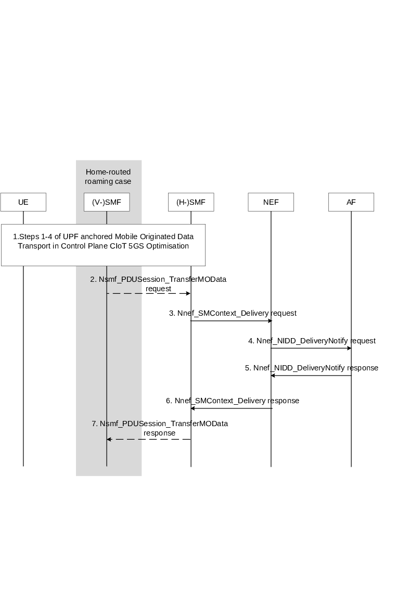

# 4.25.4 NEF Anchored Mobile Originated Data Transport

Figure 4.25.4-1 illustrates the NEF Anchored Mobile Originated Data Transport procedure.

Figure 4.25.4-1: NEF Anchored Mobile Originated Data Transport procedure

1\. The UE sends a NAS message with unstructured data according to steps 1-4 of the procedure for UPF anchored Mobile Originated Data Transport in Control Plane CIoT 5GS Optimisation (see clause 4.24.1). The Reliable Data Service header is included if the Reliable Data Service is enabled.

2\. \[Conditional\] In the case of home-routed roaming the V-SMF sends the Nsmf_PDUSession_TransferMOData request to the H-SMF including MO small data.

3\. The (H-)SMF sends the Nnef_SMContext_Delivery Request (User Identity, PDU session ID, unstructured data) message to the NEF.

4\. When the NEF receives the unstructured data and finds an NEF PDU Session context and the related T8 Destination Address, then it sends the unstructured data to the AF that is identified by the T8 Destination address in a Nnef_NIDD_DeliveryNotify Request (GPSI, unstructured data, Reliable Data Service Configuration). If no T8 Destination address is associated with the UE's PDN connection, the data is discarded, the Nnef_NIDD_DeliveryNotify Request is not sent and the flow continues at step 6. The Reliable Data Service Configuration is used to provide the AF with additional information such as indicate if an acknowledgement was requested and port numbers for originator application and receiver application, when the Reliable Data Service is enabled.

Editor's note: It is left to Stage 3 whether or not the NEF aggregates Nnef_NIDD_DeliveryNotify Request messages to the AF.

5\. The AF responds to the NEF with a Nnef_NIDD_DeliveryNotify Response (Cause).

6\. The NEF sends Nnef_SMContext_Delivery Response to the SMF. If the NEF cannot deliver the data, e.g. due to missing AF configuration, the NEF sends an appropriate error code to the SMF.

7\. \[Conditional\] In the case of home-routed roaming, the H-SMF responds to the V-SMF with a Nsmf_PDUSession_TransferMOData (Result Indication) Response.
