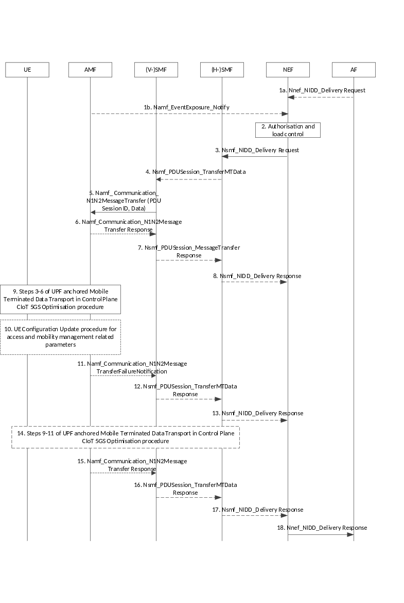

# 4.25.5 NEF Anchored Mobile Terminated Data Transport

Figure 4.25.5-1 illustrates the procedure using which the AF sends unstructured data to a given user as identified via External Identifier or MSISDN.

Figure 4.25.5-1: NEF Anchored Mobile Terminated Data Transport

1a. If AF has already activated the NIDD service for a given UE and has downlink unstructured data to send to the UE, the AF sends a Nnef_NIDD_Delivery Request (GPSI, TLTRI, unstructured data, Reliable Data Service Configuration) message to the NEF. Reliable Data Service Configuration is an optional parameter that is used to configure the Reliable Data Service, it may be used to indicate if a Reliable Data Service acknowledgement is requested and port numbers for originator application and receiver application.

1b. AMF indicates to NEF that the UE has become reachable. Based on this the NEF re-starts delivering buffered unstructured data to the UE.

2\. The NEF determines the 5GS QoS Flow Context based on the DNN associated with the NIDD configuration and the User Identity. If an NEF 5GS QoS Flow Context corresponding to the GPSI included in step 1 is found, then the NEF checks if the AF is authorised to send data and if it does not exceed its quota or rate. If these checks fail, then steps 3-15 are skipped and an appropriate error code is returned in step 17.

3\. The NEF forwards the unstructured data to the (H-)SMF using Nsmf_NIDD_Delivery Request. If NEF has indicated support of Extended Buffering in Nnef_SMContext_Create Response during SMF-NEF connection establishment, then NEF keeps a copy of the data.

4\. In the roaming case, the H-SMF sends the Nsmf_PDUSession_TransferMTData to the V-SMF including MT small data.

5\. The (V-)SMF determines whether Extended Buffering applies based on local policy and based on whether NEF has indicated support of Extended Buffering in Nnef_SMContext_Create Response during SMF-NEF connection establishment. (V-)SMF compresses the header if header compression applies and forwards the data and the PDU session ID to the AMF using the Namf_Communication_N1N2MessageTransfer service operation. If Extended Buffering applies, then (V-SMF) includes "Extended Buffering support" indication in Namf_Communication_N1N2Message Transfer.

6\. If AMF determines the UE is unreachable for the SMF (e.g. if the UE is in MICO mode or the UE is configured for extended idle mode DRX), then the AMF rejects the request from the SMF. The AMF may include in the reject message an indication that the SMF need not trigger the Namf_Communication_N1N2MessageTransfer Request to the AMF, if the SMF has not subscribed to the event of UE reachability.

If the SMF included Extended Buffering support indication, the AMF indicates the Estimated Maximum Wait time, in the reject message, for the SMF to determine the Extended Buffering time. If the UE is in MICO mode, the AMF determines the Estimated Maximum Wait time based on the next expected periodic registration timer update expiration or by implementation. If the UE is configured for extended idle mode DRX, the AMF determines the Estimated Maximum Wait time based on the start of next PagingTime Window. The AMF stores an indication that the SMF has been informed that the UE is unreachable.

7\. In the roaming case V-SMF sends Nsmf_PDUSession_TransferMTData (Result Indication) response to H-SMF. If the V-SMF receives an "Estimated Maximum Wait time" from the AMF and Extended Buffering applies, the V-SMF also passes the "Estimated Maximum Wait time" to the H-SMF.

8\. If the (H-)SMF receives a failure indication, (H-)SMF also sends a failure indication to NEF. If (H-)SMF has received the "Estimated Maximum Wait time" and Extended Buffering applies, the (H-)SMF includes Extended Buffering time in the failure indication. The Extended Buffering time is determined by the (H-)SMF and should be larger or equal to the Estimated Maximum Wait time. The NEF stores the DL data for the Extended Buffering time. The NEF does not send any additional Nsmf_NIDD_Delivery Request message if subsequent downlink data packets are received. The procedures stop at this step.

9\. If the AMF determines the UE to be reachable in Step 5, then Steps 3 to 6 of the UPF anchored Mobile Terminated Data Transport in Control Plane CIoT 5GS Optimisation procedure (clause 4.24.2) apply.

If the Reliable Data Service header indicates that the acknowledgement is requested, then the UE shall respond with an acknowledgement to the DL data that was received.

10\. If the AMF has paged the UE to trigger the NAS procedure in step 9, the AMF shall initiate the UE configuration update procedure as defined in clause 4.2.4.2 to assign a new 5G-GUTI.

11\. If the UE has not responded to paging, the AMF sends a failure notification to the (V-)SMF. Otherwise the procedure continues at step 13.

12\. In the roaming case, if V-SMF has received a failure notification from AMF, then V-SMF sends Nsmf_PDUSession_TransferMTData (Result Indication) response to H-SMF.

13\. If (H-)SMF receives a failure notification, then SMF indicates to the NEF that the requested Nsmf_NIDD_Delivery has failed. If Extended Buffering applies, then NEF purges the copy of the data. The procedure continues at step 17.

14\. Steps 9 to 11 of the UPF anchored Mobile Terminated Data Transport in Control Plane CIoT 5GS Optimisation procedure (clause 4.24.2) apply.

15\. AMF informs (V-)SMF that data has been forwarded.

16\. In the roaming case, V-SMF sends Nsmf_PDUSession_TransferMTData (Result Indication) response to H-SMF that the data has been forwarded.

17\. (H-)SMF indicates to NEF that the data has been forwarded. If Extended Buffering applies then NEF purges the copy of the data.

18\. The NEF sends a Nnef_NIDD_Delivery Response (cause) to the AF.

The Reliable Data Service Acknowledgement Indication is used to indicate if an acknowledgement was received from the UE for the MT NIDD. If the Reliable Data Service was requested in step 1, then the Nnef_NIDD_Delivery Response is sent to the AF after the acknowledgement is received from the UE or, if no acknowledgment is received, then the Nnef_NIDD_Delivery Response is sent to the AF with a cause value indicating that no acknowledgement was received.
