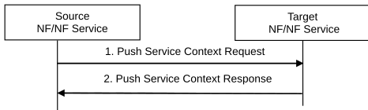

# 4.26 Network Function/NF Service Context Transfer Procedures

## 4.26.1 General

Network Function/NF Service Context Transfer Procedures allow transfer of Service Context of a NF/NF Service from a Source NF/NF Service Instance to the Target NF/NF Service Instance, e.g. before the Source NF/NF Service can gracefully close its NF/NF Service. If SMF sets are deployed this applies from an SMF instance within an SMF set to an SMF instance of another SMF set.

A request (push procedure, see clause 4.26.2) or response (pull procedure, see clause 4.26.3) from a Source NF/NF Service Instance to a Target NF/NF Service Instance contains either

\- the context being transferred, e.g. SM context (direct mode); or

\- optionally, an endpoint address from which Target NF/NF Service Instance can retrieve the context, see TS 29.501 \[62\] (indirect mode).

It assumes that access to a given context endpoint address can be restricted to single Target NF/NF Service Instance.

NOTE: Which procedures need to be executed for indirect mode is part of the specific context transfer procedures as specified in clause 4.26.5.

## 4.26.2 NF/NF Service Context Transfer Push Procedure

Figure 4.26.2-1: NF/NF Service Context Push procedure

1\. When triggered, the Source NF/NF Service acting as NF Service Consumer sends its Context (e.g. UE Context or SM context) to the Target NF/NF Service acting as NF Service producer. This may trigger several other procedures that ensure all necessary NF/NF Services are being updated and set up with necessary information about the new context location.

2\. The NF Service Consumer receives the response indicating the result of the operation (successful or not successful). When all procedures have been executed successfully the Target NF/NF Service can continue to serve the original NF Service Consumers of the Source NF/NF Service, which e.g. can be shut down gracefully.

NOTE: After resumption of a new service transaction, it may be necessary to contact the UE using existing procedures.

## 4.26.3 NF/NF Service Context Transfer Pull procedure

Figure 4.26.3-1: NF/NF Service Context Pull procedure

1\. When triggered, the Target NF/NF Service as an NF Service Consumer requests a Context (e.g. UE context or SM context) from the Source NF as a NF Service Producer. This may trigger several other procedures that ensure all necessary NF/NF services are being updated and set up with necessary information about the new context location.

NOTE 1: Which procedures need to be executed and what information needs to be updated is part of the specific context transfer procedures as specified in clause 4.26.5.

2\. The NF Service Consumer receives the Context and the operation was successful. When all procedures have been executed successfully the Target NF/NF Service can continue to serve the original NF Service Consumers of the Source NF/NF Service, which e.g. can be shut down gracefully.

NOTE 2: After resumption of a new service transaction, it may be necessary to contact the UE using existing procedures.

## 4.26.4 Context Transfer due to decommissioning

In the case of decommissioning, the Old NF may inform NRF that it is about to be decommissioned. NRF will in this case not include the NF profile of the Old NF in any discovery result from the NF/NF service discovery procedure. The NRF will also notify any consumers subscribed to changes to this resource.

## 4.26.5 SMF Service Context Transfer procedures

### 4.26.5.1 General

This clause lists the context-specific transfer procedures between different SMF Sets supporting the same DNN/S-NSSAI pair supported for SM Contexts (i.e. SMF contexts).

### 4.26.5.2 I-SMF Context Transfer procedure

Old I-SMF triggered from O&M procedure sends Nsmf_PDUSession_SMContextStatusNotify (I-SMF transfer indication, New SMF ID or SMF set ID) to AMF.

Steps 2-25 in clause 4.23.4.3 follows, where in step 2 AMF selects the indicated I-SMF, or selects the I-SMF from the indicated SMF set.

### 4.26.5.3 SMF Context Transfer procedure, LBO or no Roaming, no I-SMF

In the case of dynamic IP address assignment (IPv4 address and/or IPv6 prefix), the procedure in figure 4.26.4.1.1-1 assumes that, if the UE IP address is received from Old SMF, the control of the IP address(es) assigned by Old SMF is moved to New SMF by O&M procedures. New SMF is in full control of the concerned IP address(es) when the transfer is complete.

NOTE 1: If UPF has the IP point of presence from the DNN, the same UPF is used.

Figure 4.26.4.1.1-1: Context transfer of a PDU session

1\. SM context transfer is triggered, e.g. by OAM to Old SMF including SUPI, PDU session ID and New SMF ID or SMF set ID. The SMF selection by using SMF set ID not applicable when the IP range is managed by SMF.

2\. \[Conditional - depending on current subscription\] Old SMF subscribes to events when UE status becomes CM-IDLE or CM-CONNECTED with RRC_INACTIVE state (Namf_EventExposure_Subscribe).

3\. \[Conditional - depending on the event\] The AMF detects the monitored event occurs and sends the event report by means of Namf_EventExposure_Notify message, to Old SMF.

4\. From Old SMF to AMF Nsmf_PDUSession_SMContextStatusNotify (SMF transfer indication, Old SMF ID, New SMF ID or SMF set ID from Step 1, PDU Session ID, SUPI, SM Context ID).

5\. AMF, or SCP if delegated discovery is used, uses New SMF ID or SMF set ID to select New SMF and sends Nsmf_PDUSession_CreateSMContext request (PDU Session ID, Old SMF ID, SM Context ID in Old SMF, UE location info, Access Type, RAT Type, Operation Type, SMF transfer indication). The same PDU Session ID as received in step 4 is used. If the AMF receives the service request from the UE for the PDU session(s) affected by this procedure the AMF delays the transaction with the SMF until the step 13 completes. If the AMF receives the UE context transfer request from the other AMF due to the UE mobility, the AMF defers the response until the step 13 completes. Also, to avoid infinite waiting time, the AMF starts a locally configured guard timer upon sending the request to the SMF and the AMF decides the procedure has failed at expiry of the guard timer.

NOTE 2: Either delay or failure of the SM Context transfer may incur timeout or failure in UE procedure(s).

6\. From New SMF to Old SMF Nsmf_PDUSession_ContextRequest request (SM Context type, SM Context ID, SMF transfer indication). If New SMF is not capable to transfer this SM Context (e.g. it is not responsible for the IP range), steps 9 to 12 are skipped.

7\. Old SMF releases the N4 session with the UPF by sending a flag notifying the UPF about the expected re-establishment of the N4 session for the same PDU session. Based on this, if supported, the UPF should delay the release of the N4 session up to step 10.2 to allow for uninterrupted packet handling until the N4 session is re-established by New SMF.

8\. From Old SMF to New SMF Nsmf_PDUSession_ContextRequest response (SM Context or endpoint address where New SMF can retrieve SM Context). The SM Context includes the IP address(es) if the PDU session is of type IPv4, IPv6 or IPv4v6, or the Ethernet MAC address(es) if the PDU session if of type Ethernet as well as the UPF to be selected by New SMF. Old SMF starts a timer to monitor the SMF context transferring process.

9\. \[Conditional\] If dynamic PCC is used for the PDU Session, New SMF sets up a new policy association towards PCF.

10.1. UPF receives a N4 session establishment request for the same PDU session from step 7. The parameters from step 8 and if applies, step 9 are used.

10.2. New SMF performs a full re-establishment of the N4 session, establishing a new N4 session. All information related to the N4 session of Old SMF that is not used by the N4 session of New SMF is removed from UPF if not already done.

11\. New SMF registers to UDM. The information stored at the UDM includes SUPI, SMF identity and the associated DNN and PDU Session ID.

12\. New SMF subscribes to subscription changes for the UE.

13\. From New SMF to AMF: Nsmf_PDUSession_CreateSMContext response. If this response indicates a redirect (e.g. another SMF in the set), the procedure moves to step 5 with the indicated endpoint address as target.

14\. UDM notifies Old SMF that it is deregistered for the PDU Session by sending Nudm_UECM_DeregistrationNotification, optionally including New SMF ID

15\. \[Conditional\] If 14 was not received and the timer from step 8 expires, Old SMF re-establishes the N4 session. The UPF may for the purpose use the information stored in step 7. In this case, the procedure ends here.

16\. \[Conditional\] If Nudm_UECM_DeregistrationNotification in step 14 was received, Old SMF removes its policy association with PCF. Any changes to the QoS rules need to be sent to the UE when it becomes active.

17\. Old SMF releases any internal resources corresponding to the indicated PDU session. Subscribers to SMContextStatusNotify for the transferred SM context are notified of the context transfer and optionally of the new location of the transferred SM context.
