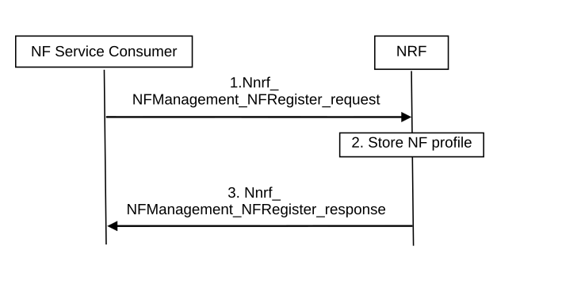

# 4.17.1 NF service Registration

NOTE 1: The term "NF service consumer" in this clause refers to the consumer of the NRF services and should not be confused with the role of the NF (consumer or producer).

Figure 4.17.1-1: NF Service Registration procedure

1\. NF service consumer, i. e. an NF instance sends Nnrf_NFManagement_NFRegister Request message to NRF to inform the NRF of its NF profile when the NF service consumer becomes operative for the first time. See clause 5.2.7.2.2 for relevant NF profile parameters

NOTE 2: NF service consumer's NF profile is configured by OAM system.

2\. The NRF stores the NF profile of NF service consumer and marks the NF service consumer available.

NOTE 3: Whether the NF profile sent by NF service consumer to NRF needs to be integrity protected by the NF service consumer and verified by the NRF is to be decided by SA3.

3\. The NRF acknowledge NF Registration is accepted via Nnrf_NFManagement_NFRegister response.
