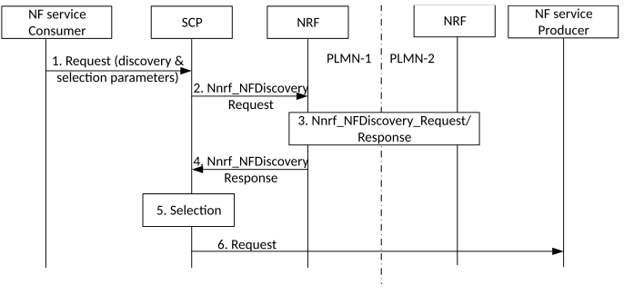

# 4.17.10 Delegated service discovery when NF service consumer and NF service producer are in different PLMNs

Figure 4.17.10-1: Delegated NF service discovery when NF service consumer and NF service producer are in different PLMNs

1\. The NF service consumer intends to communicate with an NF service producer. The NF service consumer sends the request to an SCP. The request includes at least the source PLMN ID and the target PLMN ID in the discovery and selection parameters necessary for the SCP to discover and select a NF service producer instance. The discovery and selection parameters are included in the request by the NF service consumer in a way that the SCP does not need to parse the request body.

2\. The SCP recognises that the request is for a NF service producer in another PLMN. SCP interacts with NRF using the Nnrf_NFDiscovery service.

3\. NRF in PLMN-1 and NRF in PLMN 2 interact using the Nnrf_NFDiscovery service. See step 2 in clause 4.17.5.

4\. SCP gets Nnrf_NFDiscovery service response with NF profile(s).

5\. SCP selects a NF service producer instance in PLMN-2.

6\. SCP forwards the request to the selected NF service producer instance in PLMN-2.

Alternatively, SCP may send the discovery request directly to the NRF in PLMN-2, if it has the relevant NRF address and is authorized by the NRF in PLMN-2. Thus step 2 goes from SCP to NRF in PLMN-2 and step 4 goes from NRF in PLMN-2 to SCP and step 3 is omitted.
