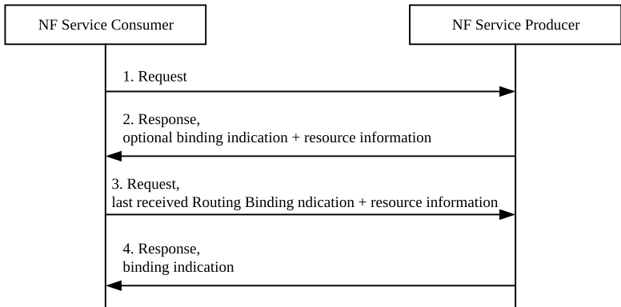
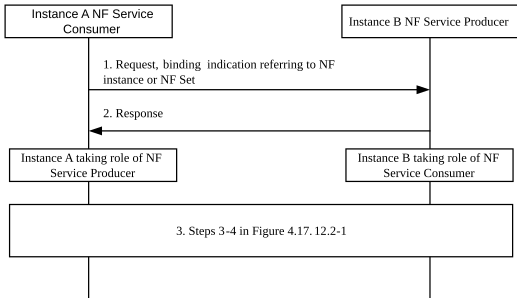
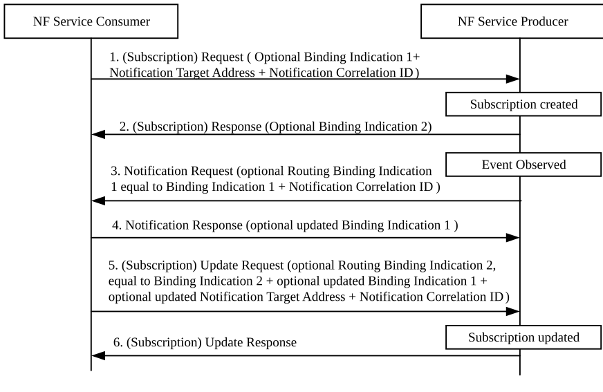
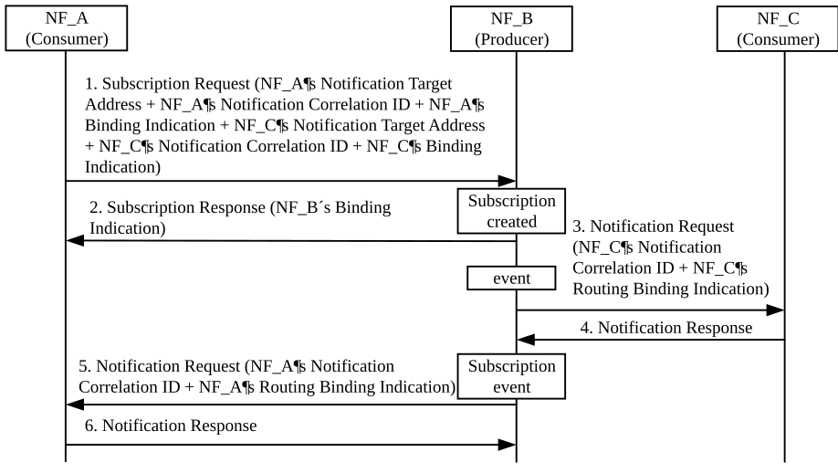

# 4.17.12 Binding between NF service consumer and NF service producer

## 4.17.12.1 General

This clause describes the procedures to establish binding between the NF service consumer and producer.

Direct Communication or Indirect Communication procedures may be used between the Consumer and Producer. In the case of Indirect Communication, an SCP is located between the Consumer and Producer.

## 4.17.12.2 Binding created as part of service response

When the NF service consumer communicates with the NF service producer, the producer may return a binding indication to the consumer. The consumer stores the received binding indication and uses it for the subsequent requests concerning the data context.

Figure 4.17.12.2-1: Binding created as part of service response

1\. If Direct Communication is used, the NF service consumer selects the NF service producer and sends the request to the selected NF service producer. If Indirect Communication without delegated discovery is used, the NF service consumer selects the NF service producer set or instance and sends the request to the selected NF service producer via the SCP; if the NF service consumer only selects the NF service producer set, it provides the necessary selection parameters and the SCP selects the NF service producer instance. If Indirect Communication with delegated discovery is used, the NF service consumer sends the request to the SCP and provides within the service request to the SCP the discovery and selection parameters necessary to discover and select a NF service producer.

2\. The NF service producer sends a response to the NF service consumer. In the response the NF service producer may include a binding indication. If the NF service consumer receives a resource information and binding indication as specified in Table 6.3.1.0-1 of TS 23.501 \[2\], it uses them for subsequent requests regarding the concerned resource. Otherwise, the procedure ends here.

3\. The NF service consumer uses the binding indication and resource information received in the previous step for subsequent requests regarding the concerned resource. If indirect communication with delegated discovery is used, the NF service consumer includes a Routing Binding Indication with the same contents as the received Binding Indication. If indirect communication without delegated discovery is used, the NF service consumer also includes the Routing Binding Indication with the same contents as the received Binding Indication unless the NF service consumer performs a reselection. The SCP shall route the service request using the Routing Binding Indication and resource information sent from the NF service consumer.

4\. The NF service producer sends a response to the consumer. The NF service producer may respond with an updated binding indication, different to the one received in the previous response.

## 4.17.12.3 Binding created as part of service request

If the NF service consumer can also be as a NF service producer for later communication from the contacted producer, a service request sent to the producer may include binding indication.

NOTE: This clause only applies to an AMF, V-SMF or I-SMF as NF service consumer sending requests to an SMF and to an AMF as NF service consumer sending requests to an I-SMF or V-SMF, in step 1 unless further usage has been defined in stage 3. Implicit subscriptions are not described in this clause.

Figure 4.17.12.3-1: Binding created as part of service request

1\. Instance A, as an NF service consumer sends a service request using either Direct Communication or Indirect communication via SCP and Instance B is selected as NF service producer. If Instance A can also be NF service producer for later communication for the concerned data context, it may include binding indication referring to NF service instance, NF service set, NF instance or NF Set as specified in Table 6.3.1.0-1 of TS 23.501 \[2\] in the request sent to the NF service producer; the binding indication shall be associated with an applicability indicating "other service" and include the service name. In this case, if indirect communication is used, the SCP sends to the Instance B the service request including the binding indication.

2\. Instance B as the NF service producer sends a response to the NF service consumer.

3\. When Instance B as NF service consumer needs to invoke the service provided by Instance A, Instance B sends a request using the binding indication received in step 1 as described in Steps 3-4 in Figure 4.17.12.2-1 with the following difference:

\- Based on the received binding indication, if delegated discovery is not used, the Instance B may need to discover the corresponding endpoint address of the Instance A.

## 4.17.12.4 Binding for subscription requests

Binding for notifications can be created as part of an explicit or implicit subscription request. In this case, illustrated in Figure 4.17.12.4-1, the subscription request may include a Binding Indication 1 referring to NF service instance, NF service Set, NF instance or NF Set and additionally includes a service name of the NF service consumer as specified in Table 6.3.1.0-1 of TS 23.501 \[2\]. The NF Service Set ID, NF service instance ID and service name relate to the service of a NF service consumer that will handle the notification.

For direct communication, the NF service producer selects the target for the related notifications using the notification endpoint received in the subscription request. If the notification endpoint included in the subscription is not reachable, the Binding Indication received is used to discover an alternative notification endpoint, as specified in Table 6.3.1.0-1 of TS 23.501 \[2\].

For indirect communication, the NF service producer includes the notification endpoint received in the subscription and may include a Routing Binding Indication with the same contents as the received Binding Indication. If the notification endpoint included in the subscription is not reachable, the SCP selects the target for the related notifications using the received Routing Binding Indication as specified in Table 6.3.1.0-1 of TS 23.501 \[2\].

If the Binding Indication for Notifications needs to be updated, the NF service consumer may initiate a new Subscription request to the NF service producer with an updated Binding Indication or may include the Binding Indication in the acknowledgment of a Notification. A Subscription request may also contain updated Notification Correlation ID and Notification Target Address.

Binding for the subscription resource at the NF service producer can also be created: The Subscription Response message may contain a Binding Indication 2 referring to NF service instance, NF instance or NF Set of the NF service producer.

For direct communication, the NF service consumer selects the target for the related request to the producer, such as the request to update the subscription shown in Figure 4.17.12.4-1, using the received Binding Indication 2 as specified in Table 6.3.1.0-1 of TS 23.501 \[2\].

For indirect communication with delegated discovery, the NF service consumer includes a Routing Binding Indication with the same contents as the received Binding Indication 2. For indirect communication without delegated discovery, the NF service consumer also includes the Routing Binding Indication with the same contents as the received Binding Indication 2 unless it performs a reselection. The SCP selects the target for the related request using the received Routing Binding Indication 2 as specified in Table 6.3.1.0-1 of TS 23.501 \[2\].

If the Binding Indication for Subscription needs to be updated, the NF service producer may provide an updated binding indication in a notification request to the NF service consumer or in the response to a subsequent subscription update request from the NF service consumer.

Figure 4.17.12.4-1: Binding in a subscription request

Figure 4.17.12.4-2: Binding during subscription via another network function

An NF service consumer may subscribe via another network function. For example, NF_A may subscribe to NF_B on behalf of NF_C. NF_A additionally subscribe to subscription related events. In this case, both the binding indication from NF_C and NF_A are provided to the NF service producer NF_B. The Binding Indication for notifications to subscription related events shall be associated with an applicability indicating "subscription events".

The NF_C's binding indication is used for reselection of a notification endpoint, which is used for event notification. The NF_A's binding indication is used for reselection of a notification endpoint, which is used for subscription change event notification.
