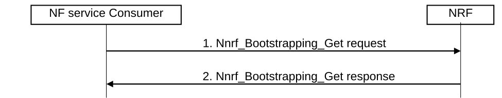

# 4.17.13 NRF bootstrapping procedure

Figure 4.17.13-1: Bootstrapping procedure

1\. NF service consumer (e.g. v-NRF) sends a Nnrf_Bootstrapping_Get request to the configured address of the Bootstrapping Service instance.

2\. NRF responds with all the Service Instances of the NRF and their endpoint addresses. This also contains if the NRF is part of an NF Set.
