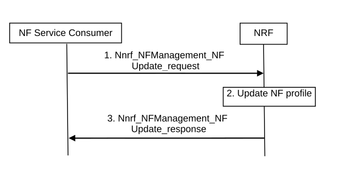

# 4.17.2 NF service update

Figure 4.17.2-1: NF Service Update procedure

1\. NF service consumer i.e. an NF instance sends Nnrf_NFManagement_NFUpdate Request message (the updated NF profile of NF service consumer) to NRF to inform the NRF of its updated NF profile (e.g. with updated capacity) when e.g. triggered after a scaling operation. See clause 5.2.7.2.3 for relevant input and output parameters.

NOTE: The updated NF profile of NF instance are configured by OAM system.

2\. The NRF updates the NF profile of NF service consumer.

3\. The NRF acknowledge NF Update is accepted via Nnrf_NFManagement_NFUpdate response.

NOTE 4: When the NF service consumer registers to NRF via the SCP, the NF Service registration procedure can also be used by the SCP to derive the relation among NF instances, e.g. whether they belong to a specific NF Set.
