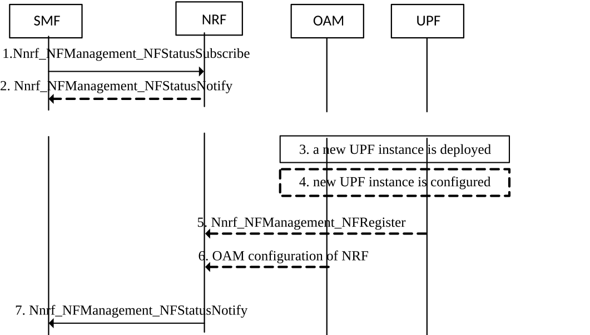

# 4.17.6 SMF Provisioning of available UPFs using the NRF

## 4.17.6.1 General

This clause describes the provisioning of available UPFs in SMF using the NRF as documented in clause 6.3.3 of TS 23.501 \[2\].

This optional node-level step takes place prior to selecting the UPF for PDU Sessions and may be followed by N4 Node Level procedures defined in clause 4.4.3 where the UPF and the SMF exchange information such as the support of optional functionalities and capabilities.

As an option, UPF(s) may register in the NRF. This registration phase uses the Nnrf_NFManagement_NFRegister operation and hence does not use N4.

For the purpose of SMF provisioning of available UPFs, the SMF uses the Nnrf_NFManagement_NFStatusSubscribe, Nnrf_NFManagement_NFStatusNotify and Nnrf_NFDiscovery services to learn about available UPFs.

NOTE 1: The protocol used by UPF to interact with NRF is described in TS 29.510 \[37\]

UPFs may be associated with UPF Provisioning Information in the NRF. The UPF Provisioning Information consists of:

\- a list of (S-NSSAI, DNN);

\- UE IPv4 Address Ranges and/or IPv6 Prefix Range(s) per (S-NSSAI, DNN); and

NOTE 2: The above information can be used by the SMF for UPF selection when static IP address/prefix allocation is required for a UE.

\- a SMF Area Identity the UPF can serve. The SMF Area Identity allows limiting the SMF provisioning of UPF(s) using NRF to those UPF(s) associated with a certain SMF Area Identity. This can e.g. be used if an SMF is only allowed to control UPF(s) configured in NRF as belonging to a certain SMF Area Identity.

\- the supported ATSSS steering functionality, i.e. whether MPTCP functionality or ATSSS-LL functionality or MPQUIC functionality, or any combination of them is supported.

\- the supported UPF event exposure service and supported Event IDs, e.g. local notification of QoS Monitoring to AF or e.g. events for data collection to NWDAF by Nupf_EventExposure_Notify.

\- the supported functionality associated with high data rate low latency services, eXtended Reality (XR) and interactive media services, specified in clause 5.37 of TS 23.501 \[2\] (for example, ECN marking for L4S, specified in clause 5.37.3 of TS 23.501 \[2\], PDU Set Marking, specified in clause 5.37.5 of TS 23.501 \[2\], UE power saving management, specified in clause 5.37.8 of TS 23.501 \[2\]).

The SMF Area Identity and UE IPv4 Address Ranges and/or IPv6 Prefix Range(s) are optional in the UPF Provisioning Information.

## 4.17.6.2 SMF provisioning of UPF instances using NRF

This procedure applies when a SMF wants to get informed about UPFs available in the network and supporting a list of parameters.

Figure 4.17.6.2-1: SMF provisioning of UPF instances using NRF procedure

The following takes place when an SMF expects to be informed of UPFs available in the network:

1 The SMF issues a Nnrf_NFManagement_NFStatusSubscribe Service Operation providing the target UPF Provisioning Information it is interested in.

2 The NRF issues Nnrf_NFManagement_NFStatusNotify with the list of all UPFs that currently meet the SMF subscription. This notification indicates the subset of the target UPF Provisioning Information that is supported by each UPF.

The following takes place when a new UPF instance is deployed:

3 At any time a new UPF instance is deployed.

4 The UPF instance is configured with the NRF identity to contact for registration and with its UPF Provisioning Information. An UPF is not required to understand the UPF Provisioning Information beyond usage of this information to register in step 5.

5 The UPF instance issues an Nnrf_NFManagement_NFRegister Request operation providing its NF type, the FQDN or IP address of its N4 interface and the UPF Provisioning Information configured in step 4.

6\. Alternatively (to steps 4 and 5) OAM registers the UPF on the NRF indicating the same UPF Provisioning Information as provided in step 5. This configuration mechanism is out of scope of this specification.

7\. Based on the subscription in step 1, the NRF issues Nnrf_NFManagement_NFStatusNotify to all SMFs with a subscription matching the UPF Provisioning Information of the new UPF
