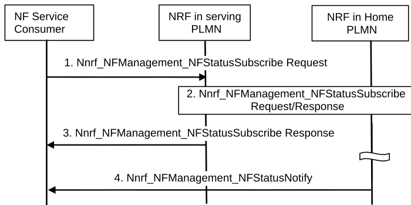

# 4.17.8 NF/NF service status subscribe/notify across PLMNs

In the case that the NF service consumer intends to subscribe to the status of NF/NF service instance(s) in home PLMN, the NRF in serving PLMN needs to request "NF status subscribe" service from NRF in the home PLMN. The notification is sent from the NRF in the home PLMN to the NF service consumer in the serving PLMN without the involvement of the NRF in the serving PLMN. The procedure is depicted in the figure below:

Figure 4.17.8-1: NF/NF service status subscribe/notify across PLMNs

NOTE 1: The NRF in the home PLMN communicates with the NRF and the NF consumer in the serving PLMN via the SEPPs in the respective PLMNs. For the sake of clarity, SEPPs are not depicted in the flow.

1\. The NF service consumer in the serving PLMN invokes Nnrf_NFManagement_NFStatusSubscribe Request from an appropriate configured NRF in the serving PLMN.

2\. The NRF in serving PLMN identifies NRF in home PLMN (hNRF) based on the home PLMN ID and it requests Nnrf_NFManagement_NFStatusSubscribe service from NRF in home PLMN. As the NRF in the serving PLMN triggers the Nnrf_NFManagement_NFStatusSubscribe service on behalf of the NF service consumer, the NRF in the serving PLMN shall not replace the information of the service requester NF, i.e. NF consumer ID, in the status subscribe Request message it sends to the hNRF.

3\. The NRF in serving PLMN acknowledges the execution of Nnrf_NFManagement_NFStatusSubscribe Request to the NF consumer in the serving PLMN.

4\. NRF in the home PLMN notifies about newly registered/updated/deregistered NF instances along with its NF services to the subscribed NF service consumer in the serving PLMN.

NOTE 2: The NF service consumer unsubscribes to receive NF status notifications by invoking Nnrf_NFManagement_NFStatusUnSubscribe service operation.

NOTE 3: When the NF or NF service instance becomes unavailable, the NRF in the home PLMN invokes Nnrf_NFManagement_NFStatusNotify service to notify the NF service consumer in the serving PLMN based on the subscription.
