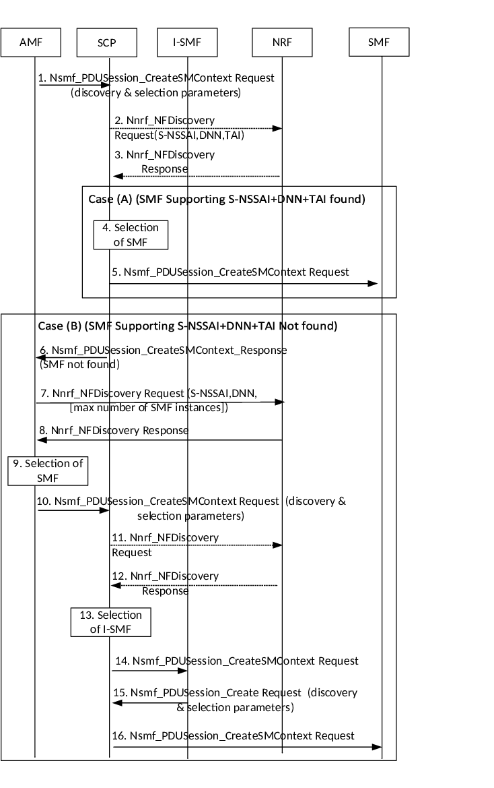
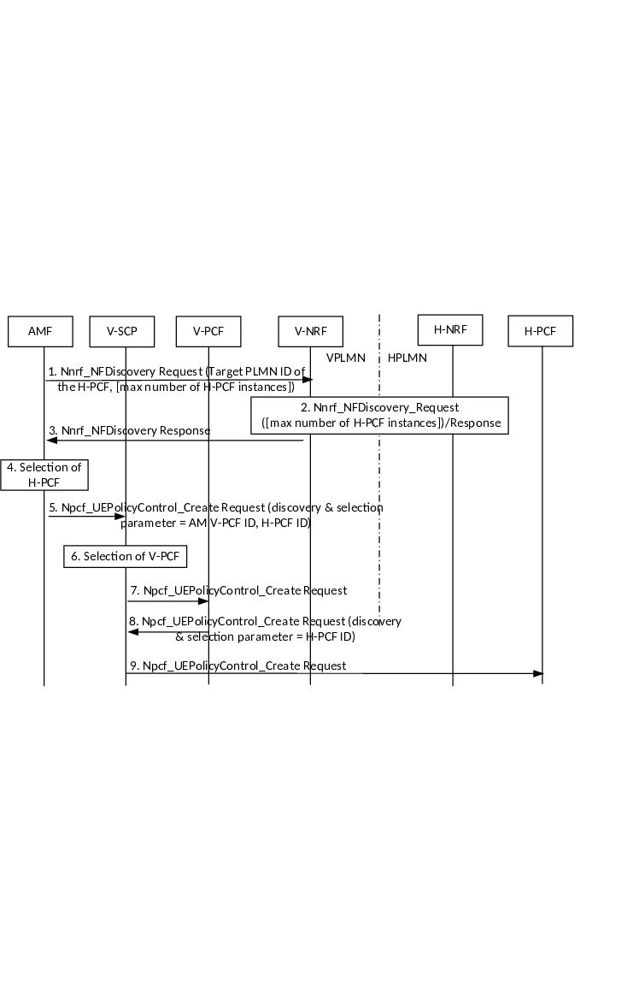

# Annex E (normative): Delegated SMF and PCF discovery in the Home Routed and specific SMF Service Areas scenarios

## E.0 Overview

This Annex describes the option where the SCP is involved in the SMF and PCF selection for following cases:

\- PDU Session to be established in Home Routed mode,

\- PDU Session requiring an I-SMF as defined in clause

\- PCF discovery in the Roaming scenario

NOTE: No similar Annex is foreseen to describe the discovery and selection of other NF involving the SCP.

## E.1 Delegated SMF discovery in the Home Routed scenario

Figure E.1: Delegated Discovery of SMF in the Home Routed Scenario

1\. The AMF sends Nnrf_NFDiscovery Request to the V-NRF. The AMF may indicate the maximum number of H-SMF instances to be returned by the NRF.

2\. The NRF in VPLMN and NRF in HPLMN interact using the Nnrf_NFDiscovery service. See step 2 in clause 4.17.5.

3\. The AMF gets Nnrf_NFDiscovery service response with one or more profile(s) of SMF(s) in HPLMN.

4\. The AMF selects an SMF instance in HPLMN (H-SMF endpoint).

5\. The AMF builds a Nsmf_PDUSession_CreateSMContext Request that includes the endpoint (e.g. URI) of the selected H-SMF in the body of the request. If the AMF supports delegated SMF discovery and is configured to apply it, the AMF sends the Nsmf_PDUSession_CreateSMContext Request with Discovery & Selection parameters to the selected SCP in the VPLMN. Discovery & Selection parameters include S-NSSAI, UE location (TAI), i.e. parameter for V-SMF selection.

6\. \[Optional\] The SCP in VPLMN sends Nnrf_NFDiscovery Request to the V-NRF using Discovery & Selection parameters received from AMF.

7\. \[Optional\] The SCP in VPLMN gets Nnrf_NFDiscovery service response with profile(s) of SMF(s) in VPLMN.

8\. The SCP in VPLMN selects an SMF instance in VPLMN (V-SMF), which supports the Discovery & Selection parameters received earlier from the AMF.

9\. The SCP in VPLMN forwards the Nsmf_PDUSession_CreateSMContext Request received from the AMF to the selected SMF instance in VPLMN.

10\. If the V-SMF does not support delegated SMF discovery or is not configured to apply it (Case A), the V-SMF sends Nsmf_PDUSession_Create Request directly to the H-SMF. Otherwise (Case B), the V-SMF sends the Nsmf_PDUSession_Create Request to the SCP in VPLMN but adds Discovery & Selection parameter set to H-SMF endpoint received from the AMF. In both cases, the V-SMF uses the received endpoint (e.g. URI) of the selected H-SMF to construct the target destination to be addressed.

NOTE: The Nsmf_PDUSession_Create Request sent by the V-SMF in Case A and in Case B is the same apart from the Discovery & Selection parameter. The Nsmf_PDUSession_Create Request received by the H-SMF in Case A and in Case B is the same.

11\. The SCP in VPLMN sends a Nsmf_PDUSession_Create Request to the selected SMF instance in HPLMN indicated in step 10.

When the V-SMF responds to AMF with Nsmf_PDUSession_CreateSMContext Response as in clause 4.3.2.2.2 in step 3b, if the AMF has not stored the SMF Service Area for the V-SMF, the AMF shall obtain the SMF Service Area for the concerned V-SMF from the NRF using the Nnrf_NFManagement_NFStatusSubscribe service operation.

## E.2 Delegated I-SMF discovery

Figure E.2: Delegated Discovery of I-SMF

The following impacts are applicable to clause 4.23.5 (PDU Session Establishment procedure) to support delegated SMF discovery:

1\. If the AMF supports delegated SMF discovery and is configured to apply it, the AMF sends an Nsmf_PDUSession_CreateSMContext Request together with discovery and selection parameters to a SCP. The discovery and selection parameters include S-NSSAI, DNN, TAI that corresponds to the UE location required SMF capability (e.g. support of ATSSS).

2\. \[Optional\] The SCP sends an Nnrf_NFDiscovery Request to the NRF. The request includes discovery and selection parameters received from AMF in step 1.

3\. \[Optional\] The SCP gets Nnrf_NFDiscovery service response. The response may include one or more profile(s) of SMF(s).

Depending on the available information, the SCP may either execute steps in Case A or in Case B.

Case A There are, either in the NRF response or discovered by the SCP, one or more SMF instances that support Discovery and selection criteria set by the AMF.

4\. The SCP selects an SMF instance.

5\. The SCP forwards the Nsmf_PDUSession_CreateSMContext Request to the selected SMF instance.

Case B There is, either in the NRF response or discovered by the SCP, no SMF instance that supports Discovery and selection criteria set by the AMF.

6\. The SCP returns an Nsmf_PDUSession_CreateSMContext Response to the AMF with an error 'NF not found'

7\. The AMF sends Nnrf_NFDiscovery Request to the NRF. The AMF may indicate the maximum number of SMF instances to be returned by the NRF.

8\. The AMF gets Nnrf_NFDiscovery service response with one or more profile(s) of SMF(s).

9\. The AMF selects an SMF instance endpoint.

10\. The AMF builds a Nsmf_PDUSession_CreateSMContext Request that contains the endpoint (e.g. URI) of the selected SMF in the body of the request. If the AMF supports delegated SMF discovery and is configured to apply it, the AMF sends the Nsmf_PDUSession_CreateSMContext Request to a SCP together with Discovery and selection parameters that include S-NSSAI, TAI that corresponds to the UE location, i.e. parameter for I-SMF selection.

11\. \[Optional\] The SCP sends an Nnrf_NFDiscovery Request to the NRF. The request includes Discovery and selection parameters received from AMF (including the TAI that corresponds to the UE location).

12\. \[Optional\] The SCP gets Nnrf_NFDiscovery service response. The response may include one or more profile(s) of I-SMF(s).

13\. The SCP selects an I-SMF instance that supports the TAI.

14\. The SCP forwards the Nsmf_PDUSession_CreateSMContext Request received from the AMF to the selected I-SMF instance.

15\. If the I-SMF does not support delegated SMF discovery or is not configured to apply it (Case A), the I-SMF sends Nsmf_PDUSession_Create Request directly to the SMF. Otherwise (Case B), the I-SMF sends the Nsmf_PDUSession_Create Request to the SCP but adds Discovery & Selection parameter set to the SMF endpoint received from AMF. In both cases the I-SMF uses the received endpoint (e.g. URI) of the selected SMF to construct the target destination to be addressed.

NOTE: The Nsmf_PDUSession_Create Request sent by the I-SMF in Case A and in Case B is the same apart from the Discovery & Selection parameter. The Nsmf_PDUSession_Create Request received by the SMF in Case A and in Case B is the same.

16\. The SCP forwards the Nsmf_PDUSession_Create Request to the selected SMF instance indicated in step 15.

The procedure continues as described in clause 4.3.2.2.2 from Step 7.

Difference comparing to procedure defined in clause 4.3.2.2.2, the V-SMF and V-UPF are replaced by I-SMF and I-UPF and H-SMF and H-UPF are replaced by SMF and UPF(PSA) respectively. Also only the S-NSSAI with the value defined by the serving PLMN is sent to the SMF.

When the I-SMF responds to AMF with Nsmf_PDUSession_CreateSMContext Response as in clause 4.3.2.2.2 in Step 3b, if the AMF has not stored the SMF Service Area for the I-SMF, the AMF shall obtain the SMF Service Area for the concerned I-SMF from the NRF using the Nnrf_NFManagement_NFStatusSubscribe service operation.

## E.3 Delegated PCF discovery in the Roaming scenario

Figure E.3: Delegated Discovery of PCF in the Home Routed Scenario

1\. The AMF sends Nnrf_NFDiscovery Request to the V-NRF in order to discover a PCF in HPLMN. The AMF may indicate the maximum number of H-PCF instances to be returned by the NRF.

2\. The NRF in VPLMN and NRF in HPLMN interact using the Nnrf_NFDiscovery service. See step 2 in clause 4.17.5.

3\. The AMF gets Nnrf_NFDiscovery service response with one or more profile(s) of PCF(s) in HPLMN.

4\. The AMF selects a PCF instance in HPLMN.

5\. The AMF builds a Npcf_UEPolicyControl Request that contains the H-PCF ID in the body of the request. If the AMF supports delegated PCF discovery and is configured to apply it, the AMF forwards the Npcf_UEPolicyControl Request to the selected SCP in VPLMN together with Discovery & Selection parameter set to V-PCF instance ID.

6\. The SCP in VPLMN selects the corresponding (V-)PCF instance for UE policy association based on Discovery & Selection parameter received from the AMF.

7\. The SCP in VPLMN forwards the Npcf_UEPolicyControl Request to the selected PCF instance in VPLMN.

8\. If the V-PCF does not support delegated PCF discovery or is not configured to apply it (Case A), the V-PCF sends Npcf_UEPolicyControl Request to the selected PCF instance. Otherwise (Case B), the V-PCF sends the Npcf_UEPolicyControl Request to a SCP in VPLMN but adds Discovery & Selection parameter set to H-PCF ID.

9\. The SCP in VPLMN sends an Npcf_UEPolicyControl Request to the selected PCF instance in HPLMN indicated in step 8.
