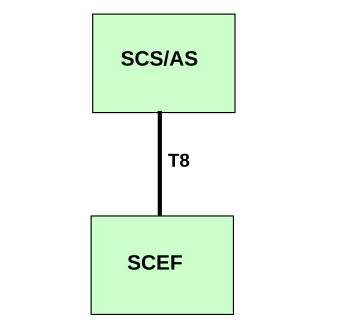

# 4.2 Reference model

The T8 reference point resides between the SCEF and the SCS/AS as depicted in figure 4.2.1. The overall SCEF architecture is depicted in clause 4.2 of 3GPP TS 23.682 \[2\].

NOTE: The SCS/AS can be provided by a third party.

Figure 4.2.1: T8 reference model
