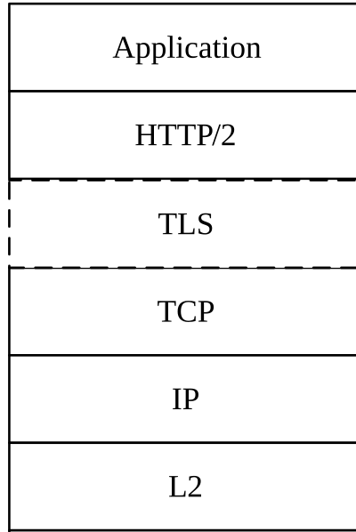

# 5.1 Protocol Stack Overview

The protocol stack for the service-based interfaces is shown on Figure 5.1-1.

Figure 5.1-1: SBI Protocol Stack

The service-based interfaces use HTTP/2 protocol (see clause 5.2) with JSON (see clause 5.4) as the application layer serialization protocol. For the security protection at the transport layer, all 3GPP NFs shall support TLS and TLS shall be used within a PLMN if network security is not provided by other means, as specified in 3GPP TS 33.501 \[17\].
