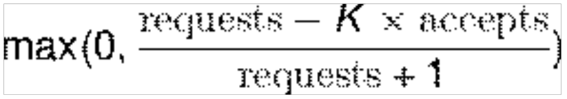

# Annex A (informative): Client-side Adaptive Throttling for Overload Control

This clause contains an example algorithm to make an NF Service Consumer adjust the traffic rate sent to an NF Service Producer based on the number of received "rejects" of HTTP requests with a status code "503 Service Unavailable", or requests that have timed-out and the response was never received. This algorithm is described in the book "Betsy Beyer, et al; Google: Site Reliability Engineering" (<https://landing.google.com/sre/book.html>), clause 21, "Handling Overload".

NOTE: The reference link provided to the book can change and hence the name of the book is expected to be used for referring to the latest edition.

Each client (NF Service Consumer) keeps track of the following counters during a certain time window:

\- Requests: The number of requests that the client (NF Service Consumer) needs to handle. Under normal operation (no overload), all these requests are sent to the server (NF Service Producer). Under an overload situation, part of these requests are locally rejected by the client (and not sent to the server), and the rest of the requests are sent to the server.

\- Accepts: The number of requests accepted by the server (i.e., requests for which a response has been effectively received at the client, with a status code other than "503 Service Unavailable").

When there is no server overload, these values are equal.

When there is an overload status in the server, the rate between "Accepts" and "Requests" decreases progressively. When this rate falls below a certain point (given by an algorithm parameter named "K"), the client shall start dropping some requests locally and not send them to the server.

The local rejection of requests can be done by calculating a "Client request rejection probability", as:

So, for example, assuming that the K parameter is set at 1.5:

\- if the server accepts \>67% of the traffic, and rejects \<33% of the traffic, the client does not take any throttling action, and keeps sending to the server all the traffic it has available for processing

\- if, during a first time-window, the server accepts, e.g., only 60% of the requests, and rejects 40% due to overload, the application of this algorithm implies that the client must drop locally 10% of the requests (probabilistically), and only send to the server the remainder 90% of its traffic.

\- if, during a second time-window, the client keeps the same amount of available traffic to handle, but the server continues rejecting requests with same rate as before (40%) of the received requests, the application of the algorithm again, results in increasing the drop rate to 14.5%, and sending to the server only 85.5% of the available traffic.

The value of the parameter K, along with the size of the time window during which the total number of "requests" and "accepts" is accounted for, has a fundamental role on how the algorithm behaves. If K is higher, the algorithm is more "permissive", and the client does not start dropping requests locally until the rejection rate is higher (e.g., \>50%, for K = 2); if K is lower, the algorithm is more "aggressive", and the client starts dropping requests sooner (e.g., K = 1.1 implies to start dropping requests as soon as the server rejects \>10% of the requests).
