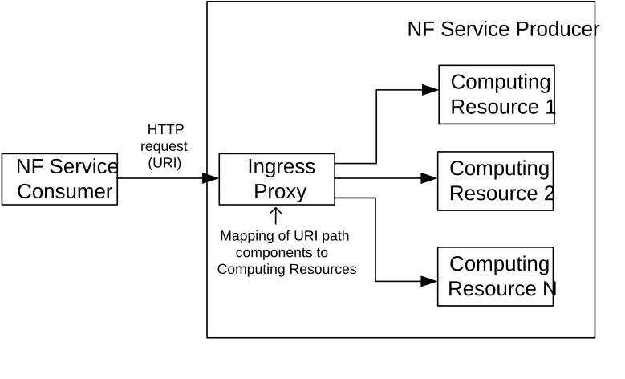

# Annex C (informative): Internal NF Routing of HTTP Requests

The internal details of the architecture of a Network Function instance is out of the scope of 3GPP and are entirely implementation-specific. This annex describes how an instance of an NF Service Producer can route internally HTTP requests received on a given Service-Based Interface.

Figure C-1 illustrates an example component architecture where incoming HTTP requests are received and processed in a component named as "Ingress Proxy" module and route them to the appropriate computing resource in the NF.

Figure C-1: Internal message routing inside NF Service Producer

The Ingress Proxy may parse any of the different components in the HTTP request, but typically it may parse the path of the URI (i.e. the :path pseudo-header in the HTTP/2 request). Parsing of other component in the request message, such as the HTTP body, is also possible but it is not desirable as it requires the parsing of the entire body (i.e. a JSON document) which is a much more computing-intensive task.

The path component of the URI contains the service name of the requested SBA service, so frequently the routing is done based on this component.

It is also frequent to inspect other components of the path (i.e. path segments), to do a more fine-grained routing and direct requests done on a specific HTTP resource(s) towards a given computing resource(s).

It can be noted that the path components used to determine the target computing resource typically do not need to be statically defined but are frequently defined in terms of "variables", or placeholders, similarly to how they are defined in the OpenAPI specification language (a mechanism usually known as "path templating"). See: <https://github.com/OAI/OpenAPI-Specification/blob/master/versions/3.0.0.md#path-templating>
