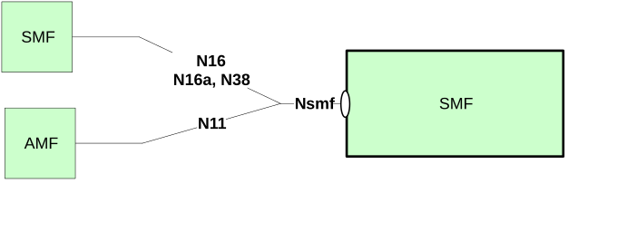

# 4 Overview

## 4.1 Introduction

Within the 5GC, the SMF offers services to NF service consumers via the Nsmf service based interface (see 3GPP TS 23.501 \[2\] and 3GPP TS 23.502 \[3\]).

Figure 4.1-1 provides the reference model (in service based interface representation and in reference point representation), with focus on the SMF services specified within the present specification.

Figure 4.1-1: Reference model – SMF

N16 is the reference point between the V-SMF and H-SMF in Home Routed (HR) roaming cases.

N16a is the reference point between SMF and I-SMF.

N38 is the reference point between I-SMFs or V-SMFs.

The functionalities supported by the SMF are listed in clause 6.2.2 of 3GPP TS 23.501 \[2\].
