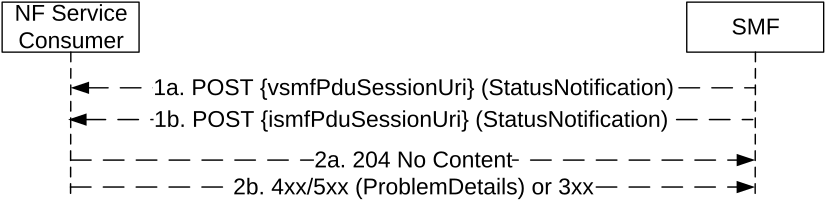

# 5.2.2.10 Notify Status service operation

## 5.2.2.10.1 General

The Notify Status service operation shall be used to notify the NF Service Consumer about status changes of a PDU session (e.g. when the PDU session is released and the release is not triggered by a Release Request, or when the PDU session is moved to another system, or when the control of the PDU session is taken over by another anchor SMF), for a HR PDU session or a PDU session involving an I-SMF.

It is used in the following procedures:

\- Home network requested PDU Session release (see clause 4.3.4.3 of 3GPP TS 23.502 \[3\]), e.g. H-SMF initiated release;

\- SMF requested PDU session release, for a PDU session involving an I-SMF (see clause 4.23 of 3GPP TS 23.502 \[3\]);

\- Handover of a PDU Session procedure from 3GPP to untrusted non-3GPP access (see clauses 4.9.2.4.2 and 4.23.16.2 of 3GPP TS 23.502 \[3\]);

\- Interworking procedures without N26 interface, e.g. 5GS to EPS Mobility (see clause 4.11.2.2 of 3GPP TS 23.502 \[3\]);

\- Handover from 5GC-N3IWF to EPS (see clause 4.11.3.2 of 3GPP TS 23.502 \[3\]);

\- Handover from 5GS to EPC/ePDG (see clause 4.11.4.2 of 3GPP TS 23.502 \[3\]);

\- The control of PDU session is taken over by a new anchor SMF within the same SMF set (see clause 5.22 of 3GPP TS 29.244 \[29\]), and the new SMF instance decides to notify the change of SMF;

\- SMF triggered I-SMF selection or removal (see clause 4.23.5.4 of 3GPP TS 23.502 \[3\]);

\- Change of SSC mode 2 PDU Session Anchor with different PDU Sessions (see clause 4.3.5.1 of 3GPP TS 23.502 \[3\]);

\- Change of SSC mode 3 PDU Session Anchor with multiple PDU Sessions (see clause 4.3.5.2 of 3GPP TS 23.502 \[3\]);

\- Network slice usage behaviour control, i.e. SMF initiated PDU session release due to slice inactivity, see clause 5.15.15.3 of 3GPP TS 23.501 \[2\].

The SMF (i.e. H-SMF for a HR PDU session, or SMF for a PDU session involving an I-SMF) shall notify the NF Service Consumer (i.e. V-SMF for a HR PDU session, or I-SMF for a PDU session involving an I-SMF) by using the HTTP POST method as shown in Figure 5.2.2.10-1.

Figure 5.2.2.10-1: PDU session status notification

1\. The SMF shall send a POST request to the resource representing the individual PDU session resource in the NF Service Consumer. The content of the POST request shall contain the notification content, with the status information.

If the notification is triggered by PDU session handover to release resources of the PDU Session in the source access, the notification content shall contain the resourceStatus IE with the value "RELEASED" and the Cause IE with value "PDU_SESSION_HANDED_OVER" as specified in clause 4.2.9.4.2 of 3GPP TS 23.502 \[3\].

If the notification is triggered by PDU session handover to release only the SM Context with the I-SMF in the source access but without releasing the PDU session in the AMF, the notification content shall contain the resourceStatus IE with the value "UPDATED" and the Cause IE with the value "PDU_SESSION_HANDED_OVER" as specified in clause 4.23.16.2 of 3GPP TS 23.502 \[3\].

If the notification is triggered by SMF for I-SMF selection or removal for the current PDU session, or SMF selection during PDU Session re-establishment for SSC mode 2/3, the notification content shall contain the resourceStatus IE with the value "UNCHANGED", the Cause IE with the value "TARGET_DNAI_NOTIFICATION" and the targetDnaiInfo IE. The targetDnai IE in the targetDnaiInfo IE shall be absent if the I-SMF removal is triggered due to the DNAI currently served by the I-SMF being no longer used for the PDU Session. If the notification is triggered for SMF selection during PDU Session re-establishment for SSC mode 3, the notification content may also contain the oldPduSessionRef IE as specified in clause 4.3.5.2 of 3GPP TS 23.502 \[3\].

If the notification is triggered by PDU session handover to release resources of the PDU Session in the target access due to handover failure between 3GPP access and non-3GPP access, the notification content shall contain the resourceStatus IE with the value "RELEASED" and the Cause IE with the value "PDU_SESSION_HAND_OVER_FAILURE".

If the NF Service Consumer indicated support of the HOFAIL feature (see clause 6.1.8) and if the notification is triggered by PDU session handover to update access type of the PDU Session due to handover failure between 3GPP access and non-3GPP access, the notification content shall contain the resourceStatus IE with the value "UPDATED", the anType IE with the value "3GPP" or "NON_3GPP" indicating the access type of the PDU session after the handover failure scenario and the Cause IE with the value "PDU_SESSION_HAND_OVER_FAILURE".

If upon a change of anchor SMF, the new anchor SMF instance decides to notify the change of anchor SMF, then the notification content shall contain the resourceStatus IE with the value "UPDATED" and the Cause IE with the value "CHANGED_ANCHOR_SMF". In addition, the new anchor SMF instance shall include its SMF Instance ID in the notification content, and/or carry an updated binding indication in the HTTP headers to indicate the change of anchor SMF (as per step 6 of clause 6.5.3.3 of 3GPP TS 29.500 \[4\]). If the PDU session may be moved to EPS with N26 and the EPS PDN Connection Context information of the PDU session on the new anchor SMF is different from the one on the old anchor SMF, the content shall also include the "epsPdnCnxInfo" IE including the updated EPS PDN Connection Context information. The NF Service consumer shall overwrite the locally stored EPS PDN Connection Context information with the new one if received.

If the notification is triggered by a PDU session release due to slice inactivity as specified in clause 5.15.15.3 of 3GPP TS 23.501 \[2\] and clause 5.11.2 of 3GPP TS 29.244 \[29\], the notification content shall contain the resourceStatus IE with the value "RELEASED" and the Cause IE with the value "REL_DUE_TO_SLICE_INACTIVITY".

If the notification is triggered by duplicated PDU session detected during Create operation (see clause 5.2.2.7.1) or SMF deregistration from UDM due to duplicated pdu sessions (see clause 5.3.2.3 of 3GPP TS 29.503 \[46\]), the request body shall include the cause IE with the value "REL_DUE_TO_DUPLICATE_SESSION_ID". Upon receipt of such a status notification, the V-SMF or I-SMF shall not send SM context status notification to the AMF.

If the notification is <u>triggered by a SMF deregistration from UDM due to a new PDU session being established with an identical PDU session Id from another anchor SMF via an ePDG (see clause 5.3.2.3 of 3GPP TS 29.503 \[46\]), the request body shall include the cause</u> IE with the value "REL_DUE_TO_DUPLICATE_SESSION_EPDG". Upon receipt of such a status notification, the V-SMF or I-SMF shall release the PDU session and also clean up the PDU session resources in AMF and RAN (if needed), but shall not release the PDU session in the UE.

2a. On success, "204 No Content" shall be returned and the content of the POST response shall be empty.

If the SMF indicated in the request that the PDU session in the SMF is released, the NF Service Consumer shall release the SM context for the PDU session.

If the SMF indicated in the request that the SM context resource is updated with the anType IE, the NF Service Consumer shall change the access type of the PDU session with the value of anType IE.

2b. On failure or redirection, one of the HTTP status code listed in Table 6.1.3.7.3.1-2 shall be returned. For a 4xx/5xx response, the message body shall contain a ProblemDetails structure with the "cause" attribute set to one of the application errors listed in Table 6.1.3.7.3.1-2.
