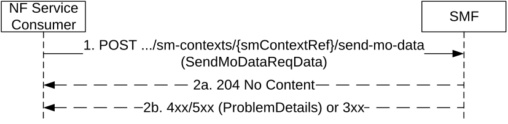

# 5.2.2.11 Send MO Data service operation

## 5.2.2.11.1 General

The Send MO Data service operation shall be used to send mobile originated data received over NAS, for a given PDU session, towards the SMF, or the V-SMF for HR roaming scenarios, or the I-SMF for a PDU session with an I-SMF.

It is used in the following procedures:

\- UPF anchored Mobile Originated Data Transport in Control Plane CIoT 5GS Optimisation (see clause 4.24.1 of 3GPP TS 23.502 \[3\]);

\- NEF anchored Mobile Originated Data Transport (see clause 4.25.4 of 3GPP TS 23.502 \[3\]).

The NF Service Consumer (e.g. AMF) shall send mobile originated data to the SMF by using the HTTP POST method (send-mo-data custom operation) as shown in Figure 5.2.2.11.1-1.

Figure 5.2.2.11.1-1: Send MO Data

1\. The NF Service Consumer shall send a POST request to the resource representing the individual SM context resource in the SMF. The content of the POST request shall contain the mobile originated data to send.

The request body may include the "MO Exception Data Counter", which indicates that the UE has accessed the network by using "MO exception data" RRC establishment, if Small Data Rate Control is enabled for the PDU session and the UE is accessing via the NB-IoT RAT.

2a. On success, "204 No Content" shall be returned.

For UPF anchored Mobile Originated Data Transport in Control Plane CIoT 5GS Optimisation, if the "MO Exception Data Counter" is included in the request then:

\- for HR PDU session, the V-SMF shall update the H-SMF (see clause 5.2.2.8.2.2);

\- for PDU session with I-SMF, the I-SMF shall update the SMF (see clause 5.2.2.8.2.2).

2b. On failure or redirection, one of the HTTP status codes listed in Table 6.1.3.3.4.5.2-2 shall be returned. For a 4xx/5xx response, the message body shall contain a ProblemDetails, with the "cause" attribute indicating the cause of the failure.
