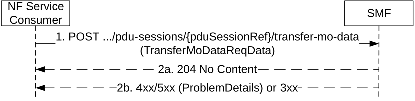

# 5.2.2.12 Transfer MO Data service operation

## 5.2.2.12.1 General

The Transfer MO Data service operation shall be used to transfer NEF anchored mobile originated data received from AMF, for a given PDU session, towards the H-SMF for HR roaming scenarios, or the SMF for a PDU session with an I-SMF.

It is used in the following procedures:

\- NEF anchored Mobile Originated Data Transport (see clause 4.25.4 of 3GPP TS 23.502 \[3\]).

The NF Service Consumer (e.g. V-SMF or I-SMF) shall transfer NEF anchored mobile originated data to the SMF by using the HTTP POST method (transfer-mo-data custom operation) as shown in Figure 5.2.2.12.1-1.

Figure 5.2.2.12.1-1: Transfer MO Data

1\. The NF Service Consumer shall send a POST request to the URI of Transfer MO Data custom operation on an individual PDU Session resource in the SMF. The content of the POST request shall contain the mobile originated data to be transferred.

The content shall also contain the MO Exception Data Counter, if received from AMF.

2a. On success, "204 No Content" shall be returned.

2b. On failure or redirection, one of the HTTP status code listed in Table 6.1.3.6.4.4.2-2 shall be returned. For a 4xx/5xx response, the message body may contain a ProblemDetails, with the "cause" attribute indicating the cause of the failure.
