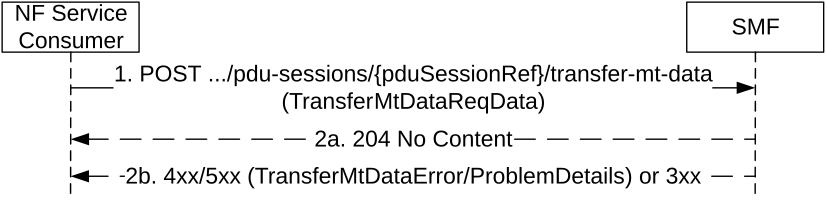

# 5.2.2.13 Transfer MT Data service operation

## 5.2.2.13.1 General

The Transfer MT Data service operation shall be used to transfer NEF anchored mobile terminated data received from NEF, for a given PDU session, towards the V-SMF for HR roaming scenarios, or the I-SMF for a PDU session with an I-SMF.

It is used in the following procedures:

\- NEF anchored Mobile Terminated Data Transport (see clause 4.25.5 of 3GPP TS 23.502 \[3\]).

The NF Service Consumer (e.g. H-SMF or SMF) shall transfer NEF anchored mobile terminated data to the SMF by using the HTTP POST method (transfer-mt-data custom operation) as shown in Figure 5.2.2.13.1-1.

Figure 5.2.2.13.1-1: Transfer MT Data

1\. The NF Service Consumer shall send a POST request to the URI of Transfer MT Data custom operation on an individual PDU Session resource in the SMF. The content of the POST request shall contain the mobile terminated data to be transferred.

The SMF shall forward the mobile terminated data to AMF. If SMF determines Extended Buffering is allowed by local policy and the NEF supports Extended Buffering, the SMF indicate the Extending Buffering support to AMF.

If AMF responds that it is attempting to reach the UE, the SMF shall wait for potential failure notification from AMF before responding to the NF consumer.

2a. On success, "204 No Content" shall be returned.

2b. On failure or redirection, one of the HTTP status code listed in Table 6.1.3.7.4.3.2-2 shall be returned. For a 4xx/5xx response, the message body may contain a TransferMtDataError or ProblemDetails object, with the "cause" attribute indicating the cause of the failure. If Estimated Maximum Waiting Time is received from AMF, the SMF shall include it in the message body.
