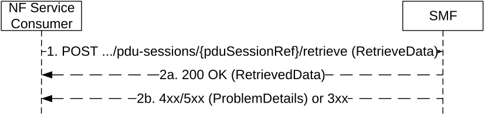

# 5.2.2.14 Retrieve service operation

## 5.2.2.14.1 General

The Retrieve service operation shall be used to retrieve information from a PDU session context from the H-SMF for a HR PDU session, or from the SMF for a PDU session with an I-SMF.

It is used in the following procedures:

\- 5GS to EPS handover using N26 interface and 5GS to EPS Idle mode mobility using N26 interface (see clauses 4.11.1.2.1 and 4.11.1.2.3 of 3GPP TS 23.502 \[3\]), for PDU sessions associated with 3GPP access and for which small data rate control is applicable.

\- Change of SSC mode 3 PDU Session Anchor with multiple PDU Sessions (see clause 4.3.5.2 of 3GPP TS 23.502 \[3\]).

The NF Service Consumer (e.g. V-SMF or I-SMF) shall retrieve information from a PDU session context by using the HTTP POST method (retrieve custom operation) as shown in Figure 5.2.2.14.1-1.

Figure 5.2.2.14.1-1: Retrieval of information from a PDU session context

1\. The NF Service Consumer shall send a POST request to the resource representing the individual PDU session context for which information needs to be retrieved. The POST request may contain a content with the following parameters:

\- smallDataRateStatusReq set to "true" to indicate a request to retrieve the small data rate control status of the PDU session, if small data rate control is applicable on the PDU session.

\- pduSessionContextType indicates that this is a request to retrieve the AF Coordination Information as defined in clause 6.1.6.2.69, during the change of SSC mode 3 PDU Session Anchor with multiple PDU Sessions, if the runtime coordination between old SMF and AF is enabled.

2a. On success, "200 OK" shall be returned and the content of the POST response shall contain the small data rate control status if this is a request for retrieving the small data rate control status.

2b. On failure or redirection, one of the HTTP status code listed in Table 6.1.3.6.4.5.2-2 shall be returned. For a 4xx/5xx response, the message body may contain a ProblemDetails structure with the "cause" attribute set to one of the application error listed in Table 6.1.3.6.4.5.2-2.
