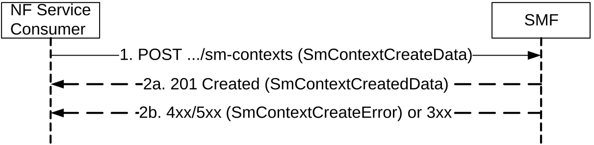

# 5.2.2.2.1 General

The Create SM Context service operation shall be used to create an individual SM context, for a given PDU session, in the SMF, in the V-SMF for HR roaming scenarios, or in the I-SMF for a PDU session with an I-SMF.

It is used in the following procedures:

\- UE requested PDU Session Establishment (see clauses 4.3.2 and 4.23.5.1 of 3GPP TS 23.502 \[3\]);

\- EPS to 5GS Idle mode mobility, EPS to 5GS Idle mode mobility with data forwarding or handover using N26 interface (see clauses 4.11.1, 4.23.12.3, 4.23.12.5 and 4.23.12.7 of 3GPP TS 23.502 \[3\]);

\- EPS to 5GS mobility without N26 interface (see clause 4.11.2.3 3GPP TS 23.502 \[3\]);

\- Handover of a PDU session between 3GPP access and non-3GPP access, when the target AMF does not know the SMF resource identifier of the SM context used by the source AMF, e.g. when the target AMF is not in the PLMN of the N3IWF (see clause 4.9.2.3.2 of 3GPP TS 23.502 \[3\]), or when the UE is roaming and the selected N3IWF is in the HPLMN (see clause 4.9.2.4.2 of 3GPP TS 23.502 \[3\]);

\- Handover from EPS to 5GC-N3IWF (see clause 4.11.3.1 of 3GPP TS 23.502 \[3\]);

\- Handover from EPC/ePDG to 5GS (see clause 4.11.4.1 of 3GPP TS 23.502 \[3\]);

\- Xn based or N2 based handover with I-SMF or V-SMF insertion and change (see clauses 4.23.7.3, 4.23.11 and 4.23.12 of 3GPP TS 23.502 \[3\]);

\- UE Triggered Service Request with I-SMF insertion/change/removal or V-SMF change (see clause 4.23.4.3 of 3GPP TS 23.502 \[3\]);

\- Registration procedure for a UE with a PDU session with I-SMF or V-SMF insertion, change and removal (see clause 4.23.3 of 3GPP TS 23.502 \[3\]);

\- Handover from EPC/ePDG to 5GS with I-SMF insertion (see clause 4.23 of 3GPP TS 23.502 \[3\]);

\- Handover from non-3GPP to 3GPP access with I-SMF insertion or V-SMF change, and Handover from 3GPP to non-3GPP access with I-SMF removal (see clause 4.23.16 of 3GPP TS 23.502 \[3\]);

\- SMF Context Transfer procedure, LBO or no Roaming, no I-SMF (see clause 4.26.5.3 of 3GPP TS 23.502 \[3\]);

\- I-SMF Context Transfer procedure (see clause 4.26.5.2 of 3GPP TS 23.502 \[3\]);

\- 5G-RG requested PDU Session Establishment via W-5GAN (see clause 7.3.1 of 3GPP TS 23.316 \[36\]);

\- FN-RG related PDU Session Establishment via W-5GAN (see clause 7.3.4 of 3GPP TS 23.316 \[36\]);

\- Non-5G capable device behind 5G-CRG and FN-CRG requested PDU Session Establishment via W-5GAN (see clause 4.10a of 3GPP TS 23.316 \[36\]);

\- Handover from 3GPP access/EPS to W-5GAN/5GC (see clause 7.6.4.1 of 3GPP TS 23.316 \[36\]);

\- SMF triggered I-SMF selection or removal (see clause 4.23.5.4 of 3GPP TS 23.502 \[3\]);

\- Multicast Session join and session establishment procedure in clause 7.2.1.3 of 3GPP TS 23.247 \[44\];

\- N2-based handover with V-SMF insertion/change/removal in HR-SBO case (see clause 6.7.2.6 of 3GPP TS 23.548 \[39\]);

\- Inter V-SMF mobility registration update in HR-SBO (see clause 6.7.2.7 of 3GPP TS 23.548 \[39\]).

There shall be only one individual SM context per PDU session.

The NF Service Consumer (e.g. AMF) shall create an SM context by using the HTTP POST method as shown in Figure 5.2.2.2.1-1.

Figure 5.2.2.2.1-1: SM context creation

1\. The NF Service Consumer shall send a POST request to the resource representing the SM contexts collection resource of the SMF. The content of the POST request shall contain:

\- a representation of the individual SM context resource to be created;

\- the requestType IE, if the Request type IE is received from the UE for a single access PDU session and if the request refers to an existing PDU session or an existing Emergency PDU session; the requestType IE shall not be included for a MA-PDU session establishment request; it may be included otherwise;

\- the Old PDU Session ID, if it is received from the UE (i.e. for a PDU session establishment for the SSC mode 3 operation);

\- the indication that the UE is inside or outside of the LADN (Local Area Data Network) service area, if the DNN corresponds to a LADN;

\- the perLadnDnnSnssaiInd IE, indicating that the PDU Session is subject to LADN per LADN DNN and S-NSSAI, if the AMF enforces the LADN Service Area per LADN DNN and S-NSSAI;

\- the indication that a MA-PDU session is requested if a MA-PDU session is requested to be established by the UE, or the indication that the PDU session is allowed to be upgraded to a MA-PDU session if so indicated by the UE;

\- the n3gPathSwitchSupportInd IE if the AMF supports non-3GPP access path switching while maintaining two N2 connections for non-3GPP access, the selected SMF supports non-3GPP path switching and if the UE supports non-3GPP access path switching as specified in clause 4.22.2.1 of 3GPP TS 23.502 \[3\];

\- the indication that the same PCF is required for the requested DNN and S-NSSAI, if it is received by the AMF from UE Subscription data in the UDM, together with the PCF ID selected by the AMF;

> \- the alternative S-NSSAI, if the NF service consumer and UE support the network slice replacement and it is requested to replace the S-NSSAI with the alternative S-NSSAI (see clause 5.15.19 of 3GPP TS 23.501 \[2\]);
>
> \- the alternative HPLMN S-NSSAI, if the NF service consumer and UE support the network slice replacement and it is requested to replace the HPLMN S-NSSAI with the alternative HPLMN S-NSSAI for a roaming PDU session (see clause 5.15.19 of 3GPP TS 23.501 \[2\]);

NOTE: If the alternative S-NSSAI is present in the PDU Session Establishment procedure, the AMF selects an SMF that supports both the original S-NSSAI and the alternative S-NSSAI. The alternative (HPLMN) S-NSSAI is provided to the SMF together with the original (HPLMN) S-NSSAI to be replaced. The SMF uses the original (H-PLMN) S-NSSAI to retrieve the session management subscription data from the UDM.

\- the anType;

\- the additionalAnType, if the UE is registered over both 3GPP and Non-3GPP accesses;

\- the cpCiotEnabled IE with the value "True", if the NF service consumer (e.g. the AMF) has verified that the CIOT feature is supported by the SMF (and for a home-routed session, that it is also supported by the H-SMF), and Control Plane CIoT 5GS Optimisation is enabled for this PDU session;

\- the cpOnlyInd IE with the value "True", if the PDU session shall only use Control Plane CIoT 5GS Optimisation;

\- the Invoke NEF indication with the value "True" for a home-routed PDU session, if the cpCiotEnabled IE is set to "True" and data delivery via NEF is selected for the PDU session;

\- a subscription for SM context status notification;

\- the servingNfId identifying the serving AMF;

\- trace control and configuration parameters, if trace is to be activated (see 3GPP TS 32.422 \[22\]);

\- identifiers (i.e. FQDN or IP address) of N3 terminations at the W-AGF, TNGF or TWIF, if available;

\- a subscription for DDN failure notification, if the Availability after DDN failure event is subscribed by the UDM;

\- the upipSupported IE set to "true", if the UE supports User Plane Integrity Protection with EPS and if the AMF supports the related functionality.

For the UE requested PDU Session Establishment procedure in home routed roaming scenario (see clause 4.3.2.2.2 of 3GPP TS 23.502 \[3\]), the NF Service Consumer shall provide the URI of the Nsmf_PDUSession service of the H-SMF in the hSmfUri IE and optionally the corresponding SMF ID, and may provide the URI of the Nsmf_PDUSession service of additional H-SMF(s) with the corresponding SMF ID(s). The V-SMF shall try to create the PDU session using the hSmfUri IE. If due to communication failure on the N16 interface the V-SMF does not receive any response from the H-SMF, then:

\- depending on operator policy, the V-SMF may try reaching the hSmfUri via an alternate path; or

\- if additional H-SMF URI is provided, the V-SMF may try to create the PDU session on one of the additional H-SMF(s) provided.

For a PDU session establishment with an I-SMF (see clause 4.23.5.1 of of 3GPP TS 23.502 \[3\]), the NF Service Consumer shall provide the URI of the Nsmf_PDUSession service of the SMF in the smfUri IE and optionally the corresponding SMF ID, and may provide the URI of the Nsmf_PDUSession service of additional SMF(s) with the corresponding SMF ID(s). The I-SMF shall try to create the PDU session using the smfUri IE. If due to communication failure on the N16a interface the I-SMF does not receive any response from the SMF, then:

\- depending on operator policy, the I-SMF may try reaching the smfUri via an alternate path; or

\- if additional SMF URI is provided, the I-SMF may try to create the PDU session on one of the additional SMF(s) provided.

For the UE requested PDU Session Establishment procedure, if the AMF determines that the RAT type is NB-IoT and the UE has already 2 PDU Sessions with user plane resources activated, the AMF may continue with the PDU Session establishment and include the cpCiotEnabled IE or cpOnlyInd IE with the value "True" to the SMF as specified in clause 4.3.2.2.1 of 3GPP TS 23.502 \[3\].

The content of the POST request may further contain:

\- the name of the AMF service to which SM context status notification are to be sent (see clause 6.5.2.2 of 3GPP TS 29.500 \[4\]), encoded in the serviceName attribute;

\- the remote provisioning server information, if both the AMF and SMF support the Remote Provisioning of UEs in Onboarding Network procedures and the AMF received the information from AUSF for remote provisioning of the UE via user plane;

\- the Onboarding Indication, if the UE is registered for onboarding in an SNPN;

\- the indication of Notification for SM Policy Association events with the value "true" and the callback information of the PCF for the UE (i.e. the PCF for AM Policy and possibly UE Policy) to receive the notification, if both NF service consumer and the SMF support the "SPAE" feature and if the SM Policy Association Establishment and Termination events should be reported for the PDU session by the PCF for SM Policy to the PCF for the UE. See clause 4.3.2.2.1 of 3GPP TS 23.502 \[3\];

\- the satelliteBackhaulCat IE indicating the category of the satellite backhaul used towards the 5G AN serving the UE, if the AMF is aware of that a satellite backhaul is used towards the 5G AN;

\- the disasterRoamingInd IE set to true if the UE is registered for Disaster Roaming service;

\- the hrsboAllowedInd IE set to true if the Session Breakout for HR session in VPLMN is allowed;

\- the indication of PDU session establishment rejection together with the corresponding rejection cause, if the SMF supports the "PSER" (PDU Session Establishment Rejection) feature and the NF service consumer (i.e. the AMF) has determined that the PDU Session Establishment shall be rejected (e.g. due to the ODB configuration retrieved from the UDM);

\- the sliceAreaRestrictInd set to true if the PDU Session is subject to area restriction for the S-NSSAI, i.e. if the S-NSSAI is part of the partially allowed NSSAI (see clause 5.15.17 of 3GPP TS 23.501 \[2\]) or if the support of the S-NSSAI is restricted to a NS-AoS (see clause 5.15.18 of 3GPP TS 23.501 \[2\]).

2a. On success, "201 Created" shall be returned, the content of the POST response shall contain the representation describing the status of the request and the "Location" header shall be present and shall contain the URI of the created resource. The authority and/or deployment-specific string of the apiRoot of the created resource URI may differ from the authority and/or deployment-specific string of the apiRoot of the request URI received in the POST request.  
  
If the requestType IE was received in the request and set to EXISTING_PDU_SESSION or EXISTING_EMERGENCY_PDU_SESSION (i.e. indicating that this is a UE request for an existing PDU session or an existing emergency PDU session), the SMF shall identify the existing PDU session or emergency PDU session based on the PDU Session ID; in this case, the SMF shall not create a new SM context but instead update the existing SM context and provide the representation of the updated SM context in the "201 Created" response to the NF Service Consumer.

> The POST request shall be considered as colliding with an existing SM context if:

\- this is a request to establish a new PDU session, i.e.:

\- the RequestType IE is present in the request and set to INITIAL_REQUEST or INITIAL_EMERGENCY_REQUEST (e.g. single access PDU session establishment request);

\- the RequestType IE and the maRequestInd IE are both absent in the request (e.g. EPS to 5GS mobility); or

\- the maRequestInd IE is present in the request (i.e. MA-PDU session establishment request) and the access type indicated in the request corresponds to the access type of the existing SM context.

and either of the following conditions is met:

\- this is a request to establish a non-emergency PDU session and the request includes the same SUPI and the same PDU Session ID as for an existing SM context; or

\- this is a request to establish an emergency PDU session and the request includes the same SUPI, or PEI for an emergency registered UE without a UICC or without an authenticated SUPI, as for an existing SM context for an emergency PDU session.

A POST request that collides with an existing SM context shall be treated as a request for a new SM context. Before creating the new SM context, the SMF should delete the existing SM context locally and any associated resources in the UPF, PCF, CHF, and UDM. If the UP connection of the existing PDU session is active, the SMF should also request (R)AN to release associated resources. See also clause 5.2.3.3.1 for the handling of requests which collide with an existing SM context. If the smContextStatusUri of the existing SM context differs from the smContextStatusUri received in the POST request, the SMF shall also send an SM context status notification (see clause 5.2.2.5) targeting the smContextStatusUri of the existing SM context to notify the release of the existing SM context. For a HR PDU session, if the H-SMF URI in the request is different from the H-SMF URI of the existing PDU session, the V-SMF should also delete the existing PDU session in the H-SMF by invoking the Release service operation (see clause 5.2.2.9). For a PDU session with an I-SMF, if the SMF URI in the request is different from the SMF URI of the existing PDU session, the I-SMF should also delete the existing PDU session in the SMF by invoking the Release service operation (see clause 5.2.2.9).

If the requestType IE was received in the request and indicates this is a request for a new PDU session (i.e. INITIAL_REQUEST) and if the Old PDU Session ID was also included in the request, the SMF shall identify the existing PDU session to release and to which the new PDU session establishment relates, based on the Old PDU Session ID.

If no GPSI IE is provided in the request, e.g. for a PDU session moved from another access or another system, and the SMF knows that a GPSI is already associated with the PDU session (or a GPSI is received from h-SMF for a HR PDU session), the SMF shall include the GPSI in the response.

If the indication of Notification for SM Policy Association events was received with the value "true" together with the callback information of the PCF for the UE in the request and SM Policy Association is to be established for the PDU session, the SMF shall provide the callback information of the PCF for the UE to the PCF for SM Policy during SM Policy Association Establishment.

If the sliceAreaRestrictInd is set to true in the request, the SMF shall subscribe to the AoI reporting event with the AoI defined by the S-NSSAI, for being notified by the AMF whether the UE is located in an area supporting the S-NSSAI, if this event has not been subscribed already.

2b. If the request does not include the "UE presence in LADN service area" indication and the SMF determines that the DNN corresponds to a LADN, then the SMF shall consider that the UE is outside of the LADN service area. The SMF shall reject the request if the UE is outside of the LADN service area.

> On failure, or redirection during a UE requested PDU Session Establishment, one of the HTTP status code listed in Table 6.1.3.2.3.1-3 shall be returned. For a 4xx/5xx response, the message body shall contain an SmContextCreateError structure, including:

\- a ProblemDetails structure with the "cause" attribute set to one of the application error listed in Table 6.1.3.2.3.1-3;

\- N1 SM information (PDU Session Reject), if the request included N1 SM information, except if the error prevents the SMF from generating a response to the UE (e.g. invalid request format).

For the UE requested PDU Session Establishment, the SMF shall reject the request with "EXCEEDED_SLICE_DATA_RATE" application error if the SMF receives from the PCF that the maximum bit rate per S-NSSAI is exceeded, or with "EXCEEDED_UE_SLICE_DATA_RATE" application error if the SMF receives from the PCF that the maximum bit rate per S-NSSAI per UE is exceeded.

For the UE requested PDU Session Establishment, the SMF shall directly reject the request if the SMF supports the "PSER" feature and it has received the indication of PDU Session Establishment Rejection from the AMF in the Create SM Context request.
