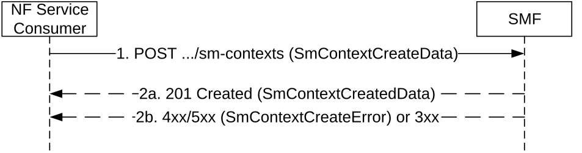

# 5.2.2.2.12 SMF triggered I-SMF selection/removal or V-SMF selection

The NF Service Consumer (e.g. AMF) shall invoke the following procedure to request:

\- the new I-SMF to create a SM context if the SMF (or the associated old I-SMF) cannot serve the target DNAI; or

\- the SMF to create the SM context if an I-SMF is used for the PDU Session and the SMF itself can serve the target DNAI hence the existing I-SMF is no longer needed; or

\- the SMF to create the SM context if an I-SMF is used for the PDU Session and the DNAI currently served by I-SMF is not used for the PDU Session anymore, hence the existing I-SMF is not needed; or

\- the new V-SMF to create a SM context if the associated old V-SMF cannot serve the target DNAI.

Figure 5.2.2.2.12-1: I-SMF selection/removal or V-SMF selection per DNAI

1\. The NF Service Consumer shall send a POST request as defined in step 1 of Figure 5.2.2.2.6-1, with the following additional information:

\- the smContextRef attribute set to the identifier of the SM Context resource in the SMF during I-SMF insertion, or the SM Context resource in the source I-SMF during I-SMF change/removal, or the SM Context resource in the source V-SMF during V-SMF change, and optionally the NF instance identifier of the SMF hosting the SM Context resource;

\- the target DNAI, if it is received in the targetDnaiInfo attribute of the SM context status notification;

\- if the UE is in CM-CONNECTED state, the ranUnchangedInd attribute shall be set to indicate that NG-RAN is not changed for the PDU Session (i.e. for this case, the NG-RAN tunnel info shall be included in SM context retrieved from old I-SMF, old V-SMF or SMF) as specified in clause 4.23.5.4 of 3GPP TS 23.502 \[3\] and clause 6.7.3.2 of 3GPP TS 23.548 \[74\];

\- the smfUri IE attribute set to the API URI of the Nsmf_PDUSession service of the SMF (during I-SMF insertion/change, or V-SMF change), and optionally the NF instance identifier of the SMF, if the "ACSCR" feature is not supported by the AMF, I-SMF or V-SMF.

2a. On success, the SMF shall return a 201 Created response, with the following additional information:

> If the SMF receives the ranUnchangedInd attribute set to indicate that NG-RAN is not changed for the PDU Session, the SMF shall include the N2 SM information to request the 5G-AN to update UPF tunnel info of the PDU session (see PDU Session Resource Modify Request Transfer IE in clause 9.3.4.3 of 3GPP TS 38.413 \[9\]), including the transport layer address and tunnel endpoint of the uplink termination point for the user plane data for this PDU session (i.e. UPF's GTP-U F-TEID for uplink traffic and NG-RAN's GTP-U F-TEID for downlink traffic).
>
> The "Location" header shall be present in the POST response and shall contain the URI of the created SM context resource.
>
> The NF Service Consumer (e.g. AMF) shall store the association of the PDU Session ID and the SMF ID.

2b. Same as step 2b of figure 5.2.2.2.1-1.
