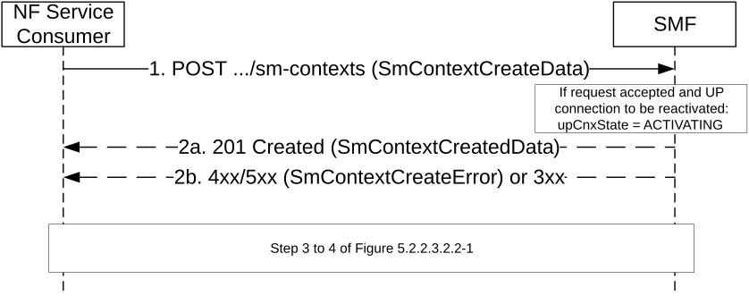

# 5.2.2.2.2 EPS to 5GS Idle mode mobility using N26 interface (with or without data forwarding)

The NF Service Consumer (e.g. AMF) shall request the SMF to move a UE EPS PDN connection to 5GS using N26 interface, as follows.

Figure 5.2.2.2.2-1: EPS to 5GS Idle mode mobility using N26 interface

1\. The NF Service Consumer shall send a POST request towards the SMF (+PGW-C) of each UE EPS PDN connection, as specified in clause 5.2.2.2.1, with the following additional information:

\- UE EPS PDN connection, including the EPS bearer contexts, received from the MME, representing the individual SM context resource to be created;

\- the pduSessionsActivateList attribute, including the PDU Session ID of all the PDU session(s) to be re-activated;

\- the epsBearerCtxStatus attribute, indicating the status of all the EPS bearer contexts in the UE, if corresponding information is received in the Registration Request from the UE;

\- the dlDataWaitingInd attribute, indicating that DL data buffered in EPS needs to be forwarded to the UE, if such indication is present in the Context Response received from the MME.

2a. Upon receipt of such a request, if:

\- a corresponding PDU session is found based on the EPS bearer contexts (after invoking a Create service operation towards the H-SMF for a Home Routed PDU session, or towards the SMF for a PDU session with an I-SMF);

\- the default EPS bearer context of the corresponding PDU session is not reported as inactive by the UE in the epsBearerCtxStatus attribute, if received; and

\- it is possible to proceed with moving the PDN connection to 5GS,

then the SMF shall return a 201 Created response including the following information:

\- PDU Session ID corresponding to the default EPS bearer ID of the EPS PDN connection;

\- S-NSSAI assigned to the PDU session; in home routed roaming case, the S-NSSAI for home PLMN shall be returned;

\- the allocatedEbiList attribute, containing the EBI(s) allocated to the PDU session;

> and, if the PDU session that is derived by the SMF based on the EPS bearer contexts was requested to be re-activated, i.e. if the PDU Session ID was present in the pduSessionsActivateList,or if DL data buffered in EPS needs to be forwarded to the UE:

\- the upCnxState attribute set to ACTIVATING;

\- N2 SM information to request the 5G-AN to assign resources to the PDU session (see PDU Session Resource Setup Request Transfer IE in clause 9.3.4.1 of 3GPP TS 38.413 \[9\]), including (among others) the transport layer address and tunnel endpoint of the uplink termination point for the user plane data for this PDU session (i.e. UPF's GTP-U F-TEID for uplink traffic).

> The "Location" header shall be present in the POST response and shall contain the URI of the created SM context resource.
>
> If the epsBearerCtxStatus attribute is received in the request, the SMF shall check whether some EPS bearer(s) of the corresponding PDU session have been deleted by the UE but not notified to the EPS, and if so, the SMF shall release these EPS bearers, corresponding QoS rules and QoS flow level parameters locally, as specified in clause 4.11.1.3.3 of 3GPP TS 23.502 \[3\].  
>   
> The NF Service Consumer (e.g. AMF) shall store the association of the PDU Session ID and the SMF ID, and store the allocated EBI(s) associated to the PDU Session ID.

NOTE: The behaviour specified in this step also applies if the POST request collides with an existing SM context, i.e. if the POST request includes the same SUPI, or PEI for an emergency registered UE without a UICC or without an authenticated SUPI, and the default EPS bearer ID received in the UE EPS PDN connection is the same as in the existing SM context.

2b. Same as step 2b of figure 5.2.2.2.1-1. Steps 3 to 4 are skipped in this case.

If the SMF determines that seamless session continuity from EPS to 5GS is not supported for the PDU session, the SMF shall set the "cause" attribute in the ProblemDetails structure to "NO_EPS_5GS_CONTINUITY".

If the default EPS bearer context of the PDU session is reported as inactive by the UE in the epsBearerCtxStatus attribute, the SMF shall set the "cause" attribute in the ProblemDetails structure to "DEFAULT_EPS_BEARER_INACTIVE".

3\. Same as step 3 of figure 5.2.2.3.2.2-1, if the SMF returned a 201 Created response with the upConnectionState set to ACTIVATING and N2 SM Information,

4\. Same as step 4 of figure 5.2.2.3.2.2-1. During an EPS to 5GS Idle mode mobility using N26 interface with data forwarding (see clause 4.11.1.3.3A of 3GPP TS 23.502 \[3\]), the 200 OK response shall additionally contain the CN tunnel information for data forwarding from EPS, i.e. the forwardingFTeid attribute or the forwarding bearer contexts to be sent to the MME in the Context Acknowledge, based on the association between the EPS bearer ID(s) and QFI(s) for the QoS flow(s).
