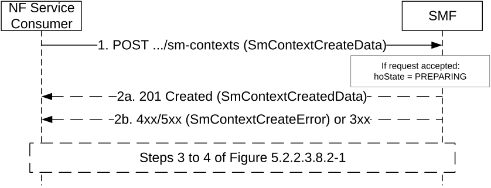

# 5.2.2.2.3 EPS to 5GS Handover Preparation using N26 interface

The NF Service Consumer (e.g. AMF) shall request the SMF to handover a UE EPS PDN connection to 5GS using N26 interface, as follows.

Figure 5.2.2.2.3-1: EPS to 5GS handover using N26 interface

1\. The NF Service Consumer shall send a POST request, as specified in clause 5.2.2.2.1, with the following additional information:

\- UE EPS PDN connection, including the EPS bearer contexts, representing the individual SM context resource to be created;

\- hoState attribute set to PREPARING (see clause 5.2.2.3.4.1);

\- the indication of whether direct or indirect DL data forwarding applies;

\- targetId identifying the target RAN Node ID and TAI based on the Target ID IE received in the Forward Relocation Request message from the source MME.

NOTE 1: The Target ID IE can be set to the Target NG-RAN Node ID containing a Global RAN Node ID and selected TAI with 3-octets length, or the Target eNB ID containing a Global eNB ID and selected TAI with 2-octets length; for the latter case, the NF Service Consumer, i.e. the AMF needs determine a value for the Target NG-RAN Node ID and TAI with 3-octets length based on the local configuration to be provided to the SMF.

2a. Upon receipt of such a request, if a corresponding PDU session is found based on the EPS bearer contexts (after invoking a Create service operation towards the H-SMF, for a Home Routed PDU session) and it is possible to proceed with handing over the PDN connection to 5GS, the SMF shall return a 201 Created response including the following information:

\- hoState attribute set to PREPARING and N2 SM information to request the target 5G-AN to assign resources to the PDU session, as specified in step 2 of Figure 5.2.2.3.4.2-1; if the SMF was indicated in step 1 that direct data forwarding is applicable, the SMF shall include an indication that a direct forwarding path is available in the N2 SM information;

\- PDU Session ID corresponding to the default EPS bearer ID of the EPS PDN connection;

\- S-NSSAI assigned to the PDU session; in home routed roaming case, the S-NSSAI for home PLMN shall be returned;

\- allocatedEbiList, containing the EBI(s) allocated to the PDU session;

\- optional udmGroupId, containing the identity of the UDM group serving the UE, to facilitate the UDM selection at the target AMF;

\- optional pcfGroupId, containing the identity of the PCF group for Session Management Policy for the PDU session, to facilitate the PCF selection at the target AMF.

> The "Location" header shall be present in the POST response and shall contain the URI of the created SM context resource.  
>   
> The NF Service Consumer (e.g. AMF) shall store the association of the PDU Session ID and the SMF ID, and store the allocated EBI(s) associated to the PDU Session ID.

NOTE 2: The behaviour specified in this step also applies if the POST request collides with an existing SM context, i.e. if the POST request includes the same SUPI, or PEI for an emergency registered UE without a UICC or without an authenticated SUPI, and the default EPS bearer ID received in the UE EPS PDN connection is the same as in the existing SM context.

2b. Same as step 2b of figure 5.2.2.2.1-1 with the following additions. Steps 3 and 4 of figure 5.2.2.3.8.2-1 are skipped in this case.

> If the SMF determines that seamless session continuity from EPS to 5GS is not supported for the PDU session, the SMF shall set the "cause" attribute in the ProblemDetails structure to "NO_EPS_5GS_CONTINUITY".

When receiving a 4xx/5xx response from the SMF, the NF service consumer (e.g. the AMF) shall regard the hoState of the SM Context to be NONE.
