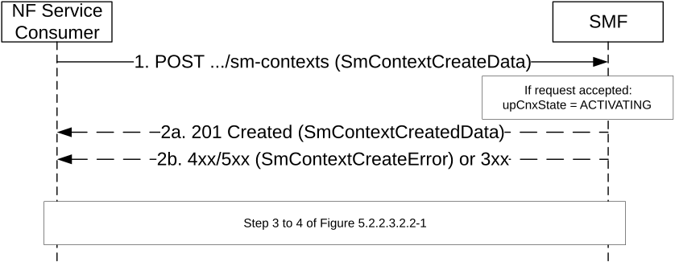

# 5.2.2.2.6 Service Request with I-SMF insertion/change/removal or with V-SMF change

The NF Service Consumer (e.g. AMF) shall request the new I-SMF or new V-SMF to create a SM context during a Service Request with I-SMF insertion/change or with V-SMF change, or shall request the SMF to create a SM context during a Service Request with I-SMF removal, as follows.

Figure 5.2.2.2.6-1: Service Request with I-SMF insertion/change/removal or with V-SMF change

1\. The NF Service Consumer shall send a POST request as specified in clause 5.2.2.2.1, with the following additional information:

\- the smContextRef attribute set to the identifier of the SM Context resource in the SMF (for a Service Request with an I-SMF insertion) or in the old I-SMF (for a Service Request with an I-SMF change or removal) or in the old V-SMF (for a Service Request with a V-SMF change), and optionally the NF instance identifier of the SMF hosting the SM Context resource.

\- the upCnxState attribute set to ACTIVATING (see clause 5.2.2.3.2.1) to indicate the establishment of N3 tunnel User Plane resources for the PDU Session;

\- the smfUri IE attribute set to the API URI of the Nsmf_PDUSession service of the SMF (for a Service Request with an I-SMF insertion or change), and optionally the NF instance identifier of the SMF, if the "ACSCR" feature is not supported by the AMF and I-SMF;

\- the hSmfUri IE attribute set to the API URI of the Nsmf_PDUSession service of the H-SMF (for a Service Request with an V-SMF change), and optionally the NF instance identifier of the H-SMF, if the "ACSCR" feature is not supported by the AMF and V-SMF.

2a. On success, the SMF shall return a 201 Created response as specified in clause 5.2.2.2.1 with the following additional information:

\- the upCnxState attribute set to ACTIVATING;

\- N2 SM information to request the 5G-AN to assign resources to the PDU session (see PDU Session Resource Setup Request Transfer IE in clause 9.3.4.1 of 3GPP TS 38.413 \[9\]), including the transport layer address and tunnel endpoint of the uplink termination point for the user plane data for this PDU session (i.e. UPF's GTP-U F-TEID for uplink traffic).

2b. Same as step 2b of figure 5.2.2.2.1-1. Steps 3 to 4 of figure 5.2.2.3.2.2-1 are skipped in this case.
