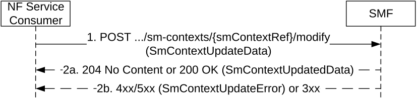

# 5.2.2.3.1 General

The Update SM Context service operation shall be used to update an individual SM context and/or provide N1 or N2 SM information received from the UE or the AN, for a given PDU session, towards the SMF, or the V-SMF for HR roaming scenarios, or the I-SMF for a PDU session with an I-SMF.

It is used in the following procedures:

\- PDU Session modification (see clause 4.3.3 of 3GPP TS 23.502 \[3\]);

\- UE or network requested PDU session release (see clause 4.3.4.2 and clause 4.3.4.3 of 3GPP TS 23.502 \[3\]);

\- UE requested MA PDU session establishment over the other access (see clause 4.22.7 of 3GPP TS 23.502 \[3\]);

\- UE or network-initiated MA PDU session release over a single access (see clause 4.22 of 3GPP TS 23.502 \[3\]);

\- Activation or Deactivation of the User Plane connection of an existing PDU session, i.e. establishment or release of the N3 tunnel between the AN and serving CN (see clause 5.6.8 of 3GPP TS 23.501 \[2\], clauses 4.2.2.2, 4.2.3, 4.2.6, 4.2.10 and 4.9.1.3.3 of 3GPP TS 23.502 \[3\], clauses 7.2.2.1, 7.2.2.2, 7.2.5.2 and 7.2.5.3 of 3GPP TS 23.316 \[36\]) and clause 7.2.5.2 of 3GPP TS 23.247 \[44\];

\- Xn and N2 Handover procedures (see clauses 4.9.1, 4.23.7 and 4.23.11 of 3GPP TS 23.502 \[3\]);

\- Handover between 3GPP and untrusted non-3GPP access procedures (see clause 4.9.2 of 3GPP TS 23.502 \[3\]);

\- Inter-AMF change due to AMF planned maintenance or AMF failure (see clause 5.21.2 of 3GPP TS 23.501 \[2\]), or inter-AMF mobility in CM-IDLE mode (see clauses 4.2.2.2 and 4.23.3 of 3GPP TS 23.502 \[3\]);

\- RAN Initiated QoS Flow Mobility (see clause 4.14.1 of 3GPP TS 23.502 \[3\] and clause 8.2.5 of 3GPP TS 38.413 \[9\]);

\- All procedures requiring to provide N1 or N2 SM information to the SMF, e.g. UE requested PDU Session Establishment procedure (see clause 4.3.2.2 of 3GPP TS 23.502 \[3\]), USS UAV Authorization/Authentication (UUAA) to carry the UUAA authentication message during the PDU Session Establishment (see clause 5.2.3.2 of 3GPP TS 23.256 \[41\] and Service-level-AA container in 3GPP TS 24.501 \[7\]), session continuity procedure (see clause 4.3.5 of 3GPP TS 23.502 \[3\]);

\- EPS to 5GS Idle mode mobility, EPS to 5GS Idle mode mobility with data forwarding or handover using N26 interface (see clause 4.11 of 3GPP TS 23.502 \[3\]);

\- 5GS to EPS Handover using N26 interface (see clause 4.11.1.2 of 3GPP TS 23.502 \[3\]);

\- 5GS to EPS Idle mode mobility using N26 interface with data forwarding (see clause 4.11.1.3.2A of 3GPP TS 23.502 \[3\]);

\- PDU Session Reactivation during P-CSCF Restoration procedure via AMF (see clause 5.8.4.3 of 3GPP TS 23.380 \[21\]);

\- AMF requested PDU session release due to a change of the set of network slices for a UE where a network slice instance is no longer available (see clause 4.3.4.2 of 3GPP TS 23.502 \[3\]);

\- AMF receives an "initial request" with PDU Session Id which already exists in PDU session context of the UE (see clause 5.4.5.2.5 of 3GPP TS 24.501 \[7\]);

\- Secondary RAT Usage Data Reporting (see clause 4.21 of 3GPP TS 23.502 \[3\]);

\- Service Request Procedures with I-SMF change or I-SMF removal when downlink data packets are buffered at the I-UPF (See clause 4.23.4 of 3GPP TS 23.502 \[3\]);

\- Connection Suspend procedure (see clause 4.8.1.2 of 3GPP TS 23.502 \[3\]);

\- Connection Resume in CM-IDLE with Suspend procedure (see clause 4.8.2.3 of 3GPP TS 23.502 \[3\]);

\- 5G-RG or Network requested PDU Session Modification via W-5GAN (see clause 7.3.2 of 3GPP TS 23.316 \[36\]);

\- 5G-RG or Network requested PDU Session Release via W-5GAN (see clause 7.3.3 of 3GPP TS 23.316 \[36\]);

\- FN-RG or Network requested PDU Session Modification via W-5GAN (see clause 7.3.6 of 3GPP TS 23.316 \[36\]);

\- FN-RG or Network requested PDU Session Release via W-5GAN (see clause 7.3.7 of 3GPP TS 23.316 \[36\]);

\- Handover between 3GPP access/5GC and W-5GAN access (see clause 7.6.3 of 3GPP TS 23.316 \[36\]);

\- AMF requested PDU session release due to Network Slice-Specific (Re-)Authentication and (Re-)Authorization failure or revocation (see clauses 4.2.9.2, 4.2.9.3 and 4.2.9.4 of 3GPP TS 23.502 \[3\]);

\- 5G-RG requested PDU Session Establishment via W-5GAN (see clause 7.3.1 of 3GPP TS 23.316 \[36\]);

\- FN-RG related PDU Session Establishment via W-5GAN (see clause 7.3.4 of 3GPP TS 23.316 \[36\]);

\- Non-5G capable device behind 5G-CRG and FN-CRG requested PDU Session Establishment via W-5GAN (see clause 4.10a of 3GPP TS 23.316 \[36\]);

\- Non-5G capable device behind 5G-CRG and FN-CRG or Network requested PDU Session Modification via W-5GAN (see clause 4.10a of 3GPP TS 23.316 \[36\]);

\- Non-5G capable device behind 5G-CRG and FN-CRG or Network requested PDU Session Release via W-5GAN (see clause 4.10a of 3GPP TS 23.316 \[36\]);

\- CN-initiated selective deactivation of UP connection of an existing PDU Session associated with W-5GAN Access (see clause 7.3.5 of 3GPP TS 23.316 \[36\]);

\- Handover between 3GPP access / EPS and W-5GAN/5GC access (see clause 7.6.4 of 3GPP TS 23.316 \[36\]);

\- AMF requested PDU session release due to Control Plane Only indication associated with PDU Session is not applicable any longer as described in 3GPP TS 23.501 \[2\] clause 5.31.4.1;

\- Subscribe to / unsubscribe from the DDN failure status notification (see clauses 4.15.3.2.7 and 4.15.3.2.9 of 3GPP TS 23.502 \[3\]);

\- AMF requested PDU session release due to ODB changes (see clause 2.6C.2 of 3GPP TS 23.015 \[42\]);

\- Simultaneous change of Branching Points or UL CLs controlled by different I-SMFs (see clause 4.23.9.5 of 3GPP TS 23.502 \[3\]);

\- Remote UE Report during 5G ProSe Communication via 5G ProSe Layer-3 UE-to-Network Relay without N3IWF (see clause 6.5.1.1 of 3GPP TS 23.304 \[43\];

\- Multicast Session join and session establishment procedure in clause 7.2.1.3 of 3GPP TS 23.247 \[44\];

\- Multicast MBS session leave and release procedure in clause 7.2.2 of 3GPP TS 23.247 \[44\];

\- MBS session activation procedure in clause 7.2.5.2 of 3GPP TS 23.247 \[44\];

\- Mobility procedures for MBS in clause 7.2.3 of 3GPP TS 23.247 \[44\];

\- Connection Inactive procedure with CN based MT communication handling in clause 4.8.1.1a of 3GPP TS 23.502 \[3\];

\- UE Triggered Connection Resume in RRC Inactive procedure in clause 4.8.2.2 of 3GPP TS 23.502 \[3\];

\- Network Slice Replacement, see clause 5.15.19 of 3GPP TS 23.501 \[2\];

\- AMF requested PDU Session release due to MBSR not authorized as described in clause 5.35A.4 of 3GPP TS 23.501 \[2\] and in clause 4.3.4.2 of 3GPP TS 23.502 \[3\];

\- Xn Handover without V-SMF change or N2-based handover with V-SMF insertion/change/removal in HR-SBO case (see clauses 6.7.2.6 and 6.7.2.10 of 3GPP TS 23.548 \[39\]).

The NF Service Consumer (e.g. AMF) shall update an individual SM context and/or provide N1 or N2 SM information to the SMF by using the HTTP POST method (modify custom operation) as shown in Figure 5.2.2.3.1-1.

Figure 5.2.2.3.1-1: SM context update

1\. The NF Service Consumer shall send a POST request to the resource representing the individual SM context resource in the SMF. The content of the POST request shall contain the modification instructions and/or the N1 or N2 SM information, or the indication that the PDU session is allowed to be upgraded to a MA PDU session if so indicated by the UE as specified in clause 6.4.2.2 of 3GPP TS 24.501 \[7\], or subscribe/unsubscribe of the DDN failure notification as specified in clause 4.15.3.2.7 of 3GPP TS 23.502 \[3\]. If the request contains EBI(s) to revoke, then the SMF shall disassociate the EBI(s) with the QFI(s) with which they are associated.

2a. On success, "204 No Content" or "200 OK" shall be returned; in the latter case, the content of the POST response shall contain the representation describing the status of the request and/or N1 or N2 SM information.

If the ExemptionInd IE is included in the request message, indicating that the NAS SM message included in the request was exempted from NAS congestion control by the AMF, the SMF shall verify that the included 5G SM message can be exempted from a NAS SM congestion control activated in the AMF as specified in clause 5.19.7 of 3GPP TS 23.501 \[2\].

The SMF may indicate to the NF Service Consumer that it shall release EBI(s) that were assigned to the PDU session by including the releaseEbiList IE, e.g. when a QoS flow is released.

2b. On failure or redirection, one of the HTTP status codes listed in Table 6.1.3.3.4.2.2-2 shall be returned. For a 4xx/5xx response, the message body shall contain an SmContextUpdateError structure, including:

\- a ProblemDetails structure with the "cause" attribute set to one of the application errors listed in Table 6.1.3.3.4.2.2-2;

\- N1 SM information, if the SMF needs and can return a response to the UE;

\- N2 SM information, if the SMF needs and can return a response to the NG-RAN.

The following clauses specify additional requirements applicable to specific scenarios.
