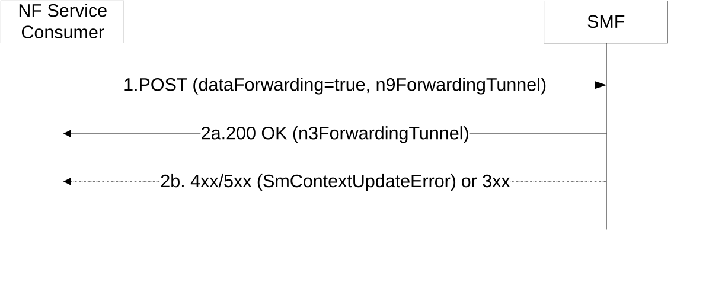

# 5.2.2.3.13 Indirect Data Forwarding Tunnel establishment during N2 based Handover with I-SMF

During N2 based handover with I-SMF insertion/change/removal, the NF Service Consumer (e.g. target I-SMF) shall use this procedure to exchange N3/N9 forwarding tunnel information with the NF Service Producer (e.g. source I-SMF).

The NF Service Consumer (e.g. target I-SMF) shall request the SMF to establish one or more downlink and/or uplink indirect data forwarding tunnels, as follows.

Figure 5.2.2.3.13-1: Indirect Data Forwarding Tunnel establishment during N2 based Handover with I-SMF

1\. The NF Service Consumer shall send a POST request, as specified in clause 5.2.2.3.1, with the following information:

\- dataForwarding attribute set to true, for the N2 based handover with I-SMF insertion/change/removal;

\- n9DlForwardingTnlList attribute carrying the N9 downlink indirect data forwarding tunnel(s) info of target I-UPF;

\- n9UlForwardingTnlList attribute carrying the N9 uplink indirect data forwarding tunnel(s) info of target I-UPF;

\- other information, if necessary.

2a. Same as step 2a of Figure 5.2.2.3.1-1, with the following information:

\- n3DlForwardingTnlList attribute carrying the N3 downlink indirect data forwarding tunnel(s) info of source I-UPF or source UPF;

\- n3UlForwardingTnlList attribute carrying the N3 uplink indirect data forwarding tunnel(s) info of source I-UPF or source UPF;

\- other information, if necessary.

2b. If the source SMF cannot proceed with the request, the source I-SMF shall return an error response, as specified for step 2b of figure 5.2.2.3.1-1.
