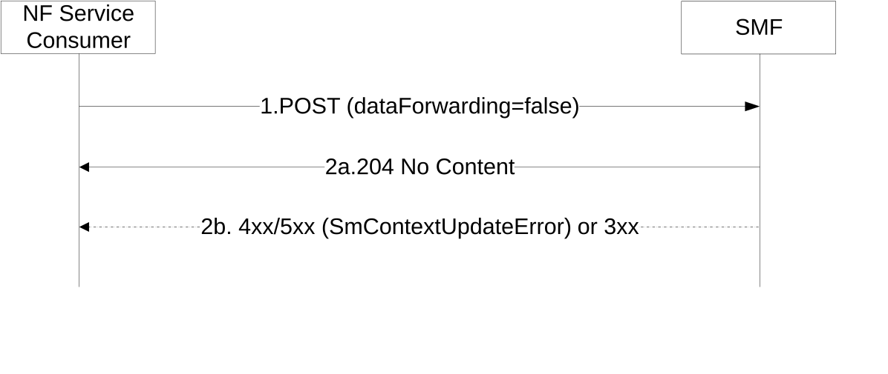

# 5.2.2.3.13A Indirect Data Forwarding Tunnel removal during N2 based Handover with I-SMF

During N2 based handover cancellation with I-SMF insertion/change/removal, the NF Service Consumer (e.g. target I-SMF) shall use this procedure to remove previously established Indirect Data Forwarding Tunnel(s) at NF Service Producer (e.g. source I-SMF).

The NF Service Consumer (e.g. target I-SMF) shall request the NF service producer to remove the established Indirect Data Forwarding Tunnel(s), as follows.

Figure 5.2.2.3.13A-1: Indirect Data Forwarding Tunnel Removal during N2 based Handover with I-SMF

1\. The NF Service Consumer shall send a POST request, as specified in clause 5.2.2.3.1, with the following information:

\- dataForwarding attribute set to false;

\- other information, if necessary.

2a. If successful, the SMF shall return a 204 No Content response.

2b. If the SMF cannot proceed with the request, the SMF shall return an error response, as specified for step 2b of figure 5.2.2.3.1-1.
