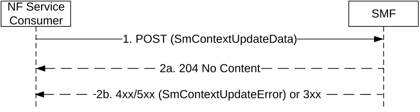

# 5.2.2.3.14 Request to forward buffered downlink data packets at I-UPF

For I-SMF change or I-SMF removal when downlink data packets are buffered at the I-UPF, the new I-SMF (for I-SMF change) or SMF (for I-SMF removal) shall request the (old) I-SMF to forward buffered downlink data packets as following:

Figure 5.2.2.3.14-1: Request to forward buffered downlink data packets at I-UPF

1\. The NF Service Consumer shall send a POST request, as specified in clause 5.2.2.3.1, with the following information:

\- n9ForwardingTunnel IE indicating the allocated tunnel endpoints information to receive the buffered downlink data packets.

2a. On success, the SMF shall initiate N4 session modification to the I-UPF trigger the sending of buffered DL data towards received tunnel endpoints and shall return "204 No Content" response.

2b. If the SMF cannot proceed with the request, the SMF shall return an error response, as specified for step 2b of figure 5.2.2.3.1-1.
