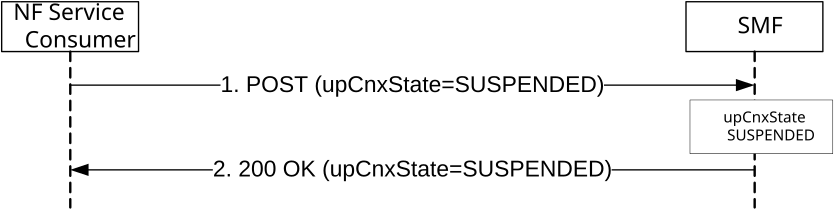

# 5.2.2.3.15 Connection Suspend procedure

The procedures specified in this clause and clause 5.2.2.3.16 are to support the Connection Suspend and Connection Resume in CM-IDLE with Suspend procedures as specified in clauses 4.8.1.2 and 4.8.2.3 of 3GPP TS 23.502 \[3\]. These procedures are used to support the User Plane CIoT 5GS Optimisation feature for E-UTRAN access as specified in clauses 5.31.1 and 5.31.18 of 3GPP TS 23.501 \[2\].

The NF Service Consumer (e.g. AMF) shall request the SMF to suspend the User Plane connection of an existing PDU session if the SMF support the UPCSMT feature, as follows.

Figure 5.2.2.3.15-1: Connection Suspend

1\. The NF Service Consumer shall request the SMF to suspend the user plane connection of the PDU session by sending a POST request, as specified in clause 5.2.2.3.1, with the following information:

\- upCnxState attribute set to SUSPENDED;

\- user location and user location timestamp;

\- N2 SM information received from the 5G-AN, including UE Context Suspend Request Transfer IE, if available;

\- other information, if necessary.

2\. Upon receipt of such a request, the SMF shall deactivate the N3 tunnel of the PDU session, set the upCnxState attribute to SUSPENDED and return a 200 OK response including the upCnxState attribute set to SUSPENDED. The SMF shall store the N3 tunnel info (including both AN Tunnel Info and the CN Tunnel Info), and upon receiving subsequent DL Data report from the UPF, the SMF will invoke the Namf_MT EnableUEReachability service operation to trigger the AMF to page the UE.
