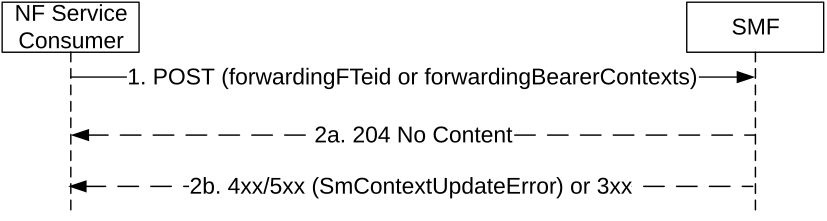

# 5.2.2.3.18 5GS to EPS Idle mode mobility using N26 interface with data forwarding

The NF Service Consumer (e.g. AMF) shall request the SMF to forward buffered DL data towards the EPS during a 5GS to EPS Idle mode mobility using N26 interface with data forwarding (see 4.11.1.3.2A of 3GPP TS 23.502 \[3\]), as follows.

Figure 5.2.2.3.18-1: 5GS to EPS Idle mode mobility using N26 interface with data forwarding

1\. The NF Service Consumer shall send a POST request, as specified in clause 5.2.2.3.1, with the following information:

\- forwardingFTeid received from the MME in the Context Acknowdge, if any; or

\- forwarding bearer contexts received from the MME in Context Acknowdge, if any.

2a. Upon receipt of such a request, the SMF shall forward the buffered DL data on the forwarding tunnel(s).

2b. If the SMF cannot proceed with the request, the SMF shall return an error response, as specified for step 2b of figure 5.2.2.3.1-1.
