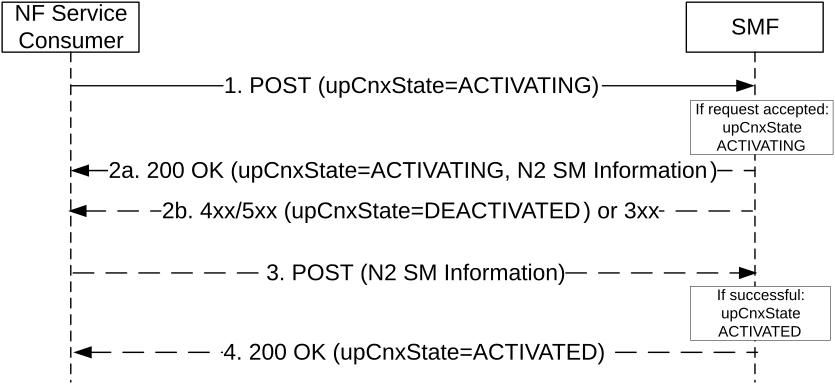
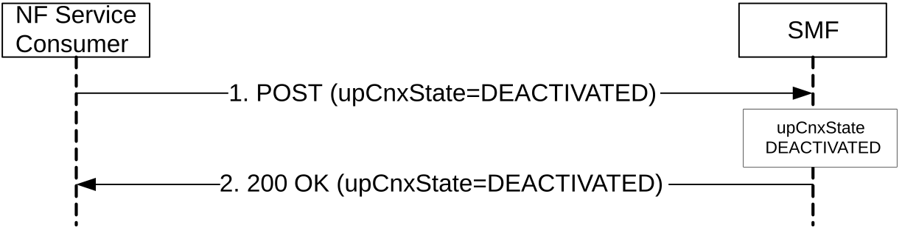
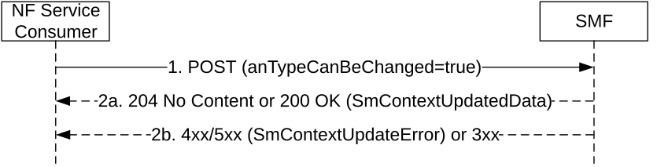

# 5.2.2.3.2 Activation and Deactivation of the User Plane connection of a PDU session

## 5.2.2.3.2.1 General

The upCnxState attribute of an SM context represents the state of the User Plane connection of the PDU session. The upCnxState attribute may take the following values:

\- ACTIVATED: a N3 tunnel is established between the 5G-AN and UPF (F-TEIDs assigned for both uplink and downlink traffic);

\- DEACTIVATED: no N3 tunnel is established between the 5G-AN and UPF;

\- ACTIVATING: a N3 tunnel is being established (5G-AN's F-TEID for downlink traffic is not assigned yet).

Clauses 5.2.2.3.2.2 and 5.2.2.3.2.3 specify how the NF Service Consumer (e.g. AMF) request the SMF to activate or deactivate the User Plane connection of the PDU session, e.g. upon receiving a Service Request from the UE requesting to activate a PDU session or upon an AN release procedure respectively. Clause 5.2.2.3.2.3 also applies in case of 5G-AN requested PDU session resource release by sending the NGAP PDU SESSION RESOURCE NOTIFY to the AMF (see step 1d in clause 4.3.4.2 of 3GPP TS 23.502 \[3\]).

In scenarios where the SMF takes the initiative to activate or deactivate the User Plane connection of the PDU session, e.g. during a Network Triggered Service Request or CN-initiated selective deactivation of the User Plane connection of a PDU session respectively, the SMF invokes the Namf_N1N2MessageTransfer procedure with the inclusion of N2 SM Information (and optionally of a N1 SM Container) as specified in 3GPP TS 23.502 \[3\] to request the establishment or release of the PDU session's resources in the 5G-AN. The Update SM Context service operation is then used as specified in clause 5.2.2.3.1 to transfer the response to the SMF.

Clause 5.2.2.3.2.4 specifies how the NF Service Consumer (e.g. AMF) indicates to the SMF that the access type of a PDU session can be changed from non-3GPP access to 3GPP access, during a Network Triggered Service Request initiated for a PDU session associated to the non-3GPP access, if the PDU Session for which the UE was paged or notified is in the List Of Allowed PDU Sessions provided by the UE and if the AMF has received N2 SM Information only or N1 SM Container and N2 SM Information for that PDU session from the SMF in step 3a of clause 4.2.3.3 of 3GPP TS 23.502 \[3\].

## 5.2.2.3.2.2 Activation of User Plane connectivity of a PDU session

The NF Service Consumer (e.g. AMF) shall request the SMF to activate the User Plane connection of an existing PDU session, i.e. establish the N3 tunnel between the 5G-AN and UPF, as follows.

Figure 5.2.2.3.2.2-1: Activation of the User Plane connection of a PDU session

1\. The NF Service Consumer shall request the SMF to activate the user plane connection of the PDU session by sending a POST request, as specified in clause 5.2.2.3.1, with the following information:

\- the upCnxState attribute set to ACTIVATING;

\- the user location and access type associated to the PDU session, if modified;

\- the indication that the UE is inside or outside of the LADN service area, if the DNN of the established PDU session corresponds to a LADN;

\- the access type for which the user plane connection needs to be re-activated, for a MA PDU session (i.e. the access type over which a Registration or Service Request was received);

\- the "MO Exception Data Counter" if the UE has accessed the network by using "MO exception data" RRC establishment cause;

\- the n3gPathSwitchExecutionInd IE if the AMF receives the indication "Non-3GPP access path switching while using old AN resources" in the registration request message from the UE and if the SMF supports non-3GPP path switching, so to request the SMF to add a new non-3GPP access path (while also keeping the existing one) during a UE requested non-3GPP access switching for a MA-PDU session;

\- other information, if necessary.

2a. Upon receipt of such a request, if the SMF can proceed with activating the user plane connection of the PDU session (see clause 4.2.3 of 3GPP TS 23.502 \[3\]), the SMF shall set the upCnxState attribute to ACTIVATING and shall return a 200 OK response including the following information:

\- upCnxState attribute set to ACTIVATING;

\- N2 SM information to request the 5G-AN to assign resources to the PDU session (see PDU Session Resource Setup Request Transfer IE in clause 9.3.4.1 of 3GPP TS 38.413 \[9\]), including the transport layer address and tunnel endpoint of the uplink termination point for the user plane data for this PDU session (i.e. UPF's GTP-U F-TEID for uplink traffic).

> If the SMF finds the PDU session already activated when receiving the request in step 1, the SMF shall delete the N3 tunnel information and update the UPF accordingly (see step 8a of clause 4.2.3.2 of 3GPP TS 23.502 \[3\]).
>
> For a MA-PDU session, the SMF shall perform the above requirements for the access type for which the user plane connection is requested to be re-activated (i.e. the access type indicated in the anTypeToReactivate attribute). The SMF shall not modify the user plane connection status for the other access type, e.g. if the user plane connection is already established for the other access type, it shall remain established. If the SMF receives the n3gPathSwitchExecutionInd IE the SMF shall not trigger the release of the UP connection in the old non-3GPP access.
>
> If the "MO Exception Data Counter" is included in the request and Small Data Rate Control is enabled for the PDU session, then the V-SMF/I-SMF shall forward the counter to the H-SMF/SMF.

2b. If the request does not include the "UE presence in LADN service area" indication and the SMF determines that the DNN corresponds to a LADN, then the SMF shall consider that the UE is outside of the LADN service area. The SMF shall reject the request if the UE is outside of the LADN service area.

> If the SMF cannot proceed with activating the user plane connection of the PDU session (e.g. if the PDU session corresponds to a PDU session of SSC mode 2 and the SMF decides to change the PDU Session Anchor), the SMF shall return an error response, as specified for step 2b of figure 5.2.2.3.1-1. For a 4xx/5xx response, the SmContextUpdateError structure shall include the following additional information:

\- upCnxState attribute set to DEACTIVATED.

3\. If the SMF returned a 200 OK response, the NF Service Consumer (e.g. AMF) shall subsequently update the SM context in the SMF by sending POST request, as specified in clause 5.2.2.3.1, with the following information:

\- N2 SM information received from the 5G-AN (see PDU Session Resource Setup Response Transfer IE in clause 9.3.4.2 of 3GPP TS 38.413 \[9\]), including the transport layer address and tunnel endpoint of one or two downlink termination point(s) and the associated list of QoS flows for this PDU session (i.e. 5G-AN's GTP-U F-TEID(s) for downlink traffic), if the 5G-AN succeeded in establishing resources for the PDU sessions; or

\- N2 SM information received from the 5G-AN (see PDU Session Resource Setup Unsuccessful Transfer IE in clause 9.3.4.16 of 3GPP TS 38.413 \[9\]), including the Cause of the failure, if resources failed to be established for the PDU session.

> Upon receipt of this request, the SMF shall:

\- update the UPF with the 5G-AN's F-TEID(s) and set the upCnxState attribute to ACTIVATED, if the 5G-AN succeeded in establishing resources for the PDU sessions; or

\- consider that the activation of the User Plane connection has failed and set the upCnxState attribute to DEACTIVATED" otherwise.

4\. The SMF shall then return a 200 OK response including the upCnxState attribute representing the final state of the user plane connection. If the activation of the User Plane connection failed due to insufficient resources, the cause IE shall be included in the response and set to "INSUFFICIENT_UP_RESOURCES".

## 5.2.2.3.2.3 Deactivation of User Plane connectivity of a PDU session

The NF Service Consumer (e.g. AMF) shall request the SMF to deactivate the User Plane connectivity of an existing PDU session, i.e. release the N3 tunnel, as follows.

Figure 5.2.2.3.2.2-1: Deactivation of the User Plane connection of a PDU session

1\. The NF Service Consumer shall request the SMF to deactivate the user plane connection of the PDU session by sending a POST request, as specified in clause 5.2.2.3.1, with the following information:

\- upCnxState attribute set to DEACTIVATED;

\- user location and user location timestamp;

\- cause of the user plane deactivation; the cause may indicate a cause received from the 5G-AN or AMF has detected that the UE has moved out of the network slice support area or due to an AMF internal event;

\- N2 SM information received from the 5G-AN (see PDU Session Resource Notify Released Transfer IE in clause 9.3.4.13 of 3GPP TS 38.413 \[9\] and PDU Session Resource Release Response Transfer IE in clause 9.3.4.21 of 3GPP TS 38.413 \[9\]), if the request is triggered due to an 5G-AN requested PDU session resource release or due to an AN Release procedure respectively;

\- other information, if necessary.

NOTE: The SMF can receive a N2 SM information (PDU Session Resource Release Response Transfer IE) without having sent any prior N2 SM information (PDU Session Resource Release Command Transfer IE) to the AMF.

2\. Upon receipt of such a request, the SMF shall deactivate release the N3 tunnel of the PDU session, set the upCnxState attribute to DEACTIVATED and return a 200 OK response including the upCnxState attribute set to DEACTIVATED.

If the request is triggered due to 5G-AN requested PDU session resource release, the SMF may decide to keep the PDU Session (with user plane connection deactivated) or release the PDU Session. If the SMF decides to keep the PDU Session, it shall return "200 OK" with the *upCnxState* attribute set to DEACTIVATED, but not including *n1SmMsg* and *n2SmInfo*. If the SMF decides to release the PDU Session, it shall return "200 OK" with the *upCnxState* attribute set to DEACTIVATED, including *n1SmMsg* IE but not-including *n2SmInfo* IE.

## 5.2.2.3.2.4 Changing the access type of a PDU session from non-3GPP access to 3GPP access during a Service Request procedure

The NF Service Consumer (e.g. AMF) shall indicate to the SMF that the access type of a PDU session can be changed as follows:

Figure 5.2.2.3.2.4-1: Indicating that the access type of a PDU session can be changed

1\. The NF Service Consumer shall indicate that the access type of a PDU session can be changed by sending a POST request, as specified in clause 5.2.2.3.1, with the following information:

\- anTypeCanBeChanged attribute set to "true";

\- other information, if necessary.

2a. Same as step 2a of figure 5.2.2.3.1-1. In HR roaming scenarios, the V-SMF shall invoke the Update service operation towards the H-SMF to notify that the access type of the PDU session can be changed (see clause 5.2.2.8.2.2).

2b. Same as step 2b of figure 5.2.2.3.1-1.

NOTE: This is used during a Service Request procedure (see clause 4.2.3.2 of 3GPP TS 23.502 \[3\]), in response to paging or NAS notification indicating non-3GPP access, if the PDU Session for which the UE was paged or notified is in the List Of Allowed PDU Sessions provided by the UE and if the AMF has received N2 SM Information only or N1 SM Container and N2 SM Information for that PDU session from the SMF in step 3a of clause 4.2.3.3 of 3GPP TS 23.502 \[3\].

The SMF may perform Network Slice Admission Control before the PDU Session is moved from the non-3GPP access to 3GPP access (i,e, before N3 tunnel for the PDU Session is established).

If the PDU Session is moved from the non-3GPP access to 3GPP access (i.e. N3 tunnel for the PDU Session is established successfully), the SMF and NF Service Consumer (e.g. AMF) updates the associated access of the PDU Session.
