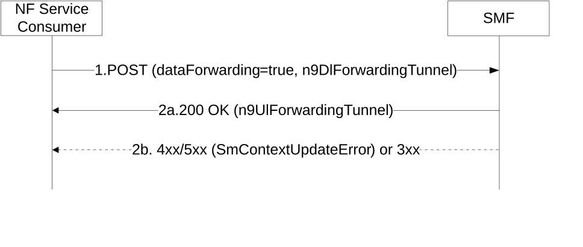

# 5.2.2.3.21 N9 Forwarding Tunnel establishment between Branching Points or UL CLs controlled by different I-SMFs

During simultaneous change of Branching Points or UL CLs controlled by different I-SMFs, the NF Service Consumer (e.g. target I-SMF) shall use this procedure to exchange N9 forwarding tunnel information with the NF Service Producer (e.g. source I-SMF).

The NF Service Consumer (e.g. target I-SMF) shall request the source I-SMF to establish one downlink and/or one uplink N9 data forwarding tunnels, as follows.

Figure 5.2.2.3.21-1: N9 Forwarding Tunnel establishment between Branching Points or UL CLs controlled by different I-SMFs

1\. The NF Service Consumer shall send a POST request, as specified in clause 5.2.2.3.1, with the following information:

\- dataForwarding attribute set to true, for the N9 Forwarding Tunnel establishment between Branching Points or UL CLs controlled by different I-SMFs;

\- n9DlForwardingTunnel attribute carrying the N9 downlink data forwarding tunnel info of target Branching Point or UL CL;

\- other information, if necessary.

2a. Same as step 2a of Figure 5.2.2.3.1-1, with the following information:

\- n9UlForwardingTunnel attribute carrying the N9 uplink data forwarding tunnel info of source Branching Point or UL CL;

\- other information, if necessary.

2b. If the source I-SMF cannot proceed with the request, the source I-SMF shall return an error response, as specified for step 2b of figure 5.2.2.3.1-1.
